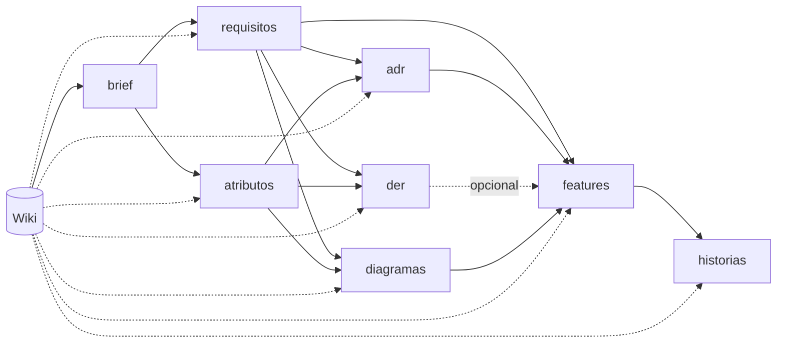
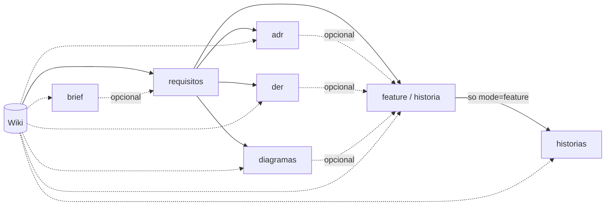

# Plano Macro — Senpai em MHL (Wiki, Work-Item, Discovery, Delivery)

> Base de leitura: [docs/site/index.html](docs/site/index.html), [docs/site/Docs-Reference.dc.html](docs/site/Docs-Reference.dc.html), [docs/site/Docs-Servers.dc.html](docs/site/Docs-Servers.dc.html), [docs/site/Docs-Extensions.dc.html](docs/site/Docs-Extensions.dc.html), [docs/site/Docs-Specification.dc.html](docs/site/Docs-Specification.dc.html), [docs/wiki-llm.md](docs/wiki-llm.md) (padrão de referência para o workflow `Wiki`), [docs/sample/](docs/sample/) (suíte de exemplos oficiais do próprio MHL — ver nota abaixo).
> Este documento é um **plano macro**, organizado por fases para execução incremental — não é uma implementação. Cada fase deve virar um ciclo de trabalho próprio.

> **`docs/sample/` como referência de uso da linguagem.** Diretório com a suíte de exemplos oficiais do MHL (`features/` — `agent`, `router`, `memory`, `prompt`, `pipeline`, `extension mcp`/`a2a`, `time`, `uuid`, `git`, `http`, `html`; `syntax/` — cada construção da gramática com um `.mh` mínimo e um `README.md` por pasta) na versão exata do runtime instalado (`1.4.0-beta.5`). Não faz parte do código do Senpai — está fora do controle de versão (`.gitignore`) porque é conteúdo de terceiros, não algo que o projeto produz — mas é a referência de primeira escolha para "qual é a sintaxe exata de X" antes de tentar por spike: mais confiável que as páginas `docs/site/*.dc.html` para comportamento exato, porque cada exemplo ali é código que roda de verdade contra o mesmo binário `mhl` usado neste projeto (a origem do diretório — como ele apareceu no projeto sem ter sido pedido — está registrada em [FASE0-ACHADOS.md §9](FASE0-ACHADOS.md#9-achado-crítico-de-segurança--claude--p-sem-flag-de-restrição-explora-e-escreve-fora-do-escopo-do-prompt)). Se este diretório não existir numa máquina nova, ele pode precisar ser regerado/localizado a partir da instalação do `mhl` antes de começar uma fase nova.

## 0. Status do desenvolvimento

> Atualizado ao final de cada ciclo de fase — não no meio de uma fase em andamento. "Concluído" aqui significa: código escrito, `mhl lint`/`mhl test` limpos, validado via `mhl run` (e `mhl serve mcp` quando aplicável), e commitado.

| Fase | Status | Resumo |
|---|---|---|
| 0 — Fundamentos e spikes | ✅ Concluída | Spikes de linguagem/runtime: suposições do plano validadas contra `mhl` real e `claude`/`codex`/`devin` CLIs, com 3 achados corrigindo decisões do plano (stdio→`--http` para `mhl_run_*`, path traversal em `memory` interpolado, schema estruturado ausente no Devin CLI) — depois revalidados contra `mhl 1.4.0-beta.6`, que corrigiu 7 desses achados (detalhes em [FASE0-ACHADOS.md](FASE0-ACHADOS.md)). Spike do projeto Wails: `wails init` (template vanilla+Vite) em `app/`, `mhlbridge` em Go faz `exec.Command` de `mhl serve mcp --http` em loopback + handshake MCP completo (`initialize`→`Mcp-Session-Id`→`tools/list`/`tools/call`); `PingMHL` exposto ao frontend via binding gerado; `wails build` produz um `.app` nativo funcional; teste automatizado (`app_test.go`) prova o ciclo completo `startup`→chamada real ao `WorkItem`→`shutdown` sem processo `mhl` órfão. |
| 1 — Workflow `WorkItem` | ✅ Concluída | `tool Paths` (isolamento C1, 17 testes) e `workflow WorkItem` (create/list/get/archive/usage) em `workflows/`. Validado via `mhl run` (ciclo completo + 2 ataques) e `mhl serve mcp`. Nota: `mhl test` cobre `Paths` diretamente; `create`/`list`/`get`/`archive`/`usage` do `WorkItem` em si foram validados via `mhl run` manual, não via bloco `test` — `test`/`describe` só exercitam `tool`s/expressões, não o motor de execução de um `workflow` inteiro com `step`/`goto` (ver [MHL-Melhorias.md #13](MHL-Melhorias.md)). **Revisado após `mhl 1.4.0-beta.6`:** `Paths.is_valid_id` simplificado com `string.matches` (era iteração char-a-char); `name`/`item_type`/`project_id` ganharam default `""` (`inputSchema` agora só exige `action`) — ambos reverificados com o mesmo conjunto de testes/ataques, sem regressão. |
| 2 — Workflow `Wiki` | ✅ Concluída | `agent Writer` (claude, `--disallowed-tools` testado de verdade — `--allowed-tools ""` NÃO bloqueia nada, achado crítico), hook `after` gravando em `Usage` (C5, validado ponta a ponta com `WorkItem action:usage`). `workflow Wiki` com `ingest`/`query`/`lint`, todos rodados de verdade contra o `claude` real (não simulado) sobre fontes de teste — `index.md`/`log.md`/páginas de entidade/conceito/fonte/resposta gerados corretamente. Modo Buddy (`pause`/`mhl run --resume`) testado de ponta a ponta no `ingest`: pausa sem gravar nada, resume não repete a chamada de LLM. Achado de arquitetura: `fs.read` resolve contra o CWD do processo, não contra o `.mh` declarante — schemas viram `prompt ... from` sem parâmetros, não `fs.read` (evita um bug de empacotamento que só apareceria na Fase 5/7). Achado de confiabilidade: `claude --json-schema` vaza a própria tag de fechamento em campos de texto longo — mitigado com `ClaudeQuirks.strip_trailing_tag_leak`, testado removendo o vazamento de verdade. Detalhes em [FASE2-ACHADOS.md](FASE2-ACHADOS.md). |
| 3 — Workflow `Discovery` | ✅ Concluída | 8 artefatos (brief/atributos/requisitos/adr/der/diagramas/features/historias), todos testados com chamadas reais ao `claude` numa cadeia completa (WorkItem→Wiki ingest→brief→requisitos→features→historias, + adr/der/diagramas/atributos). `tool Context` (C2), `tool Html` (list/sections), `tool ArtifactId` (FT00N/US00N sequencial, contando via `dir.list` — sem estado próprio pra dessincronizar). Modo Buddy testado de novo (agora com um `Gate` único compartilhado por todos os 8 artefatos, não duplicado). Diagramas Mermaid (C4/ER) embutidos e escapados corretamente. `WorkItem action:usage` agregou corretamente as 10 chamadas da cadeia inteira. **Revisões pós-entrega (matriz de dependência, ver §4.1):** (1) `adr`/`der`/`diagramas` passaram a depender também de `atributos`, e `features` de `adr`+`der`+`diagramas` — não só `requisitos`; `tool Context` ganhou `artifact_dir(...)` (+ `tool DirText` compartilhado com `WikiContext`) pra ler pastas com múltiplos arquivos como predecessor. (2) `der` foi rebaixado a dependência **opcional** de `features` — lido como contexto se existir, placeholder se não, nunca bloqueia. Revalidado de ponta a ponta com a cadeia nova nas duas revisões, incluindo os `fail()` de dependência faltando e o caso `features` sem `der` (não falha mais). Achado operacional: 2 falhas transitórias reais do `claude` CLI em chamadas consecutivas motivaram adicionar `retry:` ao `agent Writer` (confirmado que `after`/`Usage` não duplicam tokens em retry). **(3) Rastreabilidade/citação (ver §3.6):** toda informação de todo artefato agora carrega `fontes: string[]` (página da wiki, artefato predecessor, `"gap"` ou `"inferência"`) — `tool Cite` novo renderiza selos coloridos por tipo de fonte; `DirText`/`WikiContext`/`Context.artifact_dir` passaram a rotular cada bloco de contexto com uma referência curta e citável (ex. `entities/time-de-pagamentos`) em vez do caminho de disco inteiro. Validado nos 8 artefatos com chamadas reais — o modelo citou páginas da wiki, artefatos predecessores (`"requisitos"`, `"atributos"`), e usou `gap`/`inferência` corretamente quando a wiki não sustentava um número/afirmação específica. |
| 4 — Workflow `Delivery` | ✅ Concluída | Reaproveita brief/requisitos/adr/der/diagramas do Discovery (`workflows/shared/artifacts_common.mh`), sem `atributos` (não existe nesse nível). **Correção de design registrada:** a primeira versão implementou um input `standalone:bool` que gerava um "mini-Discovery" aninhado dentro da pasta de uma feature do backlog — identificado como erro (não existe no protocolo original) e removido por completo; `Delivery` só opera sobre projetos Feature/História standalone (§3.2, §4.1.1). Artefato final (`feature`/`historia`) depende só de `requisitos` (adr/der/diagramas são contexto opcional); `historias` (só `mode:"feature"`) reaproveita a mesma instrução/schema/template do `historias` de Discovery. Validado de ponta a ponta com `claude` real em 2 projetos completos (Feature com 6 histórias; História sem `brief`, confirmando opcionalidade), Modo Buddy testado sem duplicar chamada de LLM no resume, `WorkItem action:usage` agregou as 2 cadeias corretamente. Detalhes em [FASE4-ACHADOS.md](FASE4-ACHADOS.md). |
| 5 — Servir via MCP local | ✅ Concluída | `app/mhlbridge` (Go): `mhl serve mcp --http --state-dir` spawnado como processo filho; `RunStart`/`RunStatusGet`/`RunResume`/`RunCancel`/`RunList`/`RunLogs` tipados sobre `tools/call`, `ResourceRead` sobre `resources/read`, formas confirmadas por spike via `curl` antes do Go. `App`: bindings reais (`StartRun`/`GetRunStatus`/`ResumeRun`/`WatchRun`/...) substituindo o `PingMHL` temporário da Fase 0; `WatchRun` empurra progresso ao frontend via `runtime.EventsEmit` (polling do lado Go, §6.2), com `App.emit` trocável pra ser testável sem derrubar o processo de teste (`runtime.EventsEmit` é `log.Fatalf` fora de um app Wails real). **3 bugs reais encontrados e corrigidos** ao rodar de ponta a ponta pela primeira vez com a CWD de `mhl` fora da raiz do repo (a própria razão de ser desta fase): caminho do schema do Codex hardcoded relativo (`tool WorkflowsRoot`), Codex sem `--cd` próprio vendo `projects/` de todos os work-items (`tool CodexCwd`, `--skip-git-repo-check`), `WikiActions.log` sem `project_id` threaded (refatoração paralela à Fase 4). Validado com chamadas reais ao `codex` através do bridge, incluindo Modo Buddy completo (pausa→resume via `ResumeRun`). Detalhes em [FASE5-ACHADOS.md](FASE5-ACHADOS.md). |
| 6 — Interface visual | ⬜ Não iniciada | — |
| 7 — Empacotamento | ⬜ Não iniciada | — |
| 8 — Hardening | ⬜ Não iniciada | — |

## 1. Objetivo

Reconstruir o protocolo de refinamento do Senpai (ver [SENPAI-REFINAMENTO-VISAO-GERAL.md](SENPAI-REFINAMENTO-VISAO-GERAL.md)) como **4 workflows MHL separados** — `WorkItem`, `Wiki`, `Discovery`, `Delivery` —, servidos como ferramentas MCP, com uma **interface visual local** por cima. O produto final é **um executável único, distribuído e rodado localmente**, sem depender de infraestrutura externa.

Experiência alvo do usuário final:

1. Abre o app (executável local, sem instalação de runtime à parte).
2. Cria um novo work-item (projeto).
3. Faz upload dos arquivos-base (PDFs, notas, transcrições, etc.).
4. Gera a Wiki do projeto a partir desses arquivos.
5. Gera os artefatos de Discovery e/ou Delivery a partir da Wiki.

## 2. Decisões de arquitetura (âncoras nos docs)

| Decisão | Baseado em | Motivo |
|---|---|---|
| 4 workflows MHL distintos: `WorkItem`, `Wiki`, `Discovery`, `Delivery` | "Every transport publishes one tool / skill per declaration" (Docs-Servers §01) | Cada `workflow` vira 1 ferramenta MCP com contrato de input próprio — mapeia 1:1 com os 4 domínios pedidos. |
| Cada work-item é um **projeto isolado em disco**, não uma linha em banco central | `fs`/`dir` nativos ([Docs-Reference §09](docs/site/Docs-Reference.dc.html)) + `memory type: "json"` por caminho interpolado ([Docs-Reference §08](docs/site/Docs-Reference.dc.html)) | Um `path` interpolado com `${project_id}` dá a cada projeto seu próprio estado, sem risco de um work-item vazar em outro — isolamento é constraint obrigatória (C1), não só conveniência; ver §2.1 para o mecanismo de reforço. |
| Servidor exposto via **`mhl serve mcp <dir>`** em stdio, spawnado como processo filho do app | Docs-Servers §03 — "the form an MCP client uses when it spawns the server as a subprocess" | É literalmente o modelo pedido ("mcp servido como stdin"): a UI não fala com uma API própria, fala MCP com o `mhl`. |
| Uso de `Discovery`/`Delivery` como `workflow` (não `pipeline`) | `workflow` permite `goto` para trás/frente (Docs-Reference §13); `reached` no status do run é "ordered steps that started" (Docs-Servers §05) | Cada chamada só deve **executar e reportar** o step do `artifact` pedido — um `goto` direto para o step certo (e para um step `Done` final) mantém `reached` enxuto (ex. `["Dispatch","Brief","Done"]`), o que importa agora que a UI mostra progresso real por `reached`/`step`. Sem isso, um `pipeline`/`workflow` sem goto "roda" (e reporta) os 8 steps a cada chamada, mesmo os que são no-op para outros artefatos — progresso enganoso. |
| "Modo Buddy" = `pause()` + `mhl_run_resume` | Docs-Servers §06 (Human-in-the-loop) | É o mesmo conceito descrito no protocolo original ("agente pausa em cada ponto de decisão") — não precisa ser reinventado, é nativo do runtime. |
| Geração de artefato = chamada assíncrona (`mhl_run_start` / `mhl_run_status`) | Docs-Servers §05 | Steps chamam agente de LLM (podem levar segundos/minutos); a UI precisa de progresso por etapa (`step`, `stepIndex`, `reached`), não de uma chamada bloqueante. |
| Upload de arquivo não trafega como argumento MCP | "pass large payloads by reference (a URL, a blob key), not inline" + limite de 256 KiB por chamada (Docs-Servers §05) | O shell da aplicação grava o arquivo em disco no diretório do projeto e passa **caminhos**, não bytes, para os workflows. |
| `Wiki` segue o padrão de 3 camadas (raw / wiki / schema) de [docs/wiki-llm.md](docs/wiki-llm.md) | "There are three layers: Raw sources… The wiki… The schema…" | `raw/` fica imutável (só o usuário grava, via upload); `wiki/` é escrita só pelo agente de extração; a "schema" vira um `prompt` fixo (convenções de ingest/lint) que molda como o agente escreve a wiki. |
| `wiki/index.md` + `wiki/log.md` como os dois arquivos especiais do padrão | "Two special files help the LLM (and you) navigate the wiki as it grows" | `index.md` é o catálogo que Discovery/Delivery leem antes de gerar qualquer artefato (evita reprocessar a wiki inteira a cada step); `log.md` é o histórico append-only de ingest/lint por projeto. |
| Todo artefato = **schema JSON** (contrato da LLM) + **template MHL** (contrato de renderização) | `agent.run(prompt:, schema:)` é um argumento nativo, string, "passed to backends that support structured output" (Docs-Specification §12); `prompt X(...) from "file.ext"` já é um motor de template com interpolação nomeada, sem restrição de extensão (Docs-Reference §07) | A LLM nunca escreve markup livre — só JSON validado contra o schema; quem escreve o arquivo final é um `prompt`-template MHL, determinístico, carregado de arquivo. Ver §3.4. |
| **Artefatos (`artifacts/`) em HTML, não Markdown** — a Wiki (`wiki/`) continua em Markdown | Requisito explícito do usuário; padrão [docs/wiki-llm.md](docs/wiki-llm.md) é especificamente sobre uma wiki Markdown (Obsidian etc.), o que não se aplica aos artefatos de engenharia | Cada template vira `templates/<artefato>.html`; o resultado (`brief.html`, `feature.html`, …) já é a coisa final a pré-visualizar/imprimir/exportar — sem passo de conversão markdown→html na UI. |
| Escaping obrigatório de todo campo JSON antes de interpolar num template HTML | `html.escape`/`html.attr_escape` nativos desde `mhl 1.4.0-beta.6` (confirmado por spike, FASE0-ACHADOS.md §0 — não existiam na `beta.5`, quando só havia `.replace(old, new)` em string, Docs-Specification §10.3) | Um template `.md` que recebe texto cru da LLM é só texto; um template `.html` que recebe texto cru é **HTML-injection** (um campo com `<` ou `"` quebra a página ou injeta markup). Cada argumento passa por `html.escape(...)` (texto) ou `html.attr_escape(...)` (valor de atributo) antes de toda chamada ao prompt-template. Ver §3.4. |
| Pré-visualização = renderização direta do HTML, sem conversão | Artefato já É o HTML final | A UI abre o arquivo gerado num `iframe`/webview (`sandbox`, sem rede), lado a lado com a lista de artefatos — não precisa de um markdown renderer embutido. |
| Progresso da UI = leitura direta de `mhl_run_status` (`state`, `step`, `stepIndex`, `stepTotal`, `reached`) | Docs-Servers §05 — campos já existem no status de todo run assíncrono | Nenhuma lógica de progresso nova no MHL: a UI só faz polling do `runId` que ela mesma iniciou e desenha a barra/etapa a partir do JSON de status. |

## 2.1 Constraints obrigatórias

Sete regras valem para o sistema inteiro, não para uma fase específica — qualquer decisão de fase futura que as viole precisa ser revista antes de seguir:

**C1 — Isolamento de work-item.** Nenhuma operação de nenhum dos 4 workflows pode ler ou escrever fora de `projects/<project_id>/` do work-item que a está chamando.
- **Correção ao design anterior deste plano, revisada de novo na Fase 4:** uma versão anterior deste documento descrevia um `Delivery` com `standalone: false` para "detalhar uma feature/história dentro do backlog de uma Oportunidade" usando o mesmo `project_id` da Oportunidade. Esse input **foi removido por completo** — não existe no protocolo original (§3.2, §4). "Detalhar a Feature FT001 desta Oportunidade em histórias" é `Discovery` chamando `artifact: "historias"` com um `feature_id`, sempre dentro do próprio `project_id` da Oportunidade; `Delivery` só existe para um projeto Feature/História que é, desde a criação, inteiramente próprio. C1 continua valendo do mesmo jeito para os dois: um work-item só tem um `project_id`, e cada chamada só enxerga o seu.
- **Mecanismo de reforço:** um `tool Paths` único, compartilhado pelos 4 workflows, é o único ponto que monta caminhos sob `projects/` — `Paths.artifact(project_id, relative)`, `Paths.wiki(project_id, relative)`, `Paths.raw(project_id, relative)`. Ele valida `project_id` contra um padrão fechado (sem `..`, sem `/`, sem caracteres fora de um slug/UUID) antes de qualquer `fs`/`dir` op; nenhum step monta caminho à mão com `"projects/" + project_id + "/..."`.
- **O runtime MHL não sandboxa isso por nós — só parcialmente, e por opt-in.** Não há, nos docs lidos, isolamento automático de sistema de arquivos por `workflow`/declaração — `fs`/`dir` operam com a permissão do processo, ponto. **Atualização (`mhl 1.4.0-beta.6`):** `memory { path_guard: "no_traversal" }` agora existe e bloqueia de verdade um valor interpolado (`${project_id}`) contendo `..`/caminho absoluto antes de tocar o disco — verificado por spike (FASE0-ACHADOS.md §0/§3). É opt-in, e só cobre `memory`, não `fs`/`dir` direto — o isolamento de work-item continua sendo responsabilidade do nosso código (`tool Paths`) como mecanismo primário; `path_guard: "no_traversal"` é adotado como **defesa em profundidade adicional** em todo `memory` futuro que interpolar `project_id` (ex. `Usage` em C5), nunca como substituto de `Paths.ensure_valid`. Ver risco correspondente em §7.

**C2 — Geração de artefato só pode usar Wiki ou artefatos já gerados.** Nenhum step de `Discovery`/`Delivery` pode `fs.read` em `raw/`, nem fazer `http.*`/`extension mcp` durante a geração de um artefato. As únicas fontes permitidas são `wiki/**` e `artifacts/**` do mesmo `project_id` — nunca de outro work-item.
- Isso já era o comportamento descrito no protocolo original — "cada artefato é derivado do conteúdo da Wiki e dos artefatos predecessores, garantindo rastreabilidade completa" (ver [SENPAI-REFINAMENTO-VISAO-GERAL.md](SENPAI-REFINAMENTO-VISAO-GERAL.md)) — agora é uma restrição obrigatória, não só uma convenção de UX.
- Consequência prática: um dado presente numa fonte bruta mas que o `ingest` ainda não "compilou" na Wiki **não existe** para Discovery/Delivery. Reforça por que `Wiki ingest` é sempre pré-requisito bloqueante antes de gerar qualquer artefato (Fase 6).
- **Mecanismo de reforço:** um `tool Context { wiki(project_id): {...}, priorArtifacts(project_id): {...} }` é o único ponto de leitura de contexto para um `agent.run(...)` de artefato — nenhum step chama `fs.read`/`http.*` solto para montar o prompt. Complementar com um `mhl test` por artefato que falha se o step tocar `raw/`.
- **Reforço adicional obrigatório, confirmado por spike de Fase 0 (FASE0-ACHADOS.md §9):** restringir `tool Context`/`prompt` a nunca pedir leitura de `raw/` não é suficiente sozinho — um `claude -p` real, sem nenhuma flag de restrição, explorou e escreveu arquivos fora do escopo de um prompt inofensivo por conta própria (leu/buscou o bastante para copiar ~300 arquivos + um binário para dentro do projeto, sem que o prompt pedisse nada disso). Por isso, **toda declaração `agent` usada por `Wiki`/`Discovery`/`Delivery` inclui, desde a primeira versão (não como hardening tardio da Fase 8), a flag de restrição de ferramentas do backend correspondente**. **Correção da Fase 2 (FASE2-ACHADOS.md §1):** `--allowed-tools ""` **não bloqueia nada** — testado com um prompt pedindo `Bash`+`Read` explicitamente, o `claude` executou os dois e devolveu o conteúdo de um arquivo, com `permission_denials: []`; uma string vazia é tratada como "sem restrição", não "permitir nada". O mecanismo validado de verdade é `--disallowed-tools "Bash,Read,Write,Edit,MultiEdit,NotebookEdit,WebFetch,WebSearch,Glob,Grep,Task"` (claude, lista explícita — testado recusando os dois pedidos) · `--sandbox read-only` (codex, ainda não testado ponta a ponta) · `--permission-mode auto` + `--sandbox` (devin, sendo `auto` o default seguro — nunca usar `accept-edits`/`smart`/`dangerous` para geração de artefato, também ainda não testado ponta a ponta). C2 depende dessa flag — testada de verdade, não só presumida — tanto quanto depende do desenho do prompt.

**C3 — Prompt de LLM só carrega trabalho de julgamento, nunca trabalho determinístico.** Nenhuma instrução de prompt (nem o schema) pode pedir à LLM para fazer algo que um `tool`/operação nativa já resolve deterministicamente: id/slug, ordenação, formatação de lista, escaping, data/hora, contagem, dedupe. É o próprio princípio do MHL — "Your program owns the flow; AI contributes judgment where it helps" ([index.html](docs/site/index.html)) — elevado a regra de produto.
- Já cumprido por design em: geração de `FT00N`/`US00N` (`tool`, não LLM), escaping HTML (nativo — ver atualização abaixo), timestamp de `log.md` (`time.format`, não LLM).
- **Atualização (`mhl 1.4.0-beta.6`):** `html.escape(text)` e `html.attr_escape(text)` agora são operações nativas (confirmado por spike, FASE0-ACHADOS.md §0) — escapam `<`, `>`, `&`, `'`, `"` corretamente para conteúdo de texto e para valor de atributo, respectivamente. **O `tool Html` da §3.4 deixa de precisar reimplementar escaping via `.replace()` encadeado** — chama `html.escape`/`html.attr_escape` nativos diretamente; só a composição lista→`<ul><li>` (`Html.list`) continua sendo código nosso, porque isso é formatação de estrutura, não escaping em si.
- **Fecha a "decisão em aberto" da §3.4:** a opção (a) (pedir à LLM uma string já formatada em HTML/markdown) deixa de ser uma alternativa válida — formatar uma lista é exatamente o tipo de tarefa determinística que essa regra proíbe delegar à LLM. **(b) — schema com `type: "array"` de verdade + `tool Html.list(...)` — é a única opção compatível com C3.**
- **Estende-se à Wiki:** a LLM de `ingest` não reescreve `index.md`/`log.md` inteiros nem decide onde inserir a entrada nova (isso é bookkeeping determinístico). Ela devolve, via `schema:`, só os campos julgados — título, resumo, categoria, fatos-chave da entidade/conceito/fonte; um passo determinístico (`tool`) insere/ordena/dedupe em `index.md` e formata a linha de `log.md`. **O mesmo padrão schema+template da §3.4 passa a valer também para `wiki/entities|concepts|sources`**, não só para os artefatos de Discovery/Delivery — a LLM só entrega conteúdo, nunca mecânica de arquivo.

**C4 — O backend do agente de LLM é substituível por ambiente: local usa Claude Code CLI ou Codex CLI; produção usa Devin CLI.** Nenhum `prompt`/`schema`/step pode depender de uma peculiaridade de um CLI específico — o contrato entre o workflow e o agente é só `prompt:`/`schema:` entrando e uma string (idealmente JSON puro) saindo.
- **Mecanismo implementado e validado (substitui o design anterior baseado em `env("SENPAI_AGENT_CLI")` — nunca chegou a ser escrito daquele jeito):** dois `agent`s de verdade, `Claude`/`Codex` (`workflows/shared/agents.mh`), cada um com seu próprio `command`/`args`, escolhidos por chamada através de `tool AgentSelector.pick(prompt): string -> nameof(Codex)` (hoje sempre Codex — único backend validado ponta a ponta nesta fase; pronto pra virar `env(...)`/lógica por prompt sem mudar quem chama). `tool Writer.generate(...)` (o adapter único que todo `workflow` chama, nunca os agentes diretamente) resolve com `match AgentSelector.pick(...) { nameof(Claude) -> Claude.run(...); nameof(Codex) -> Codex.run(...) }` e monta o valor de `schema:` na forma que cada CLI exige: `schema_file.content` (JSON inline) para Claude, `schema_file.path` (caminho de arquivo real) para Codex — os dois vindo de um único par `{content, path}` que cada `*SchemaFile` `tool` expõe (`workflows/shared/artifacts_common.mh` e equivalentes por workflow).
- **Por que não um `router` do MHL, apesar de parecer o encaixe natural:** tentado primeiro com `router AgentRouter { agents: [Claude, Codex]; select: (prompt) -> nameof(Codex) }` + `AgentRouter.select(...)`/`.delegate(...)`. Quebrou em runtime com `undefined variable "Router"` — `select` é só um hook interno que `.delegate()` invoca sozinho, nunca um método chamável de fora (confirmado por spike isolado; registrado em [MHL-Melhorias.md #16](MHL-Melhorias.md)). Como Claude e Codex precisam de **formas diferentes** do mesmo argumento `schema:`, `Writer.generate` precisa saber qual forma montar **antes** de rodar o agente — exatamente o que `router.delegate()` não deixa consultar de fora. `tool AgentSelector` + `match` + `.run()` direto por agente contorna essa limitação sem abrir mão da troca de backend por chamada; só abre mão do `decider`/cascata de decisão por LLM que um `router` real ofereceria de graça (não usado aqui, `select` já é 100% determinístico).
- **`agent.after` também não serve mais para extrair uso aqui.** O design original (ver C5 abaixo) usava `after` pra devolver `{content, tokens_in, tokens_out}` e/ou atribuir `tokens_in`/`tokens_out` por efeito colateral nas vars do `step` chamador. Os dois quebram quando `Agent.run(...)` é chamado de dentro de um `tool` compartilhado (o caso de `Writer.generate`, criado justamente pra não duplicar a declaração do `agent` em cada workflow — C7): `after` só pode devolver `string`/nada (devolver um objeto falha em runtime — `"<Agent>.after must return a string (or nothing), got object"`), e só enxerga variáveis do `step` de pipeline mais externo, nunca de um `tool` intermediário (efeito colateral numa var falha com `undefined variable`). Os dois achados, confirmados por spike, registrados em [MHL-Melhorias.md #17](MHL-Melhorias.md). **Mecanismo adotado:** nenhum `agent` declara `after`; `.run()` devolve o stdout cru do CLI, e `Writer.generate` extrai uso (`UsageParser.extract_claude`/`extract_codex`) e normaliza o conteúdo (`StructuredOutput.normalize_json` — generaliza o antigo `ClaudeQuirks.strip_trailing_tag_leak` da Fase 2 pra qualquer campo de string, recursivamente, não só um campo nomeado) explicitamente, na mesma função que fez a chamada — sem depender de visibilidade ambiente nem de retorno estruturado de `after`.
- **Achado operacional grave, registrado porque quase passou despercebido:** a combinação `router` quebrado + `after` devolvendo objeto quebrado significa que, por um período desta fase, **toda chamada a `Writer.generate` falhava em runtime** — ou seja, `Wiki`/`Discovery`/`Delivery` inteiros ficaram inoperantes (só `mhl lint`/`mhl test` continuavam passando, porque nenhum dos dois problemas é estático). Encontrado e corrigido ao tentar uma chamada real de `Delivery` depois de uma sessão de refatoração paralela; revalidado com chamadas reais nos três workflows depois da correção (`Wiki action:query`, `Discovery`/`Delivery` reaproveitando o mesmo `Writer.generate`). Lição: `mhl lint`/`mhl test` limpos não substituem pelo menos uma chamada real de ponta a ponta por backend depois de qualquer mudança em `workflows/shared/agents.mh` — os dois bugs aqui só existem em tempo de execução.
- **`devin`, ainda não integrado ao `AgentSelector`:** continua sem nenhuma flag de saída estruturada em nenhum subcomando (reverificado, [MHL-Melhorias.md #11](MHL-Melhorias.md)) — permanece risco de bloqueio de produção, não detalhe de configuração (ver §7), até esse suporte existir ou até o Senpai adotar outro backend de produção.

**C5 — A UI precisa mostrar consumo de token; os agentes são responsáveis por extrair esse dado.** Toda chamada de `agent.run(...)` que gera artefato ou página de wiki deve capturar quantos tokens de entrada/saída aquela chamada consumiu, e esse número precisa chegar até a UI — não é só um log de depuração.
- **O runtime já rastreia isso para exibição no terminal** — o exemplo de `mhl run` na home do MHL mostra `tokens 1420 → 38` na saída bonita do CLI (index.html) — mas isso é só o *pretty-print* do `mhl run`; não há, nos docs lidos, nenhum campo documentado (`result.tokens`, `context.tokens`, `mhl_run_status.vars.tokens`, …) que exponha esse número programaticamente para um step ou para o cliente MCP. Não presumir que existe; construir a extração como responsabilidade nossa.
- **Mecanismo, revisado na Fase 4 (o design original abaixo usava o hook `after` do `agent` — não funciona mais assim; ver C4 acima para o porquê):** o próprio CLI do agente (Claude/Codex, com `--output-format json`) devolve o uso de token junto da resposta, fora do conteúdo pedido pelo `schema:`. `tool UsageParser` (`workflows/shared/usage.mh`) tem um método de extração por backend (`extract_claude`/`extract_codex` — formatos de envelope bem diferentes: Claude devolve um único JSON; Codex devolve JSONL, com o uso no evento `turn.completed`) — chamado por `Writer.generate` **depois** que `Agent.run(...)` devolve o stdout cru (sem `after` nenhum no meio), não dentro de um hook. `Writer.generate` grava o resultado numa `memory { type: "jsonl", path: "projects/${project_id}/usage.jsonl" }` (mesmo padrão de `Audit.append` do exemplo canônico do MHL — a interpolação de `${project_id}` funciona normalmente a partir do parâmetro do próprio `tool`, sem precisar de escopo de `step`) e devolve ao chamador só `{content, tokens_in, tokens_out}` com o conteúdo já limpo — assim o `json.parse` do step continua recebendo exatamente o schema esperado, sem quebrar C3.
- Cada `step *Generate` atribui `tokens_in`/`tokens_out` a partir do valor de retorno de `Writer.generate(...)` (não mais por efeito colateral de `after`) — essas vars pipeline-scoped entram no `output:` do workflow, dando o número **daquela geração específica** de volta pro `mhl_run_status` do run em andamento, sem esperar o work-item inteiro.
- Para o total acumulado do work-item (que atravessa várias chamadas/`runId`s independentes — cada artefato é seu próprio run), a UI não lê `usage.jsonl` direto do disco: `WorkItem` ganha `action: "usage"` (soma + lista por artefato), mantendo `Paths`/`Context` como único ponto de leitura de arquivo (C1/C2) — ver §4.
- **Reforço obrigatório descoberto na Fase 0 (ver FASE0-ACHADOS.md §7):** a interpolação `${project_id}` dentro de `memory { path: "projects/${project_id}/usage.jsonl" }` **não sanitiza sozinha** — um spike confirmou que `../` nesse ponto escapa de verdade do diretório pretendido. Todo step que grava em `Usage` (ou em qualquer `memory` cujo `path:` referencie `project_id`) precisa primeiro reatribuir `project_id = Paths.ensure_valid(project_id)` — nunca declarar o `memory` a partir de um `project_id` ainda não validado por `tool Paths`.

**C6 — Compatibilidade multiplataforma (Windows, Linux, macOS).** Todo o sistema — os `.mh`, o binário `mhl` vendorizado, o shell Wails/Go — precisa rodar de forma idêntica nos três sistemas operacionais, já que o produto final é "um executável único, distribuído e rodado localmente" (§1), sem infra externa que abstraia o SO por trás.
- **Caminhos:** `tool Paths`/qualquer construção de caminho usa sempre `/` como separador dentro das strings passadas para `fs`/`dir` — nunca concatenar `\\` manualmente. Ainda não validado em Windows real (o desenvolvimento até aqui rodou em macOS); tratar como item explícito de smoke test da Fase 7, já que o runtime do `mhl` é Go e `fs`/`dir` provavelmente delegam para `os`/`filepath` do Go (que aceitam `/` na maioria das chamadas de I/O do Windows) — mas isso é uma suposição a confirmar, não um fato já testado.
- **`cmd.exec`:** nunca assumir um shell POSIX disponível — seguir sempre "prefer argv" (Docs-Reference §09); nenhum step introduz `sh -c "..."`/pipes de shell sem um equivalente verificado no Windows (`cmd.exe`/PowerShell não entendem a mesma sintaxe).
- **Binário `mhl` vendorizado:** build por plataforma já previsto na Fase 7 (`mhl-darwin-arm64`, `mhl-darwin-amd64`, `mhl-windows-amd64.exe`, `mhl-linux-amd64`) — o Go do Wails escolhe o binário certo por `runtime.GOOS`/`GOARCH` em tempo de execução, nunca um caminho fixo.
- **Diretório de dados do usuário (`~/.senpai/`):** resolvido via `os.UserHomeDir()`/`os.UserConfigDir()` do Go no shell Wails, nunca um caminho POSIX hard-coded — o equivalente correto por SO (`%APPDATA%` no Windows, `~/Library/Application Support` no macOS, `~/.config`/`~/.local/share` no Linux, conforme a API do Go escolher) é responsabilidade do bridge, não dos `.mh`.
- **Não validado ainda:** nenhum spike de Fase 0 rodou em Windows — este item permanece uma suposição de compatibilidade até a Fase 7 (empacotamento) incluir um smoke test manual real em Windows, não só macOS/Linux.

**C7 — Código limpo em todo arquivo `.mh`.** As mesmas práticas de código limpo que valeriam em qualquer linguagem se aplicam aos workflows MHL — ser uma linguagem declarativa dedicada a orquestrar LLMs não é desculpa para arquivos grandes ou obscuros.
- Nomes de `tool`/método/`var`/`step` dizem o que fazem sem precisar de comentário (`Paths.ensure_valid`, não `Paths.check`); comentário só quando explica um "porquê" não óbvio (ex. a nota em `paths.mh` sobre por que o projeto não usa `memory` interpolado direto).
- Métodos de `tool` pequenos e de responsabilidade única — compor (`Paths.artifact` chama `Paths.artifacts_dir` + `Paths.ensure_safe_relative`) em vez de duplicar a mesma concatenação em vários lugares.
- Nenhuma duplicação de lógica de validação/formatação entre os 4 workflows — toda regra compartilhada (validação de id, escaping HTML, geração de slug) vive em exatamente um `tool` sob `workflows/shared/`, importado por quem precisar.
- Evitar strings mágicas repetidas (nomes de `action`, `type`, categorias de wiki) — quando o mesmo literal aparece em mais de um ponto de decisão, extrair para uma constante nomeada. **`enum` continua fora de cogitação para `input` de workflow servido por MCP** (mesmo o `inputSchema` já projetando `"enum": [...]` desde a `beta.6`): um valor externo (`mhl run --input`/`tools/call`) vinculado a um `input` do tipo `enum` não é coagido para o valor-tag de verdade (`type_of` continua `"string"`, `== Enum.Variant` é sempre `false`) — usar `enum` aqui quebraria `match`/`==` silenciosamente. Reportado como [MHL-Melhorias.md #15](MHL-Melhorias.md); `action`/`item_type` do `WorkItem` (e o equivalente em Discovery/Delivery) continuam `string` validada por `tool`. Revisitar quando esse item for corrigido no runtime.
- Todo `tool` novo ganha ao menos um bloco `test`/`describe` cobrindo o caminho feliz e pelo menos um caso de borda malicioso/inválido antes de ser considerado pronto — mesmo padrão já aplicado em `paths.mh` (Fase 1).
- Os achados de sintaxe da Fase 1 (FASE0-ACHADOS.md §8) — `obj["campo"] = x` para escrita de campo — continuam valendo como convenção padrão de todo `.mh` novo. **Atualizado na Fase 2:** chamada a método-irmão dentro do mesmo `tool` usa `self.<método>(...)`, não o nome do `tool` repetido — `self.` já funciona (nunca tinha sido testado até a Fase 2; [MHL-Melhorias.md #6](MHL-Melhorias.md)) e é mais resistente a rename. **Atualizado após `beta.6`:** o falso-positivo do lint em `<array>.append(x)` foi corrigido no runtime ([MHL-Melhorias.md #5](MHL-Melhorias.md)) — `.append(x)` volta a ser preferível a `acc += [x]` por ser mais direto, mas ambos funcionam; não é mais necessário evitar `.append()` por causa do lint. Validação de string por classe de caractere (ex. `is_valid_id`) usa `string.matches(pattern)` (regex, disponível desde `beta.6`) em vez de iterar `split("")` caractere a caractere — ver refatoração de `tool Paths` na Fase 1.

### Melhorias de linguagem sugeridas

Toda limitação/lacuna do runtime MHL encontrada por tentativa durante o desenvolvimento (ver FASE0-ACHADOS.md para o relato completo de cada spike) que vale a pena propor como melhoria da **linguagem em si** — não como workaround do produto Senpai — é registrada separadamente em [MHL-Melhorias.md](MHL-Melhorias.md), por ser feedback para quem mantém o compilador/runtime do MHL, não para este projeto.

## 3. Layout de dados por work-item

Cada work-item é uma pasta própria sob um diretório-base da aplicação (ex.: `~/.senpai/projects/<project_id>/`). O layout dentro de `artifacts/` depende do **modo** do work-item — não é o mesmo para todos:

### 3.1 Work-item Discovery (Oportunidade) — modo com breakdown

Quando existe uma Oportunidade completa, `features` e `historias` são **pastas**, não arquivos únicos — uma pasta por feature, e as histórias agrupadas pelo id da feature-mãe:

```
projects/<project_id>/
  project.json              # metadata: nome, nível ativo (discovery|delivery), criado_em
  usage.jsonl                # ledger append-only de tokens por chamada de agente (C5)
  raw/                      # fontes enviadas pelo usuário — imutáveis, o agente só lê
  wiki/
    index.md                 # catálogo: página, link, resumo de 1 linha, categoria — lido antes de cada geração
    log.md                    # append-only: "## [2026-04-02] ingest | Nome da fonte"
    sources/
      <slug-da-fonte>.md       # 1 página de síntese por fonte ingerida (não é o arquivo bruto)
    entities/
      <slug>.md
    concepts/
      <slug>.md
  artifacts/
    brief.html
    atributos.html
    requisitos.html
    adr/
    der.html
    diagramas/               # diagramas C4 do projeto/oportunidade, cada um seu .html
    features/
      FT001-nome-da-feature/
        feature.html
      FT002-outra-feature/
        feature.html
    historias/
      FT001/
        US001-nome-da-historia/
          historia.html
        US002-outra-historia/
          historia.html
      FT002/
        US001-nome-da-historia/
          historia.html
```

`diagramas/` — em qualquer nível (projeto, feature ou história) — guarda os diagramas C4 model daquele escopo, um `.html` autocontido por diagrama (ver §3.5). `wiki/sources/` guarda a síntese gerada por fonte, não o arquivo original (esse fica intocado em `raw/`) — **a Wiki continua em Markdown**, só `artifacts/` vira HTML.

### 3.2 Work-item Delivery (Feature ou História, sempre projeto próprio)

**Revisado na Fase 4 (decisão final, não é mais uma escolha em aberto):** um work-item de `Delivery` **é sempre** a própria Feature ou a própria História — seu próprio `project_id`, sua própria Wiki, seus próprios artefatos na raiz de `artifacts/`. `Delivery` nunca aninha dentro do backlog de uma Oportunidade nem recebe um `feature_id`/`historia_id` de outro projeto para "detalhar mais fundo" — isso não existe no protocolo original ([SENPAI-REFINAMENTO-VISAO-GERAL.md](SENPAI-REFINAMENTO-VISAO-GERAL.md) só lista `feature`/`historia` como artefatos finais de um projeto Feature/História próprio, nunca como um segundo nível de detalhamento sobre o backlog de uma Oportunidade). "Detalhar uma feature específica do backlog de uma Oportunidade em histórias" é o próprio `Discovery` gerando `artifact: "historias"` com um `feature_id` — permanece inteiramente dentro de `Discovery`, nunca cruza para `Delivery` (ver §4, §4.1).

Não há por quê fatiar em pastas por feature/história — o resultado é **um único artefato final por projeto**, mais uma pasta de histórias quando o projeto é uma Feature:

```
projects/<project_id>/
  project.json               # metadata.type: "feature" | "historia"
  usage.jsonl
  raw/
  wiki/
    index.md
    log.md
    sources/
      <slug-da-fonte>.md
    entities/
      <slug>.md
    concepts/
      <slug>.md
  artifacts/
    brief.html                 # opcional
    requisitos.html
    adr/                       # opcional
    der.html                   # opcional
    diagramas/                 # diagramas C4 dessa feature/história isolada
    feature.html                # mode: "feature" — o detalhamento final da feature
    historias/                  # mode: "feature" apenas — historias/US00N-slug/historia.html, sem prefixo de feature
      US001-nome-da-historia/
        historia.html
    # ou, exclusivamente (mode: "historia"):
    historia.html                # sem pasta de historias — o projeto inteiro É a história
```

Note que **não existe `atributos.html`** em Delivery — o protocolo original não lista esse artefato em nenhum nível de Feature/História (só em Oportunidade); ver §4.1. Isso espelha `docs/wiki/`, `docs/senpai.yml` e `output/artifacts/*` do protocolo original, um projeto por vez, com caminhos interpolados (`memory { path: "projects/${project_id}/project.json" }`). A estrutura de `wiki/` é idêntica à de Discovery — o padrão de [docs/wiki-llm.md](docs/wiki-llm.md) não muda por causa do tamanho do projeto.

### 3.3 A "schema" da wiki

O terceiro elemento do padrão — "a document... that tells the LLM how the wiki is structured, what the conventions are" — não é um arquivo por projeto em v1: vira um `prompt` fixo, versionado junto com o workflow `Wiki` (ex. `workflows/wiki/schema.prompt.md`), injetado em todo `agent.run(...)` de ingest/lint. Ele descreve: convenção de página (entidade/conceito/fonte), formato do `index.md`, formato do prefixo em `log.md` (`## [YYYY-MM-DD] ingest | <fonte>`), e o que conta como contradição/órfão no lint. Evoluir esse prompt por projeto (como o artigo original sugere) fica como melhoria de fase futura, não do v1.

### 3.4 Padrão de artefato: schema JSON + template (requisito técnico)

**Regra fixa para todo artefato gerado por LLM (Wiki, Discovery, Delivery): a LLM nunca escreve o markdown final — ela só responde JSON validado contra um schema. Quem escreve o arquivo é um template MHL determinístico.** Cada tipo de artefato (brief, atributos, requisitos, adr, der, feature, historia, …) é um **par de arquivos**, versionado junto com o workflow (não por work-item):

```
workflows/
  <discovery|delivery|shared>/
    schemas/
      brief.schema.json        # JSON Schema — os campos que a LLM DEVE devolver
      requisitos.schema.json
      feature.schema.json
      ...
    templates/
      brief.html                # template HTML com marcação `${...}` — o "arquivo base" do artefato
      requisitos.html
      feature.html
      ...
```

Fluxo de geração de 1 artefato, em 4 passos + 1 hook (parte do mesmo padrão do exemplo `LocalCoder.run(prompt:, schema:)` de Docs-Reference §05, com um passo de escaping a mais por causa do destino ser HTML, e a extração de tokens da C5 embutida no próprio agente via `after`):

0. **Hook `after` do agente, sempre presente (C5)** — todo `agent` usado para gerar artefato ou página de wiki declara `after: () -> { var usage = UsageParser.extract(result); Usage.append({artifact: artifact, tokens_in: usage.in, tokens_out: usage.out, at: time.now()}); tokens_in = usage.in; tokens_out = usage.out; return usage.content; }` — lê a resposta crua do CLI (`result`), separa o envelope de uso do conteúdo, grava no ledger `Usage` (`memory jsonl`, §2.1) e devolve só o conteúdo limpo. `UsageParser` é uma `tool` com um método por backend (`claude`/`codex`/`devin`, C4) — o formato do envelope difere entre eles.
1. **Chamada à LLM, sempre com `schema:`** — `var raw = Writer.run(prompt: BriefInstruction(...), schema: BriefSchemaFile())`. O `raw` que chega aqui já passou pelo `after` acima — é só o conteúdo, não o envelope de uso. O `schema:` é um argumento nativo do `.run()` (string, JSON Schema) "passed to backends that support structured output" (Docs-Specification §12) — para agente `cli/*` ele vira `${schema}` interpolado em `args` (ex. `--json-schema`); para `ollama/*` o adapter usa o output estruturado nativo do modelo. **Nenhum agente de artefato deve ser declarado sem essa flag em `args`.** **Correção de mecanismo feita na Fase 2 (FASE2-ACHADOS.md §2):** carregar o schema via `fs.read("schemas/brief.schema.json")` quebraria assim que o `mhl` rodasse com um CWD diferente de onde o `.mh` está (exatamente o caso da Fase 5/7, quando o shell Wails spawna `mhl serve mcp` de um CWD que não é `workflows/`) — `fs.read` resolve contra o CWD do processo, nunca contra o arquivo declarante. `prompt ... from "arquivo"`, ao contrário, resolve contra o `.mh` que declara, funcionando de qualquer CWD (confirmado por spike). Por isso todo schema vira um `prompt <Nome>SchemaFile() from "schemas/<nome>.schema.json"` **sem parâmetros** — carrega o JSON cru, verbatim, portável — em vez de `fs.read`.
2. **Parse** — `var data = json.parse(raw)`. Se a LLM responder algo fora do schema, `json.parse` falha e o step falha (comportamento desejado: melhor falhar do que gravar HTML malformado).
3. **Escape** — cada campo de texto de `data` passa por `html.escape(...)` nativo (`mhl 1.4.0-beta.6`+; escapa `<`, `>`, `&`, `'`, `"`) — ou `html.attr_escape(...)` no caso raro de um campo virar valor de atributo, não conteúdo de texto. Isso acontece **na chamada** ao prompt-template, não dentro do arquivo de template (os placeholders de um `prompt ... from file` só recebem os parâmetros declarados daquele prompt, não expressões arbitrárias).
4. **Render pelo template** — um segundo `prompt`, carregado do arquivo base, faz a interpolação: `prompt BriefTemplate(problema: string, objetivos: string, stakeholders: string) from "templates/brief.html"`; a chamada `BriefTemplate(problema: html.escape(data.problema), objetivos: html.escape(data.objetivos), stakeholders: html.escape(data.stakeholders))` devolve a string final, gravada com `fs.write(path, rendered)`. O `output:` do workflow inclui `tokens_in`/`tokens_out` (setados no passo 0) junto do resultado — `mhl_run_status` já devolve o custo daquela geração, sem passo extra.

Isso reaproveita um mecanismo que o MHL já tem — "A prompt renders to a string" (Docs-Reference §07) — como motor de template, em vez de introduzir uma dependência de templating nova. Como bônus, **schema e template ficam auto-validados**: os nomes de propriedades do `.schema.json` precisam bater exatamente com os parâmetros do `prompt ... from template.html` (parâmetro faltando, sobrando ou desconhecido falha — "Missing, extra, or unknown placeholders fail instead of producing incomplete text", Docs-Reference §07), e isso é pego por `mhl lint` antes de rodar.

**Validado na Fase 0** (não é mais assunção): `prompt ... from "arquivo.html"` funciona idêntico a `.md`, sem restrição de extensão — confirmado por spike (FASE0-ACHADOS.md §3).

**Campos de lista — resolvido pela constraint C3 (§2.1), não é mais uma escolha em aberto:** campos do schema que representam listas (`objetivos: string[]`) usam `type: "array"` de fato — nunca uma string já formatada pela LLM ("devolva isto como bullets em HTML" é trabalho determinístico, proibido em prompt por C3). Uma `tool Html { list(items: string[]): string -> ... }` própria (não nativa — só o escaping em si é nativo) faz a conversão depois do escape: `list(items: string[]): string -> "<ul>" + items.map((i) -> "<li>" + html.escape(i) + "</li>").join("") + "</ul>"` (`map`/`join` são métodos nativos de array, Docs-Specification §10), rodando entre o passo 3 (escape) e o passo 4 (render). Mantém toda formatação HTML em código determinístico e testável (`mhl test`), nunca em texto livre da LLM.

### 3.5 Diagramas C4 (Mermaid) dentro de artefatos HTML

O campo do schema para diagrama é a **sintaxe Mermaid C4** como string (ex. `"diagrama_mermaid": "C4Context\n  Person(user, \"Usuário\")\n  ..."`), nunca uma imagem pronta. O template do artefato de diagrama grava um `.html` autocontido:

```html
<pre class="mermaid">${diagrama_mermaid}</pre>
<script src="./assets/mermaid.min.js"></script>
<script>mermaid.initialize({ startOnLoad: true });</script>
```

- `diagrama_mermaid` passa por `html.escape` nativo como qualquer outro campo (mermaid tolera `&amp;`/`&lt;`/`&gt;` no texto).
- `assets/mermaid.min.js` é um asset **vendorizado com o app** (mesma lógica de vendoring do binário `mhl`, Fase 7) — sem CDN, para funcionar 100% offline; referenciado por caminho relativo a partir de cada `diagramas/*.html`.
- Renderização é **client-side** (no navegador/webview no momento da pré-visualização ou ao abrir o `.html`), não um passo de `cmd.exec` no MHL — evita empacotar Chromium/`mermaid-cli` só para gerar SVG em build-time. Trade-off: o `.html` do diagrama só "aparece certo" com JS habilitado (ok para o preview da UI e para abrir num navegador comum; não ok se algum dia for exportado para PDF sem JS — ver Fase 8/futuro).
- Quando um artefato (ex. `brief.html`) referencia um diagrama já gerado, o template **inlina** o bloco `<pre class="mermaid">` inteiro (lido de volta do `.html` do diagrama, ou do dado bruto salvo à parte) em vez de linkar por `<iframe src="../diagramas/...">` — mantém cada artefato como arquivo único abrível isoladamente, sem depender de path relativo entre pastas.

### 3.6 Rastreabilidade: toda informação carrega uma fonte

**Requisito de produto, não do plano original:** nenhuma informação de um artefato de Discovery/Delivery aparece sem indicar de onde veio — uma referência real (página da wiki ou artefato predecessor), ou uma marca explícita de `"gap"` (a wiki não tem essa informação) ou `"inferência"` (dedução razoável, sem citação direta). É uma extensão natural de C3 (§2.1): **decidir qual fonte sustenta uma alegação é trabalho de julgamento** — cabe à LLM; **renderizar essa decisão como um selo colorido é trabalho determinístico** — cabe a um `tool`, nunca à LLM formatar isso como texto livre.

**Granularidade adotada** (decisão de implementação, não estava especificada): não é citação por sentença — over-atomizar prosa natural em "1 frase = 1 citação" produziria documentos fragmentados e um schema muito mais frágil. Duas granularidades:
- **Campos de lista** (`objetivos`, `funcionais`/`não_funcionais`, `critérios_aceite`, atributos por categoria) — cada item já é uma alegação atômica independente, então cada um carrega seu próprio `fontes: string[]` (sempre array — uma alegação pode vir de mais de uma página).
- **Campos de prosa** (`problema` do brief; `contexto`/`decisão`/`consequências` de uma ADR; a descrição de um DER/diagrama/feature/história) — um `fontes: string[]` irmão cobre o registro inteiro, renderizado como uma nota logo abaixo do parágrafo, não citação inline por sentença.

**Mecanismo:**
- `tool Cite` (`workflows/shared/cite.mh`) — `list(items: {texto, fontes}[])`, `sections(items: {titulo, corpo, fontes}[])`, `note(fontes)`. Cada fonte vira um `<span class="cite cite-*">`, com classe `cite-gap`/`cite-inferencia`/`cite-fonte` conforme o valor — substituiu `tool Html` por completo em Discovery (o antigo `Html.list`/`Html.sections` sem citação não sobrou uso nenhum).
- Todo bloco de contexto que a LLM recebe (páginas da wiki, artefatos predecessores lidos como pasta) ganha um cabeçalho `# <referência-curta>` — `entities/time-de-pagamentos`, não o caminho de disco inteiro (`projects/<id>/wiki/entities/time-de-pagamentos.md`). Mecanismo: `DirText.concat_all(dir_path, base_dir)` recebe explicitamente o prefixo a remover; `WikiContext`/`Context.artifact_dir` passam o `wiki_dir`/`artifacts_dir` do projeto como `base_dir`. Um artefato predecessor de arquivo único (`requisitos.html`) é citado pelo nome do artefato (`"requisitos"`) — instruído em `schema.prompt.md`, não derivado de cabeçalho.
- `workflows/discovery/schema.prompt.md` ganhou a regra de citação: cita a referência exata do cabeçalho `# ...` que sustenta cada campo; usa `"inferência"` para dedução razoável sem citação direta; usa `"gap"` para uma lacuna real — nunca inventar uma referência falsa pra evitar marcar `gap`.

**Validado com chamadas reais nos 8 artefatos:** o modelo citou páginas da wiki (`entities/...`, `concepts/...`, `sources/...`) e artefatos predecessores (`"requisitos"`, `"atributos"`, `"brief"`) corretamente, e usou `gap`/`inferência` de forma criteriosa — por exemplo, marcou um limiar de latência de 2s inventado como `gap` (a wiki não tinha esse número) mas marcou a implicação de conformidade PCI-DSS como `inferência` (dedução razoável a partir do requisito de tokenização, não uma alegação inventada do nada).

**Fora do escopo desta mudança:** a Wiki em si (fatos de entidades/conceitos) não ganhou citação de volta para `raw/` — o pedido era escopado a "os artefatos" (Discovery/Delivery), não à Wiki. Estender rastreabilidade um nível abaixo (todo fato da wiki citando a fonte bruta que o originou) é um desdobramento natural, mas não foi pedido nem implementado agora.

## 4. Contrato dos 4 workflows (alto nível)

Sem código de implementação ainda — só o formato de entrada/saída de cada ferramenta MCP, para travar o design antes de escrever `.mh`.

### `WorkItem` — ciclo de vida do projeto
- `input action: string` (`"create" | "list" | "get" | "archive" | "usage"`)
- `input name: string` (quando `create`)
- `input project_id: string` (quando `get`/`archive`/`usage`)
- Efeito: cria/lê `project.json`; não conhece Wiki nem artefatos, **exceto** `usage`, que lê `usage.jsonl` (C5) via `Paths` e devolve `{total_tokens_in, total_tokens_out, by_artifact: [...]}` — é a única leitura "cross-domain" que o `WorkItem` faz, porque é puramente um agregador de bookkeeping, não geração.

### `Wiki` — ingestão, consulta e saneamento (padrão [docs/wiki-llm.md](docs/wiki-llm.md))
- `input project_id: string`
- `input action: string` (`"ingest" | "query" | "lint"`) — as 3 operações do padrão.
- `input raw_paths: string[]` (quando `ingest`; caminhos já gravados em `raw/` pelo shell, **um por vez** por padrão — ver Fase 2)
- `input question: string` (quando `query`)
- `input file_answer: bool = false` (quando `query`; se `true`, a resposta também é gravada como página nova em `wiki/` — "good answers can be filed back into the wiki as new pages")
- Efeito (sempre no padrão schema+template da §3.4/C3 — a LLM só devolve JSON com o conteúdo julgado; inserção/ordenação/formatação de arquivo é sempre `tool`):
  - `ingest`: para cada fonte, o agente lê **só** `raw/<arquivo>` (a única exceção a C2, já que é o próprio passo que faz a Wiki existir) e devolve, via `schema:`, os campos de cada página afetada (síntese da fonte, fatos por entidade/conceito, título+resumo+categoria para o índice) — nunca o Markdown pronto. Um passo determinístico renderiza `wiki/sources/<slug>.md`/`entities/*.md`/`concepts/*.md` pelos templates, insere/ordena a entrada em `wiki/index.md` e escreve a linha formatada em `wiki/log.md`.
  - `query`: o agente lê `wiki/index.md` (e as páginas que decidir abrir), devolve a resposta via `schema:`; opcionalmente vira página nova pelo mesmo mecanismo template quando `file_answer: true`.
  - `lint`: contradições entre páginas, alegações desatualizadas, páginas órfãs (sem link de entrada), conceitos citados sem página própria, cross-references faltando — relatório estruturado (`schema:`), sem side-effect automático.

### `Discovery` — artefatos de nível Oportunidade
- `input project_id: string`
- `input artifact: string` (`"brief" | "atributos" | "requisitos" | "adr" | "der" | "diagramas" | "features" | "historias"`)
- `input feature_id: string` (opcional; só relevante quando `artifact: "historias"` e se quer gerar histórias de uma feature específica, ex. `FT001`)
- Efeito: 1 `step` por artefato (branch pelo `artifact`), lê `wiki/*` + artefatos predecessores, escreve em `artifacts/`.
  - `artifact: "features"` cria/atualiza uma pasta por feature em `artifacts/features/FT00N-slug/feature.md` (id `FT00N` gerado sequencialmente pelo próprio step, slug derivado do nome).
  - `artifact: "historias"` cria uma pasta por história em `artifacts/historias/FT00N/US00N-slug/historia.md`, agrupada sob a feature indicada.
- Cada step com gate `pause()` opcional quando `buddy: true` for passado.

### `Delivery` — artefatos de um projeto Feature/História standalone
- `input project_id: string` — sempre o próprio projeto Feature/História (nunca uma Oportunidade; nunca cruza para outro `project_id`, C1 em §2.1).
- `input mode: string` (`"feature" | "historia"`) — deve bater com o `type` gravado em `project.json` na criação do work-item.
- `input artifact: string` (`"brief" | "requisitos" | "adr" | "der" | "diagramas" | "feature" | "historia" | "historias"`) — **sem `atributos`** (não existe nesse nível, ver §4.1); `"historias"` só é válido quando `mode: "feature"`.
- Efeito: mesma mecânica do Discovery para os artefatos intermediários (`brief`/`requisitos`/`adr`/`der`/`diagramas`, reaproveitando schema/prompt/template de `workflows/shared/artifacts_common.mh`), sempre na raiz de `artifacts/` do `project_id` recebido — nunca uma sub-pasta de feature/história, porque não existe backlog aqui:
  - `artifact: "feature"` / `"historia"` (deve bater com `mode`) → grava o detalhamento final em arquivo único (`artifacts/feature.html` ou `artifacts/historia.html`); título vem de `project.json.name` (nunca a LLM decidindo um título, C3).
  - `artifact: "historias"` (só quando `mode: "feature"`) → quebra a `feature` final (a única deste projeto) em histórias de usuário, reaproveitando a mesma instrução/schema/template do `historias` de Discovery — grava em `artifacts/historias/US00N-slug/historia.html`, sem prefixo de feature (só existe uma feature implícita neste projeto).
- Cada step com gate `pause()` opcional quando `buddy: true` for passado — mesmo `Gate` único compartilhado do Discovery.

### 4.1 Matriz de dependência entre artefatos

Não existia como documento — vivia só espalhada em código (`if (predecessor_content.is_empty()) fail(...)` em cada step `*Generate`, ver `workflows/discovery/discovery.mh`). Extraída direto da implementação, não da memória. **Revisada duas vezes após feedback de produto**: (1) `adr`/`der`/`diagramas` passaram a depender também de `atributos`, e `features` de `adr`+`der`+`diagramas`, não só `requisitos`; (2) `der` foi rebaixado a dependência **opcional** de `features` — usado como contexto quando existe, mas não bloqueia mais a geração de `features` na ausência dele.

| Artefato | Depende de (além da Wiki, sempre lida) | Nível |
|---|---|---|
| `brief` | — (só Wiki) | Oportunidade |
| `atributos` | `brief` | Oportunidade |
| `requisitos` | `brief` | Oportunidade |
| `adr` | `requisitos` + `atributos` | Oportunidade |
| `der` | `requisitos` + `atributos` | Oportunidade |
| `diagramas` | `requisitos` + `atributos` | Oportunidade |
| `features` | `requisitos` + `adr` + `diagramas` — **`der` é opcional**, lido se existir | Oportunidade |
| `historias` | `features` (a feature específica indicada por `feature_id`) | Feature (dentro da Oportunidade) |



Três coisas que uma leitura linear da lista de `artifact` (`"brief" | "atributos" | "requisitos" | ...`) ainda escondem, mesmo depois das revisões:

- **`atributos` e `requisitos` continuam irmãos** — os dois dependem só de `brief`; gerar um não exige o outro primeiro, mesmo a ordem textual do enum sugerindo sequência.
- **`adr`, `der` e `diagramas` continuam paralelos entre si** — nenhum dos três depende dos outros dois; convergem depois, em `features`.
- **`der` é a única dependência opcional de todo o grafo** — todas as outras setas do diagrama são bloqueantes (`fail()` se o predecessor não existir); só a de `der` → `features` (tracejada, rotulada "opcional") deixa passar com um texto de placeholder (`"(não gerado para esta oportunidade)"`) no lugar do conteúdo. Justificativa: nem toda oportunidade tem um modelo de dados formal que valha a pena diagramar — exigir `der` sempre bloquearia `features` sem necessidade real.
- A Wiki é lida por **todo** artefato, sempre — a linha pontilhada `wiki -.->` existe só pra não poluir visualmente repetindo `wiki -->` em cada nó; não tem o mesmo significado da linha tracejada de `der` (que é opcionalidade de verdade, não decoração visual) — só usam o mesmo estilo de traço porque o Mermaid não diferencia isso por padrão; o rótulo "opcional" em `der -.->` é o que carrega o significado real.

**Mecanismo de reforço, atualizado:** como `adr`/`diagramas` gravam **pastas** (um arquivo por decisão/diagrama), não um único arquivo, `Context` ganhou `artifact_dir(project_id, relative_dir)` — concatena todo o conteúdo de uma pasta, igual `WikiContext` já fazia para `wiki/entities`/`wiki/concepts`. A lógica de concatenação virou um `tool DirText` compartilhado entre os dois, em vez de duplicada (Fase 3, revisão pós-Discovery).

**Achado operacional desta revisão:** duas chamadas reais consecutivas (`der`, depois `diagramas`) falharam de forma transitória e tiveram sucesso no retry manual imediato, sem nenhuma mudança de prompt/schema entre as tentativas — sinal de instabilidade momentânea do lado do `claude` CLI, não um bug do Senpai. `agent Writer` ganhou `retry: { max_attempts: 3, delay: 2s, retry_on: [500, 503, "timeout", "rate_limit"] }` em resposta direta a isso — `after` roda só uma vez, sobre a resposta final bem-sucedida (Docs-Reference §05), então o retry não duplica tokens em `usage.jsonl` (confirmado: 9 chamadas bem-sucedidas na cadeia de teste, nenhuma entrada fantasma das 2 tentativas que falharam).

Mecanismo de reforço (já implementado, não é proposta): cada `step *Generate` chama `Context.artifact(project_id, "<predecessor>.html")` e falha com uma mensagem clara (`"gere '<predecessor>' antes de '<artifact>'"`) se vier vazio — nunca deixa um artefato gerar com um predecessor ausente silenciosamente. `historias` (Discovery) resolve `feature_id` → pasta real via `ArtifactId.find_feature_dir`, que falha se a feature não existir.

#### 4.1.1 Matriz de dependência do `Delivery` (mais simples — sem `atributos`)

**Decidido na Fase 4, não é mais o "em aberto" que a versão anterior deste documento apontava aqui:** `Delivery` **não tem** `atributos` — o protocolo original ([SENPAI-REFINAMENTO-VISAO-GERAL.md](SENPAI-REFINAMENTO-VISAO-GERAL.md)) nunca lista esse artefato em nível de Feature/História, só de Oportunidade. Isso simplifica o grafo em relação ao de Discovery: `adr`/`der`/`diagramas` dependem só de `requisitos` (não de um `atributos` que não existe nesse nível). `brief` é **opcional** em Delivery (ao contrário de Discovery, onde é raiz obrigatória de `requisitos`) — a sequência do protocolo original lista `brief (opcional)` tanto para Feature quanto para História.

| Artefato | Depende de (além da Wiki, sempre lida) | Quando existe |
|---|---|---|
| `brief` | — (opcional; nada depende dele ser gerado) | sempre |
| `requisitos` | `brief` — **opcional**, lido se existir (placeholder se não) | sempre |
| `adr` | `requisitos` | sempre |
| `der` | `requisitos` | sempre |
| `diagramas` | `requisitos` | sempre |
| `feature` / `historia` (final, conforme `mode`) | `requisitos` — `adr`/`der`/`diagramas` são **contexto opcional**, lidos se existirem, nunca bloqueiam | sempre |
| `historias` | `feature` (a única deste projeto) | só quando `mode: "feature"` |



Diferença deliberada em relação a Discovery: lá, só `der → features` era opcional (todo o resto bloqueava com `fail()`); aqui, **`brief → requisitos` e as três setas `adr/der/diagramas → final` também são opcionais** — reflete que o protocolo original marca `brief`, `adr` e `der` como `(opcional)` na sequência de Delivery (Feature e História), enquanto `requisitos` e `diagramas` não têm essa marca (por isso continuam obrigatórios como predecessores, mesmo não sendo obrigatórios *para o usuário rodar* — o usuário sempre pode optar por não gerar `adr`/`der`, e nesse caso o artefato final segue em frente com um texto de placeholder no lugar). Validado de ponta a ponta com chamadas reais ao `claude`: uma cadeia `requisitos → adr → der → diagramas → historia` **sem `brief`** completou normalmente (ver [FASE4-ACHADOS.md](FASE4-ACHADOS.md)).

> Cada um viraria uma entrada em `tools/list` — a UI descobre os 4 workflows via `tools/list` e o schema via `resources/read` em `mhl://workflow/<nome>`, sem precisar hardcodar o contrato duas vezes.

## 5. Fases macro

### Fase 0 — Fundamentos e spikes · ✅ Concluída
- ✅ Instalar o runtime `mhl` localmente e rodar os exemplos de `Docs-Servers` (`workflows/summarize.mh`, `approval.mh`) para validar o ciclo `mhl_run_start/status/resume` na máquina de desenvolvimento. *(validado via `Approval`, ciclo completo start→paused→resume→completed sobre `--http`.)*
- ✅ Validar como spike: `--state-dir` funciona em `mhl serve mcp <dir>` (stdio puro), ou só em `--http`? *(resposta: só em `--http` — e mais que isso, o próprio `mhl_run_*` só existe em `--http`; achado crítico que corrigiu a Fase 5, ver FASE0-ACHADOS.md §2.)*
- ✅ Agente de LLM: decisão C4 validada. *(1) `env()` em `command`/`args` **não funcionava** na `beta.5` — só literal (achado §1) — **corrigido pelo mantenedor na `beta.6`, reverificado por spike: funciona de verdade agora** (FASE0-ACHADOS.md §0); (2) `--json-schema`/saída estruturada diverge por CLI — `claude` inline, `codex` via arquivo, **`devin` não tem nenhuma** (achado §4, ainda sem correção); (3) uso de token do `claude` confirmado no envelope de `--output-format json` (achado §5) — Devin/Codex ainda não inspecionados, fica para quando esses backends entrarem em uso real.*
- ✅ Setup inicial do projeto Wails (ver §6 — stack já definida): `wails init -t vanilla` em `app/` (`app.go`/`main.go`/`wails.json` gerados). Pacote próprio `app/mhlbridge` faz `exec.Command` de `mhl serve mcp --http --addr 127.0.0.1:<porta livre>` (já usando `--http`, não stdio, por causa do achado da Fase 0), com processo em grupo próprio (`setProcessGroup`, com variante `_unix`/`_windows` — C6), espera `/healthz`, completa o handshake MCP (`initialize` → captura `Mcp-Session-Id`) e expõe `ToolsList`/`ToolsCall` genéricos. `App.PingMHL()` (bound method) chama `tools/list` + `WorkItem(action:"list")` de verdade e é gerado como binding JS (`wailsjs/go/main/App.js`) — um botão mínimo no frontend vanilla o exercita. *(validado: `go build`/`go vet`/`gofmt` limpos; `wails build` produz um `.app` nativo funcional — só a assinatura ad-hoc automática falhou por causa de um atributo estendido `com.apple.provenance` que o sandbox de desenvolvimento adiciona aos arquivos, resolvido com `xattr -cr` + `codesign` manual, não é um problema do código; o binário assinado à mão sobe de verdade, loga `mhl bridge: ready`, e um `kill` no processo aciona `OnShutdown` do Wails → `Stop()` do bridge → nenhum `mhl serve` órfão depois. `app_test.go::TestPingMHLEndToEnd` automatiza esse ciclo inteiro — startup real, chamada real ao `WorkItem`, shutdown real — sem precisar de interação manual numa janela.)* **Não verificado nesta fase:** o clique do botão dentro de uma janela real e visível — este ambiente de desenvolvimento não tem sessão gráfica interativa; a cadeia de binding (JS → método Go → resultado) foi confirmada mecanicamente (binding gerado corretamente, mesmo método testado via `go test`), não visualmente. Confirmar visualmente na Fase 6, quando a UI de verdade existir.

### Fase 1 — Workflow `WorkItem` · ✅ Concluída
- ✅ Declarar `memory`/`tool` para criar, listar e ler `project.json` por `project_id`. *(decisão: sem `memory` interpolado — `tool Paths` + `fs`/`dir` diretos, por causa do achado de path traversal da Fase 0 §7; `memory` interpolado não sanitiza sozinho.)*
- ✅ Implementar aqui o `tool Paths` (C1, §2.1) — validação de `project_id` + resolução de caminhos sob `projects/<project_id>/...`. *(`workflows/shared/paths.mh`, importado pelo `WorkItem`.)*
- ✅ `mhl lint` + `mhl test` cobrindo criação/listagem **e** casos de `project_id` inválido/malicioso rejeitados por `Paths`. *(17 asserções em `paths.mh` cobrem os casos maliciosos; `create`/`list` do `WorkItem` em si foram cobertos via `mhl run` manual, não via bloco `test` — ver nota na tabela de status §0.)*
- ✅ Rodar via `mhl run` isolado antes de plugar em `serve`. *(ciclo completo create→get→usage→archive + 2 ataques via `mhl run`; schema também validado via `mhl serve mcp` stdio.)*

### Fase 2 — Workflow `Wiki` · ✅ Concluída
- ✅ Usa `Paths` (Fase 1) para todo acesso a `raw/`/`wiki/` — nenhum caminho montado à mão.
- ✅ `prompt WikiSchema()` fixo (`schema.prompt.md`, a "schema" do padrão) + `agent Writer`, com `prompt`s de instrução carregados de arquivo — um prompt + um `schema.json` por operação (ingest/query/lint), seguindo C3: a LLM só devolve campos, nunca o arquivo pronto. *(Testado com chamadas reais ao `claude`, não simuladas.)*
- 🟡 `schemas/`+`templates/` para as páginas de wiki: implementado de forma **diferente do que o texto original previa**. Em vez de um `entity.schema.json`/`entity.md` separado por tipo de página, o **schema único de `ingest`** já descreve a forma de `entities[]`/`concepts[]` aninhada (uma chamada de LLM toca várias páginas de uma vez, como o próprio padrão wiki-llm.md descreve — "a single source might touch 10-15 wiki pages"); quem escreve cada página é `WikiPages`/`WikiIndex` (`tool`s determinísticos), não um `prompt ... from template.md` por página. Motivo: um schema+template por página faria sentido se cada página fosse **1 chamada de LLM**, mas aqui 1 chamada de `ingest` gera N páginas — a decomposição por `tool` bateu melhor com C3 do que replicar o padrão de artefato único da §3.4. Revisitar essa nota se Discovery/Delivery (schema 1:1 por artefato) expuserem um jeito melhor de generalizar.
- ✅ Ação `ingest` processa **uma fonte por chamada** — `raw_paths` com mais de 1 elemento falha com mensagem clara. Lote fica pra Fase 6, como previsto.
- ✅ Gate `pause()` em `ingest` (`input buddy`/`input approved`) — implementado como 3 steps (`IngestGenerate`→`IngestGate`→`IngestCommit`) para o `pause()` não custar uma nova chamada de LLM no resume. Testado de ponta a ponta com `mhl run --resume` real: pausa depois de gerar o conteúdo, **nenhum arquivo gravado antes da aprovação**, resume não re-executa `IngestGenerate` (`"skipped": ["Dispatch","IngestGenerate"]`, tokens idênticos antes/depois).
- ✅ Inserção/ordenação em `wiki/index.md` é 100% `tool` (`WikiIndex`) — nunca a LLM. **Desvio do texto original:** em vez de ler-e-editar o `index.md` existente (frágil sem regex), `WikiIndex` mantém um estado interno (`.index-state.json`, fora de `wiki/`) e **rerenderiza `index.md` inteiro** a cada upsert — mesmo resultado (índice sempre correto e ordenado), mecanismo mais simples/testável. `log.md` usa `memory WikiLog { type: "append_log" }` como previsto, linha montada por `time.format` + campos do schema.
- ✅ Ação `query` não persiste nada por padrão; grava página nova (`wiki/answers/`) só com `file_answer: true` — testado com uma pergunta real, resposta arquivada e indexada corretamente.
- ✅ Ação `lint` — testado com uma chamada real; identificou corretamente conceito sem página própria, página órfã e alegação potencialmente desatualizada numa wiki de teste pequena. Sem side-effect na wiki, como previsto.
- ⬜ Fora do escopo do v1 (como já previsto no plano original): busca híbrida via `qmd`/MCP externo — não avaliado, não bloqueia.
- **Achados não previstos no texto original, descobertos construindo esta fase (ver [FASE2-ACHADOS.md](FASE2-ACHADOS.md)):** (1) `--allowed-tools ""` não bloqueia nada — só `--disallowed-tools` com lista explícita bloqueia de verdade (crítico para C2); (2) `fs.read` resolve contra o CWD do processo, não contra o `.mh` declarante — schemas carregados via `prompt ... from` sem parâmetros, nunca `fs.read` (evita um bug de empacotamento); (3) `claude --json-schema` vaza a própria tag de fechamento em campos de texto longo — mitigado com `ClaudeQuirks.strip_trailing_tag_leak`, testado removendo o vazamento de verdade; (4) `self.<método>()` (não só `NomeDoTool.<método>()`) resolve chamada a método-irmão dentro de um `tool` — corrige um "gap" que a Fase 1 achou que existia (não existia, só não tinha sido testado).
- MHL foi atualizado de `1.4.0-beta.5` para `1.4.0-beta.6` **antes** desta fase começar (não durante) — 7 dos achados de linguagem reportados em Fases 0/1 já vieram corrigidos; ver seção "Revisão pós-atualização" em [FASE0-ACHADOS.md](FASE0-ACHADOS.md) e [MHL-Melhorias.md](MHL-Melhorias.md) para o que mudou antes desta fase escrever qualquer código novo.

### Fase 3 — Workflow `Discovery` · ✅ Concluída
- ✅ Um par `Generate`/`Commit` por artefato (não 1 `step` só — mesma razão da Fase 2: pausar não deve custar refazer a chamada de LLM no resume), selecionado pelo input `artifact`.
- ✅ Cada artefato lê Wiki + artefatos predecessores **do mesmo `project_id`** via `tool Context` (C2, §2.1) — nunca `raw/`, nunca outro projeto. Testado com uma cadeia real de dependências (brief → requisitos → features/adr/der/diagramas → historias), cada uma falhando com mensagem clara se o predecessor não existir ainda.
- ✅ Cada artefato segue o padrão schema+template da §3.4: `schemas/<artifact>.schema.json` (via `prompt ... from`, não `fs.read` — Fase 2) + `templates/<artifact>_body.html`; nenhum step escreve HTML vindo direto da LLM — sempre `run(..., schema: ...)` → `json.parse` → `html.escape`/`Cite.list`/`Cite.sections` → `prompt ...Body(...) from "templates/..."` → `PageShell(...)` → `fs.write` (via `Paths`, C1). **Adição não prevista no texto original:** um `prompt PageShell` compartilhado (título+corpo+rodapé de metadados) evita duplicar a mesma folha de estilo em 8 templates — cada artefato só declara o `_body.html`. **`tool Html` (`list`/`sections`) foi substituído por `tool Cite` na revisão de rastreabilidade (§3.6)** — mesma composição estrutural, mas cada item carrega sua fonte.
- ✅ `Dispatch` inicial + `goto` para o par `Generate`/`Commit` do `artifact` pedido + `goto Done` ao final — `reached` no `mhl_run_status` mostra só o que realmente rodou.
- ✅ Campos de lista no schema sempre `type: "array"` + `Cite.list`/`Cite.sections` (para lista de objetos, ex. atributos por categoria) — cada item com `fontes: string[]` (§3.6).
- ✅ `tool ArtifactId` para id sequencial + slug (`FT001-nome-da-feature`, `US001-nome-da-historia`, `ADR-001-titulo`), reaproveitada por `features`/`historias`/`adr`. Contador vive em disco (`dir.list(pasta-alvo).size()`), não em `memory` — nunca dessincroniza do que realmente existe. Testado: US numera **por feature** (FT002 reinicia em US001, não continua de FT001).
- ✅ Steps de `features`/`historias`/`adr`/`diagramas` usam `dir.create` (idempotente) antes do `fs.write` de cada item.
- ✅ Gate `pause()` compartilhado — **um único step `Gate`** para os 8 artefatos (não um `pause()` duplicado por artefato), que despacha pro `Commit` certo depois de aprovado. Testado de ponta a ponta em `atributos`: pausa sem gravar, resume não refaz a chamada de LLM.
- Testado com chamadas reais ao `claude` para os 8 artefatos (não simulado): `brief`, `requisitos`, `features` (4 features com id sequencial), `historias` (2 features, US reiniciando corretamente), `diagramas` (Mermaid C4, escapado), `der` (Mermaid ER), `atributos` (Modo Buddy), `adr` (4 decisões, id sequencial `ADR-00N`). `WorkItem action:usage` agregou corretamente as 10 chamadas (1 ingest + 9 Discovery) da cadeia inteira.
- `ClaudeQuirks.strip_trailing_tag_leak` (achado da Fase 2) aplicado em `der.diagrama_mermaid` (o único campo solto na última posição de um schema de Discovery) como precaução — não reproduzido nas chamadas reais desta fase, mas a causa raiz nunca foi confirmada com o mantenedor do `claude`.
- **Revisão pós-entrega, a pedido:** a cadeia original (`adr`/`der`/`diagramas`/`features` todos saindo só de `requisitos`, em paralelo) foi trocada por uma mais linear — `adr`/`der`/`diagramas` também exigem `atributos`; `features` exige os três (`adr`+`der`+`diagramas`), não só `requisitos`. Ver matriz revisada em §4.1. Consequências de implementação: `tool Context` ganhou `artifact_dir(project_id, relative_dir)` pra ler pastas com múltiplos arquivos (adr/diagramas) como predecessor — a lógica de concatenação foi extraída pra um `tool DirText` compartilhado com `WikiContext` (que fazia a mesma coisa para `wiki/entities`/`wiki/concepts`, só que duplicada), fechando uma duplicação que já existia desde a Fase 2. Toda a cadeia nova revalidada de ponta a ponta com chamadas reais, incluindo os `fail()` novos (`adr` sem `atributos`, `features` sem `adr`/`der`/`diagramas`, cada um testado isoladamente).
- **Achado operacional desta revisão:** 2 chamadas reais consecutivas (`der`, `diagramas`) falharam de forma transitória e funcionaram no retry manual imediato, sem mudança nenhuma de prompt/schema — sinal de instabilidade momentânea do `claude` CLI. `agent Writer` ganhou `retry: { max_attempts: 3, delay: 2s, retry_on: [500, 503, "timeout", "rate_limit"] }`; confirmado que isso não duplica tokens em `usage.jsonl` (`after` só roda sobre a resposta final bem-sucedida).
- **Segunda revisão pós-entrega, a pedido:** `der` deixou de ser obrigatório para `features` — `FeaturesGenerate` lê `Context.artifact(project_id, "der.html")` e, se vazio, usa um texto de placeholder (`"(não gerado para esta oportunidade)"`) em vez de `fail()`. `adr`/`diagramas` continuam obrigatórios para `features` (revalidado isoladamente: `features` sem `adr` falha, sem `diagramas` falha, sem `der` **não falha** — testado nos três casos). `der` continua exigindo `requisitos`+`atributos` para ser gerado; só deixou de ser exigido como predecessor de outra coisa.

### Fase 4 — Workflow `Delivery` · ✅ Concluída
- ✅ Reaproveita os mesmos `schema`s/`prompt`s/`template`s de `brief`/`requisitos`/`adr`/`der`/`diagramas` do Discovery (`workflows/shared/artifacts_common.mh`) — sem duplicação (C7). `Delivery` **não tem** `atributos` (não existe nesse nível no protocolo original) — `AdrInstruction`/`DerInstruction`/`DiagramasInstruction` recebem um texto fixo (`tool NoAtributos`) no lugar do `atributos_content` que o Discovery preenche de verdade, em vez de duplicar 3 pares de prompt/schema só pra remover um parâmetro.
- ✅ **Correção de design a meio da implementação, registrada porque o desvio importa:** a primeira versão implementada tinha um input `standalone: bool` — `false` gerava um "mini-Discovery" aninhado dentro da própria pasta da feature no backlog de uma Oportunidade (`artifacts/features/FT001-slug/brief.html`, `.../adr/`, etc.). Identificado como erro ao observar o arquivo sendo gravado numa pasta de Feature — não existe brief/ADR por feature na prática, e o protocolo original ([SENPAI-REFINAMENTO-VISAO-GERAL.md](SENPAI-REFINAMENTO-VISAO-GERAL.md)) nunca descreve esse segundo modo. **Decisão final: `standalone` foi removido por completo.** `Delivery` só opera sobre um projeto Feature/História que já é, desde a criação pelo `WorkItem`, inteiramente próprio (§3.2) — "detalhar uma feature do backlog em histórias" continua sendo `Discovery` chamando `artifact: "historias"` com um `feature_id`, nunca `Delivery`.
- ✅ Artefato final (`feature` ou `historia`, conforme `mode`) tem seu próprio par prompt/schema (`workflows/delivery/prompts|schemas/feature.*`, `historia.*`) — depende só de `requisitos`; `adr`/`der`/`diagramas` entram como contexto lido-se-existir, nunca bloqueiam (§4.1.1). Título nunca é a LLM decidindo (C3): sempre `project.json.name`, gravado pelo `WorkItem` na criação do work-item.
- ✅ `historias` (só quando `mode: "feature"`) reaproveita a **mesma** instrução/schema/template do `historias` de Discovery (`workflows/shared/artifacts_common.mh` — "quebrar uma feature em histórias" é a mesma operação nos dois workflows, só muda de onde vem o `feature.html` e onde é gravado) — escreve em `artifacts/historias/US00N-slug/historia.html`, sem prefixo de feature (`ArtifactId.next_historia_id(project_id)` com `feature_dir` default vazio).
- ✅ Validado de ponta a ponta com chamadas reais ao `claude` (não simulado), dois projetos completos: um Feature (`brief→requisitos→adr→der→diagramas→feature→historias`, 6 histórias geradas) e uma História (`requisitos→adr→der→diagramas→historia`, deliberadamente **sem** `brief`, confirmando que é mesmo opcional). Modo Buddy testado no `historias`: pausou com o conteúdo pronto em `pending_data`, resume com `approved:true` gravou sem nova chamada de LLM (`skipped: [Dispatch, HistoriasGenerate]` no `mhl run --resume --format json`). `WorkItem action:usage` agregou corretamente as 9 e 6 chamadas das duas cadeias. Detalhes (incluindo uma resposta degenerada transitória do `claude`, mesma classe de instabilidade já vista na Fase 3) em [FASE4-ACHADOS.md](FASE4-ACHADOS.md).

### Fase 5 — Servir via MCP local · ✅ Concluída
- ✅ `mhl serve mcp --http --addr 127.0.0.1:<porta-livre> --state-dir <appdata>/state <workflowsDir>` spawnado de `app/mhlbridge.Start` (`os/exec.Command`), processo filho da aplicação — sobe com `startup(ctx)`, morre com `shutdown(ctx)` (`Client.Stop`, handshake `DELETE /mcp` + `SIGINT`/`Kill`). **`--http`, não stdio** — achado de Fase 0 (§2), não revisitado aqui: `mhl_run_*` só existe sob `--http`.
- ✅ Cliente MCP em Go (`app/mhlbridge`): `ToolsList`/`ToolsCall`/`ResourceRead` genéricos, mais `RunStart`/`RunStatusGet`/`RunResume`/`RunCancel`/`RunList`/`RunLogs` tipados (`RunStatus{runId,state,step,stepIndex,stepTotal,reached,vars,error,resumable}`, decodificando `result.structuredContent` do envelope `tools/call` — forma confirmada por spike via `curl` antes de escrever qualquer Go, não presumida da doc). `App` (bindings Wails reais, substituindo o `PingMHL` temporário da Fase 0): `ListWorkflows`, `GetWorkflowManifest`, `StartRun`, `GetRunStatus`, `ResumeRun`, `CancelRun`, `ListRuns`, `GetRunLogs`.
- ✅ `GetWorkflowManifest` lê `mhl://workflow/<nome>` via `resources/read` — a UI de formulário (Fase 6) pode usar o `inputSchema` compacto já presente em `tools/list` (não precisa do manifesto pra isso) ou o manifesto completo (`steps`, `checkpoint`, `declared`) quando precisar de mais detalhe.
- ✅ `WatchRun` — polling do lado Go (`mhlbridge.Client.PollRunStatus`, deliberadamente sem nenhuma dependência de Wails, testável headless) empurrado ao frontend via `runtime.EventsEmit` (evento `"run:<runId>"`) a cada snapshot, até estado terminal (completed/failed/canceled) ou pausado (Modo Buddy) — nenhum polling duplicado do lado frontend, exatamente como §6.2 pede. **Achado de teste:** `runtime.EventsEmit` é `log.Fatalf` (mata o processo) fora do `ctx` real que o Wails injeta em `OnStartup` — `App.emit` existe como campo trocável só por isso, o que tornou `WatchRun` testável de verdade em `go test` sem derrubar o processo.
- ✅ **Achado crítico não previsto no texto original desta fase, encontrado e corrigido rodando de ponta a ponta pela primeira vez com uma CWD de `mhl` diferente da raiz do repo:** três bugs reais — caminho do schema do Codex (`--output-schema`) hardcoded relativo, quebrando fora da raiz do repo; Codex recusando rodar fora de um repositório git E, mesmo permitindo, enxergando `projects/` de todos os work-items via CWD compartilhada (fura C1/C2 em princípio); `tool WikiActions.log` (refatoração paralela) não recebendo `project_id` através de `self.log(...)`, quebrando `WikiLog.append`'s interpolação. Os três corrigidos (`tool WorkflowsRoot`, `tool CodexCwd` + `codex exec --cd`/`--skip-git-repo-check`, `project_id` threaded explicitamente) e validados com chamadas reais ao `codex` através do bridge, incluindo um ciclo completo de Modo Buddy (pausa → `ResumeRun` → completo) — não simulado. Detalhes completos, incluindo dois achados de linguagem sobre `env(...)` em `agent.args` e sobre o que `${...}` interpola numa chamada de agente, em [FASE5-ACHADOS.md](FASE5-ACHADOS.md).
- ✅ `--state-dir`/dados do usuário resolvidos via `os.UserConfigDir()` (multiplataforma nativo, sem branch por SO — C6): `<UserConfigDir>/senpai/{state,data,codex-cwd}` — `state` (sessões/runs do `mhl`), `data` (CWD real do `mhl`, onde `projects/<id>/...` vive), `codex-cwd` (scratch vazio, CWD isolada do Codex).

### Fase 6 — Interface visual
- Tela "Meus work-items" (lista via `WorkItem action:list`).
- Fluxo "Novo work-item" → upload de arquivos-base → grava em `raw/` do projeto → chama `Wiki ingest`.
- Tela da Wiki gerada (visualização de `wiki/entities/*.md`, `concepts/*.md`, `sources/*.md`, `index.md` — ainda Markdown, então essa tela sim precisa de um renderer markdown→html client-side).
- Tela de geração de artefatos: lista de checkboxes/steps (igual à tabela "Visão geral do que será construído" do protocolo original), cada um disparando `Discovery`/`Delivery` com o `artifact` certo.
- **Progresso visível** — para cada `runId` iniciado (`mhl_run_start`), a UI faz polling de `mhl_run_status` e mostra, por artefato: estado (`working` / `paused` / `completed` / `failed` / `canceled`), `step`/`stepIndex`/`stepTotal` durante a execução, e o `reached` acumulado. A tela de geração inteira é essa lista de artefatos com o status de cada run lado a lado — o usuário nunca fica sem saber se algo está rodando, travado ou parado esperando aprovação. Estado `paused` mostra um botão "Aprovar e continuar" (`mhl_run_resume`) — Modo Buddy.
- **Pré-visualização por artefato** — como cada artefato já é `.html` (§3.4/3.2), a UI abre o arquivo direto num `iframe sandbox="allow-same-origin"` (sem `allow-scripts` para artefatos de texto; com `allow-scripts` só para os que embutem Mermaid, §3.5) ou via `srcdoc` a partir do `fs.read` do arquivo — nenhuma conversão client-side é necessária. Um toggle "ver fonte" mostra o HTML bruto para depuração.
- Preview e progresso vivem na mesma tela: clicar num artefato `completed` abre a pré-visualização; um artefato `working`/`paused` mostra o status em vez do preview (ainda não há arquivo final, ou o arquivo é o de uma tentativa anterior).
- **Consumo de token visível (C5)** — cada artefato `completed`/`working` mostra `tokens_in`/`tokens_out` daquela geração (vindo do `output:` do próprio run, sem chamada extra); o cabeçalho do work-item mostra o agregado via `WorkItem action:"usage"` (total de tokens do projeto inteiro, somando todos os `runId`s já executados nele) — atualizado a cada `mhl_run_status` que chega em `completed`.

### Fase 7 — Empacotamento como executável local
- Vendorizar o binário `mhl` por plataforma (`mhl-darwin-arm64`, `mhl-darwin-amd64`, `mhl-windows-amd64.exe`, `mhl-linux-amd64`), seguindo a mesma convenção de nomeação usada pelas extensions (Docs-Extensions §"One package can carry every platform's binary").
- `wails build -platform darwin/amd64,darwin/arm64,windows/amd64,linux/amd64` gera o executável nativo por SO; decidir (`go:embed` vs. pasta ao lado do binário) onde entram o `mhl` vendorizado, os `workflows/*.mh`, `schemas/`, `templates/` e `assets/mermaid.min.js` — ver §6.1.
- Diretório de dados do usuário (`~/.senpai/`) criado no primeiro start via `os.UserHomeDir()`/`os.UserConfigDir()` do Go, nunca um caminho POSIX hard-coded (C6); state-dir do `mhl serve` aponta pra lá.
- **C6 (compatibilidade multiplataforma) fecha aqui:** esta é a fase que precisa do smoke test manual real em Windows (não só macOS/Linux, onde o desenvolvimento rodou até agora) — build Windows real, `mhl serve mcp --http` subindo, caminhos com `/` resolvendo certo via `fs`/`dir`, e nenhum `cmd.exec` dependendo de shell POSIX. Sem esse teste, C6 continua sendo suposição, não garantia.

### Fase 8 — Hardening
- `mhl lint .` e `mhl test .` no CI antes de cada empacotamento.
- Revisão de segurança: processo filho só fala stdio local (sem bind de rede exposta), sem token necessário porque não há transporte de rede; se algum dia migrar para `--http`, revisitar `--token`/loopback (Docs-Servers, seção de guardas).
- Checklist de C1/C2/C3 (§2.1) em todo PR que toca `Wiki`/`Discovery`/`Delivery`: todo `fs`/`dir` passa por `Paths`/`Context`? Nenhum step lê `raw/` fora de `Wiki ingest`? Nenhum schema/prompt pede formatação, id ou ordenação à LLM? Como `mhl lint` não pega isso, vira item de review manual (ou um linter próprio, se der tempo).
- Política de retenção: `checkpoint.ttl` e limpeza de sessões antigas por work-item.

## 6. Stack do shell visual — decidido: Wails (Go + web frontend)

Fechado. Mesma linguagem (Go) do runtime `mhl`; spawn de processo filho + pipes de stdio são nativos da stdlib Go (`os/exec`); compila para **1 binário nativo por SO**, sem runtime extra embarcado (ao contrário do Electron/Node). Alternativas descartadas: Tauri (Rust — toolchain a mais, sem ganho que justifique, já que o runtime já é Go) e Electron (binário grande, backend em outra linguagem para orquestrar um processo Go).

### 6.1 O que isso fixa no design

- **Backend do shell = Go.** É quem spawna `mhl serve mcp <dir>` (`os/exec.Command`), mantém os pipes `Stdin`/`Stdout` abertos pela vida do processo filho, e implementa o cliente JSON-RPC 2.0 mínimo por cima desses pipes (`initialize` → `tools/list` → `tools/call`/`mhl_run_*`) — é o "cliente MCP em stdio" da Fase 5, só que concretamente em Go, não uma escolha em aberto.
- **Frontend = HTML/CSS/TS**, servido pelo runtime do Wails dentro do webview nativo do SO (WebView2 no Windows, WebKit no macOS/Linux — sem Chromium embarcado, diferente do Electron). É essa mesma webview que faz a pré-visualização dos artefatos `.html` (§ Fase 6) e roda o Mermaid client-side (§3.5).
- **Ponte Go↔JS é bindings do Wails**, não uma API HTTP própria: métodos exportados de uma struct Go (`type App struct{...}`) ficam chamáveis direto do TypeScript do frontend (`window.go.main.App.StartRun(...)`), com o Wails gerando os tipos TS automaticamente a partir das assinaturas Go. Evita reinventar um protocolo entre UI e shell além do MCP que já fala com o `mhl`.
- **Distribuição = `wails build`**, cross-compilando por plataforma (`-platform darwin/amd64,darwin/arm64,windows/amd64,linux/amd64`) — cobre o requisito de "executável único por SO" da Fase 7 diretamente, sem passo extra de empacotamento.
- **Assets locais** (binário `mhl` vendorizado, `mermaid.min.js`, os `schemas/`/`templates/` dos workflows) entram via `go:embed` no binário do Wails ou como pasta ao lado do executável — decidir em Fase 7 qual dos dois, mas o mecanismo (`go:embed`) já é o padrão natural do Go, sem dependência nova.

### 6.2 Consequência para as fases já descritas

- **Fase 0**: setup do projeto Wails substitui a "escolha de stack" (ver Fase 0 acima).
- **Fase 5 (Servir via MCP local)**: "implementar, no shell, um cliente MCP mínimo em stdio" passa a ser, concretamente, um pacote Go dentro do projeto Wails.
- **Fase 6 (Interface visual)**: o `iframe`/`srcdoc` de pré-visualização e o polling de `mhl_run_status` rodam dentro da webview do Wails; o polling em si pode ser feito do lado Go (que já fala com o `mhl` pelos pipes) e empurrado pro frontend via evento Wails (`runtime.EventsEmit`), em vez de o frontend fazer polling duplicado por cima do binding.
- **Fase 7 (Empacotamento)**: `wails build` é o comando central; vendoring do binário `mhl` por plataforma continua necessário (Wails empacota o *shell*, não o runtime MHL, que é um binário externo spawnado).

## 7. Riscos e perguntas em aberto

- **`--state-dir` em stdio puro**: precisa validar cedo (Fase 0) se persiste entre reinícios do processo filho; se não persistir, um `pause()` sobrevive só enquanto o app estiver aberto — pode ser aceitável para v1, mas muda a promessa de "retomar depois".
- **Dependência de um agente de LLM**: `Wiki`/`Discovery`/`Delivery` chamam `agent.run(...)`; se o objetivo é "rodar localmente" sem configuração externa, isso empurra para um modelo local via Ollama — precisa decidir se isso é aceitável em termos de qualidade de geração.
- **Tamanho dos uploads**: arquivos grandes (PDFs) devem ser referenciados por caminho, nunca inline — já coberto no design, mas vale um teste de carga na Fase 2.
- ~~**Reuso de prompts entre Discovery e Delivery**~~ — **Resolvido na Fase 4**: `workflows/shared/artifacts_common.mh` compartilha schema/prompt/template de `brief`/`requisitos`/`adr`/`der`/`diagramas`/`historias` entre os dois workflows; nenhum par duplicado (C7).
- **Ingest um-a-um vs. batch**: o padrão de [docs/wiki-llm.md](docs/wiki-llm.md) recomenda revisar fonte por fonte; para um upload de 20 arquivos de uma vez isso vira 20 chamadas (ou 20 pausas) — decidir na Fase 6 se a UI expõe as duas velocidades (supervisionado vs. lote sem pausa) desde o v1 ou só a versão supervisionada.
- **Schema fixa (Fase 2) vs. schema evolutiva por projeto (artigo original)**: v1 usa um único `prompt` de convenções para todos os projetos; se diferentes domínios de work-item precisarem de convenções de wiki diferentes, isso vira trabalho de uma fase futura (schema editável por projeto, guardada em `wiki/SCHEMA.md`).
- **Suporte a `--json-schema` no agente CLI escolhido**: o padrão schema+template (§3.4) depende do backend realmente honrar saída estruturada. **Parcialmente validado na Fase 0:** uma chamada real ao `claude` CLI com `schema:` devolveu `structured_output` batendo exatamente com o schema pedido (FASE0-ACHADOS.md §5) — confiável o bastante para seguir com `claude` como agente de dev. `codex`/`devin` **ainda não tiveram uma chamada real de ponta a ponta testada** (só a presença/ausência da flag foi confirmada, FASE0-ACHADOS.md §4) — validar com uma chamada real antes de depender de qualquer um dos dois em produção.
- **HTML-injection via campo não escapado**: se algum artefato novo esquecer de passar um campo por `html.escape`/`Cite.list` antes do prompt-template (§3.4), o conteúdo (potencialmente influenciado por texto de `raw/` ou pela própria LLM) quebra o layout ou injeta markup no artefato final — `html.escape` ser nativo (desde `beta.6`) não elimina o risco de **esquecer de chamá-lo**; a mitigação continua sendo convenção + `mhl test` cobrindo pelo menos um caso de caractere especial por schema.
- **Mermaid client-side (§3.5) exige JS no viewer**: a pré-visualização dentro do app funciona (webview tem JS), mas se o artefato `.html` for aberto fora do app (double-click, anexado a um e-mail) com JS bloqueado, o diagrama não renderiza — aceitável para v1, mas revisitar se "exportar para PDF" virar requisito (aí precisaria de um render-to-SVG em build-time, com o custo de Chromium/`mermaid-cli` mencionado em §3.5).
- ~~**Extensão `.html` em `prompt ... from`**~~ — **Resolvido na Fase 0**: confirmado por spike que funciona idêntico a `.md`, sem restrição de extensão (FASE0-ACHADOS.md §3, ver nota em §3.4).
- **C1/C2/C3 (§2.1) não são impostas pelo compilador do MHL** — `mhl lint` valida sintaxe/tipos/referências, não "este `fs.read` só pode apontar para dentro de `wiki/`". As três constraints dependem de convenção de código (sempre passar por `Paths`/`Context`/escaping nativo, nunca montar path ou pedir formatação à mão) reforçada por `mhl test`, não de uma garantia estrutural da linguagem — tratar como item fixo de checklist de code review em toda fase que toca `Discovery`/`Delivery`/`Wiki` (Fase 8 formaliza isso, mas vale desde a Fase 2). **Exceção parcial desde `beta.6`:** `memory { path_guard: "no_traversal" }` é uma garantia estrutural real para o caso específico de path traversal num `memory` interpolado — mas é opt-in (precisa ser declarado) e não cobre `fs`/`dir` direto, então continua sendo item de checklist, não algo que se possa presumir automático.
- **Devin CLI é a maior incógnita do plano inteiro**: diferente de `claude`/`codex` (usados desde a Fase 0 em dev), o Devin CLI só entra em produção — então C3 (saída JSON via schema) e C5 (extração de token) podem passar a Fase 0 inteira "funcionando" com Claude/Codex e só quebrar quando alguém apontar o `SENPAI_AGENT_CLI` pra produção. Mitigação: incluir um smoke test manual com Devin CLI real ainda na Fase 0 (não esperar a Fase 7/deploy), mesmo que o resto do desenvolvimento continue em Claude/Codex.
- **Parser de uso por backend (C5) é código que ninguém documentou**: o formato exato do envelope de tokens em `--output-format json` de cada CLI (`claude`/`codex`/`devin`) não está nos docs do MHL (é particularidade de cada ferramenta, fora do escopo da linguagem) — `UsageParser` só pode ser escrito depois de inspecionar a saída real de cada CLI, e cada um pode mudar esse formato numa atualização futura sem aviso; tratar como acoplamento externo frágil, com teste de contrato (`mhl test`) por backend.
- ~~**Comando/args por `env()` (C4) pode não ser suportado**~~ — **Resolvido.** A Fase 0 confirmou, contra a `beta.5`, que `command:`/`args:` só aceitavam literais; o mantenedor do MHL corrigiu isso na `beta.6` (reportado em [MHL-Melhorias.md #1](MHL-Melhorias.md), reverificado por spike). `command: env("SENPAI_AGENT_CLI")` é viável numa única declaração `agent`, sem precisar de arquivos duplicados por ambiente. **Risco residual, ainda aberto:** a *forma* de `args` (não só o `command`) diverge estruturalmente entre `claude`/`codex`/`devin` (schema inline vs. arquivo vs. inexistente) — isso não é resolvido por `env()` sozinho; ver mecanismo atualizado em C4 (§2.1) e [MHL-Melhorias.md #11](MHL-Melhorias.md).
