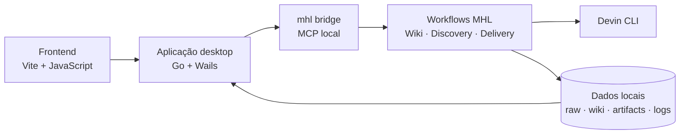

<p align="center">
  
</p>

# Senpai Refiner

Aplicação desktop para transformar documentos de negócio e engenharia em uma wiki rastreável e em artefatos estruturados de Discovery e Delivery.

O Senpai organiza o trabalho por **Oportunidade**, **Feature** ou **História**, usa LLM para extrair e sintetizar conhecimento e mantém o usuário no controle por meio de revisão antes da publicação dos artefatos.

## Principais recursos

- Ingestão de fontes em `.txt`, `.md` e `.pdf`.
- Wiki incremental organizada em fontes, entidades, conceitos e respostas arquivadas.
- Consulta e verificação de consistência da wiki com apoio de LLM.
- Geração guiada de brief, requisitos, ADRs, DER, diagramas, features e histórias.
- Revisão dos artefatos, solicitação de alterações e aprovação antes da gravação.
- Rastreabilidade por fonte, incluindo marcações explícitas de `gap` e `inferência`.
- Diagramas Mermaid renderizados também fora do aplicativo, sem dependência de rede.
- JSON estruturado como contexto semântico dos LLMs e HTML como apresentação no frontend.
- Métricas de tokens, cache e custo quando disponibilizadas pelo backend.
- Persistência de logs de execução, prompts e respostas para auditoria local.
- Exportação da wiki, dos artefatos completos ou de documentos individuais.

## Como funciona

1. Crie um work-item como Oportunidade, Feature ou História.
2. Adicione os documentos de origem na aba **Fontes**.
3. Faça a ingestão das fontes para construir a wiki do work-item.
4. Consulte ou verifique a wiki na aba **Wiki**.
5. Gere os artefatos disponíveis na ordem indicada pela interface.
6. Revise, aprove ou solicite alterações antes de persistir cada artefato.
7. Exporte o resultado quando estiver pronto.

### Artefatos por tipo de work-item

| Tipo | Pipeline |
| --- | --- |
| Oportunidade | Brief → Atributos de qualidade → Requisitos → ADRs / DER / Diagramas → Features → Dependências → Histórias |
| Feature | Brief opcional → Requisitos → ADRs / DER / Diagramas → Detalhamento da feature → Histórias |
| História | Brief opcional → Requisitos → ADRs / DER / Diagramas → Detalhamento da história |

ADRs, DER e diagramas podem ser opcionais em alguns fluxos de Delivery. A interface informa quais dependências são obrigatórias antes de cada geração.

## Arquitetura



Em produção, o backend de LLM suportado é o **Devin CLI**. O código contém adaptadores auxiliares para outros agentes usados no desenvolvimento, mas eles não são dependências obrigatórias do produto.

Cada tipo de resposta estruturada possui um contrato em JSON Schema. O adaptador normaliza a saída e o workflow faz o parse do JSON antes da renderização. Cada artefato novo é persistido em duas representações:

```text
artifacts/
├── requisitos.json   # fonte semântica usada como contexto pelos LLMs
└── requisitos.html   # documento apresentado no frontend e exportável
```

Projetos antigos que possuem somente HTML continuam funcionando; o leitor de contexto usa HTML como fallback até que o artefato seja regenerado.

## Estrutura do repositório

```text
.
├── app/                  # aplicação Go/Wails
│   ├── frontend/         # interface Vite em JavaScript
│   ├── mhlbridge/        # cliente e ciclo de vida do servidor MCP local
│   └── embedded/         # runtime MHL, workflows e assets embarcados
├── workflows/            # workflows MHL usados em desenvolvimento
│   ├── wiki/             # ingestão, consulta, lint e HTML estático
│   ├── discovery/        # pipeline de Oportunidade
│   ├── delivery/         # pipelines de Feature e História
│   └── shared/           # agentes, schemas, renderização e utilitários
├── scripts/              # verificação de ambiente e builds
└── assets/               # identidade visual e fontes de demonstração
```

## Pré-requisitos

Para executar e desenvolver o projeto:

- Go `1.26` ou compatível com [app/go.mod](app/go.mod).
- Node.js e npm.
- Wails v2 CLI compatível com a versão do módulo Go.
- Devin CLI instalado e autenticado.
- MHL CLI para alterar, validar ou testar os workflows.

Instale o Wails usado pelo projeto:

```bash
go install github.com/wailsapp/wails/v2/cmd/wails@v2.16.0
```

Valide o restante do ambiente a partir da raiz:

```bash
./scripts/check-devin-environment.sh
```

Se necessário, autentique o Devin:

```bash
devin auth login --force-manual-token-flow
```

## Desenvolvimento local

Instale as dependências do frontend:

```bash
cd app/frontend
npm install
```

Inicie o aplicativo com hot reload:

```bash
cd app
wails dev
```

Durante o desenvolvimento, a aplicação prefere a árvore `workflows/` do checkout. O runtime MHL é embarcado no binário. Caso a versão local do MHL seja atualizada, sincronize o runtime da plataforma atual:

```bash
cd app
bash embedded/sync-dev-mhl.sh
```

## Validação

Depois de alterar os workflows, execute na raiz:

```bash
mhl lint workflows
mhl test workflows
```

Depois de alterar o backend Go/Wails:

```bash
cd app
go test ./...
go vet ./...
```

Depois de alterar o frontend:

```bash
cd app/frontend
npm run lint
npm run build
```

## Build

Para um build Wails da plataforma atual:

```bash
cd app
wails build
```

O script abaixo executa o ciclo completo usado no ambiente de desenvolvimento principal: testa e compila o runtime MHL, atualiza os recursos embarcados e gera o bundle do Senpai.

```bash
./scripts/build-all.sh --release
```

Esse script espera o código-fonte do runtime MHL em `MHL_RUNTIME_DIR` e permite configurar o executável do Wails com `WAILS`.

Para gerar o executável Windows x64:

```bash
./scripts/build-windows.sh
```

Detalhes sobre os binários e workflows embarcados estão em [app/embedded/README.md](app/embedded/README.md).

## Dados locais

Por padrão, o Senpai usa o diretório de configuração do usuário:

| Sistema | Diretório base |
| --- | --- |
| macOS | `~/Library/Application Support/senpai` |
| Windows | `%AppData%\senpai` |
| Linux | `$XDG_CONFIG_HOME/senpai` ou `~/.config/senpai` |

A variável `SENPAI_APPDATA_DIR` substitui esse diretório, sendo útil principalmente para testes e ambientes isolados.

Estrutura principal em disco:

```text
senpai/
├── settings.json
├── logs/app.log
├── state/
└── data/projects/<project_id>/
    ├── project.json
    ├── raw/
    ├── wiki/
    ├── artifacts/
    ├── usage.jsonl
    ├── prompt_log.jsonl
    └── run_logs/
```

Os prompts, respostas e documentos de origem podem conter informações sensíveis. Proteja o diretório de dados e não inclua segredos nas fontes ou instruções enviadas aos agentes.

## Convenções para contribuições

- Execute comandos gerais na raiz; comandos Go/Wails devem rodar em `app/`.
- Mantenha todo acesso em `projects/` restrito ao `project_id` recebido.
- Não grave segredos no repositório, em prompts ou em argumentos de linha de comando.
- Ao alterar `workflows/`, sincronize a cópia em `app/embedded/workflows/` antes de preparar uma release.
- Preserve o Devin como backend obrigatório de produção.

As instruções completas para agentes e contribuidores automatizados estão em [AGENTS.md](AGENTS.md).
