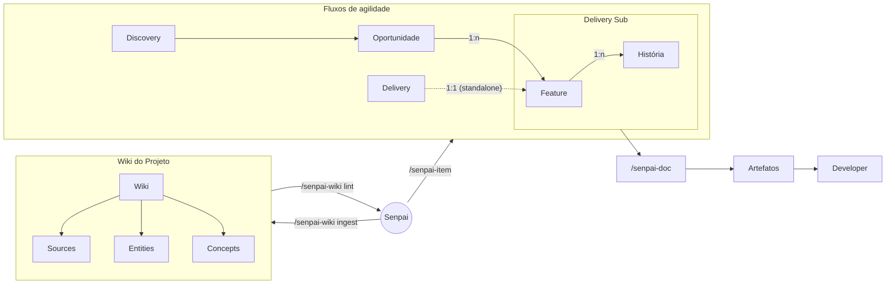

# Protocolo de Refinamento — Doc Senpai (Visão Geral)

> Consolidado a partir de 10 fotos de tela (`IMG_3743`–`IMG_3752`) da documentação interna:
> `hub-pages.cloud.itau.com.br/itau-ru2-doc-senpai/docs/senpai-refinamento/operacoes/protocolo`
> Página: "Protocolo de Refinamento | Doc Senpai"

## O que é o fluxo de refinamento

O refinamento no SENPAI é um processo iterativo organizado em dois níveis hierárquicos: **Discovery** (exploração estratégica) e **Delivery** (detalhamento técnico). Cada nível opera dentro de um workitem específico, com sua própria Wiki e conjunto de artefatos.

### Diagrama — Fluxos e agilidade

Transcrição textual (aproximada, para quem não visualiza Mermaid):

- **Discovery** → **Oportunidade** — relação `1:n` →
- **Delivery** → (`1:1`, standalone) → **Feature** — relação `1:n` → **História** (agrupados em "Delivery Sub")
- **Feature / História** → `/senpai-doc` → **Artefatos** → **Developer**
- **Senpai** ↔ (via `/senpai-item`) ↔ **Discovery / Delivery**
- **Wiki do Projeto**: **Wiki** → **Sources**, **Entities**, **Concepts**
- **Senpai** ↔ (via `/senpai-wiki ingest` / `/senpai-wiki lint`) ↔ **Wiki** (Sources / Entities / Concepts)

> A foto original está borrada nas linhas tracejadas e nos rótulos pequenos; a direção exata de algumas setas (especialmente `/senpai-item` e `/senpai-wiki lint`) é uma aproximação.

## Ciclos e Comandos

| Ciclo | O que faz | Comando |
|---|---|---|
| Gestão de Itens | Cria ou seleciona o contexto de trabalho ativo (Discovery ou Delivery) | `/senpai-item` |
| Ingestão | Alimenta a base de conhecimento com documentos externos (PDFs, transcrições, notas, e-mails) | `/senpai-wiki ingest` |
| Saneamento | Mantém a Wiki organizada, sem links quebrados ou contradições | `/senpai-wiki lint` |
| Geração | Produz artefatos de engenharia (Brief, Requisitos, Features, Histórias, DER, ADR, Diagramas) | `/senpai-doc` |

## Como funciona na prática

### 1. Defina o contexto ativo

Tudo parte de um **item de trabalho ativo**. Sem ele, os comandos não sabem onde salvar as saídas nem qual conhecimento usar. Use `/senpai-item` para criar ou selecionar o item — pode ser uma Oportunidade (Discovery) ou uma Feature/História (Delivery).

O item ativo fica registrado no arquivo `docs/senpai.yml`. Todos os outros comandos leem esse arquivo para saber onde operar.

### 2. Alimente a Wiki

A **Wiki** (`docs/wiki/`) é a base da verdade do SENPAI. Use `/senpai-wiki ingest` para processar documentos externos: o agente lê o conteúdo, extrai entidades (pessoas, sistemas), conceitos (regras de negócio, termos de domínio) e cria páginas estruturadas na Wiki.

Quanto mais fontes ingeridas, mais rico será o conteúdo dos artefatos gerados. A ingestão é incremental — você pode adicionar documentos a qualquer momento.

### 3. Saneie a Wiki

Use `/senpai-wiki lint` periodicamente para detectar links quebrados, entidades duplicadas ou páginas sem conteúdo suficiente.

### 4. Gere artefatos

Com a Wiki populada, use `/senpai-doc` para produzir artefatos. O comando detecta o nível ativo e oferece os artefatos disponíveis para aquele contexto — cada artefato é derivado do conteúdo da Wiki e dos artefatos predecessores, garantindo rastreabilidade completa.

- **Sequência típica no Discovery:** `brief` → `attributes` → `requirements` → `adr` → `der` (opcional) → diagramas C4 → diagramas específicos → `features` → historias
- **Sequência típica no Delivery (Feature):** `brief` (opcional) → `requirements` → `adr` (opcional) → `der` (opcional) → diagramas → diagramas específicos → `feature` → historias
- **Sequência típica no Delivery (História):** `brief` (opcional) → `requirements` → `adr` (opcional) → `der` (opcional) → diagramas → historia

Para o protocolo completo com exemplos detalhados, consulte a página *Protocolo de Refinamento*.

### 5. Modo Buddy

Todos os comandos suportam a flag `-buddy`. No modo buddy, o agente pausa em cada ponto de decisão relevante para revisão humana antes de prosseguir.
*(o restante desta seção não aparece nas fotos)*

## Visão geral do que será construído

### Discovery — Oportunidade

| # | Etapa | Comando | Status |
|---|---|---|---|
| 1 | Criar a Oportunidade | `/senpai-item` | ✅ |
| 2 | Ingerir documentos | `/senpai-wiki ingest` | ✅ |
| 3 | Gerar o Brief | `/senpai-doc brief` | ✅ |
| 4 | Gerar os Atributos de Qualidade | `/senpai-doc atributos` | ✅ |
| 5 | Gerar os Requisitos de Negócio | `/senpai-doc requisitos` | ✅ |
| 6 | Gerar os ADRs do Discovery | `/senpai-doc adr` | ✅ |
| 7 | Gerar o DER | `/senpai-doc der` | — |
| 8 | Gerar os Diagramas C4 | `/senpai-doc diagramas` | ✅ |
| 9 | Gerar Diagramas Específicos | `/senpai-doc diagrama [file:Feature ou file:Historia]` | — |
| 10 | Gerar a Feature List | `/senpai-doc features` | ✅ |
| 11 | Gerar a Lista de Histórias | `/senpai-doc historias [file:Feature]` | ✅ |

### Delivery — Feature (Mode Standalone)

| # | Etapa | Comando | Status |
|---|---|---|---|
| 12 | Criar uma Feature | `/senpai-item` | ✅ |
| 13 | Gerar o Brief da Feature | `/senpai-doc brief` | — |
| 14 | Gerar os Requisitos da Feature | `/senpai-doc requisitos` | ✅ |
| 15 | Gerar os ADRs da Feature | `/senpai-doc adr` | — |
| 16 | Gerar o DER da Feature | `/senpai-doc der` | — |
| 17 | Gerar os Diagramas da Feature | `/senpai-doc diagramas` | ✅ |
| 18 | Gerar Diagramas Específicos | `/senpai-doc diagrama [file:Historia]` | — |
| 19 | Gerar o Detalhamento da Feature | `/senpai-doc feature` | ✅ |
| 20 | Gerar a Lista de Histórias | `/senpai-doc historias` | ✅ |

### Delivery — História (Mode Standalone)

| # | Etapa | Comando | Status |
|---|---|---|---|
| 21 | Criar uma História | `/senpai-item` | ✅ |
| 22 | Gerar o Brief da História | `/senpai-doc brief` | — |
| 23 | Gerar os Requisitos da História | `/senpai-doc requisitos` | ✅ |
| 24 | Gerar os ADRs da História | `/senpai-doc adr` | — |
| 25 | Gerar o DER da História | `/senpai-doc der` | — |
| 26 | Gerar os Diagramas da História | `/senpai-doc diagramas` | ✅ |
| 27 | Gerar o Detalhamento da História | `/senpai-doc historia` | ✅ |

> "Status ✅" indica que a etapa aparecia marcada como concluída nas fotos originais; "—" indica que não havia marcação visível.

## Tabela de artefatos gerados (caminhos de saída)

Trecho parcial capturado nas fotos — nem todas as linhas da tabela original (etapas 1, 2, 12–18, 21–26) foram fotografadas:

| # | Nível | Artefato | Caminho |
|---|---|---|---|
| 3 | Discovery | Brief | `output/artifacts/brief.md` |
| 4 | Discovery | Atributos | `output/artifacts/atributos.md` |
| 5 | Discovery | Requisitos | `output/artifacts/requisitos.md` |
| 6 | Discovery | ADRs | `output/artifacts/adr/` |
| 7 | Discovery | DER | `output/artifacts/der.md` |
| 8 | Discovery | Diagramas C4 | `output/artifacts/diagrams/` |
| 9 | Discovery | Diagramas Específicos | `output/artifacts/diagrams/` |
| 10 | Discovery | Features | `output/artifacts/features.md` |
| 11 | Discovery | Histórias | `output/artifacts/historias.md` |
| 19 | Delivery / Feature | Detalhamento Feature | `output/artifacts/feature-detail/` |
| 20 | Delivery / Feature | Histórias | `output/artifacts/historias.md` |
| 27 | Delivery / História | Detalhamento História | `output/artifacts/historia.md` |

## Etapa 1 — Criar a Oportunidade

A página segue com o detalhamento passo a passo de cada uma das 27 etapas acima (começando pela Etapa 1), mas o conteúdo dessas seções não aparece em nenhuma das fotos disponíveis.

---

## Lacunas conhecidas (não cobertas pelas fotos)

- Final da seção "5. Modo Buddy".
- Tabela de artefatos completa: linhas das etapas 1, 2, 12–18 e 21–26.
- Detalhamento individual de cada etapa (a partir de "Etapa 1 — Criar a Oportunidade" em diante).
