# HOW IT WORKS — Anatomia do motor Radahn

Este documento explica, em detalhe, **como o código do Radahn funciona por dentro** — do
`main.go` até o processamento de cada skill. O objetivo é permitir que engenheiros entendam o
fluxo completo e consigam **contribuir com segurança**.

Para o guia de uso (esquema do `radahn.yaml`, exemplos), veja [`README.md`](README.md).
Para o fluxo de contribuição, veja [`CONTRIBUTING.md`](CONTRIBUTING.md).

---

## Sumário

- [1. Visão geral da arquitetura](#1-visão-geral-da-arquitetura)
- [2. Ciclo de vida do processo (`main.go`)](#2-ciclo-de-vida-do-processo-maingo)
- [3. Camada de configuração (`internal/config`)](#3-camada-de-configuração-internalconfig)
- [4. Camada de workflow (`internal/workflow`)](#4-camada-de-workflow-internalworkflow)
  - [4.6 Workers em segundo plano (`spec.workers`)](#46-workers-em-segundo-plano-specworkers)
- [5. O Engine (`engine/engine.go`)](#5-o-engine-engineenginego)
- [6. Ciclo de vida de uma requisição](#6-ciclo-de-vida-de-uma-requisição)
  - [6.4 O runtime de workers (`engine/workers.go`)](#64-o-runtime-de-workers-engineworkersgo)
- [7. Skills (`engine/skills.go` + `engine/skills/`)](#7-skills-engineskillsgo--engineskills)
- [8. Interpolação e JSONPath (`engine/interpolate.go`)](#8-interpolação-e-jsonpath-engineinterpolatego)
- [9. Camada de banco (`engine/db.go`)](#9-camada-de-banco-enginedbgo)
- [10. Escrita da resposta HTTP](#10-escrita-da-resposta-http)
- [11. Trace ponta a ponta](#11-trace-ponta-a-ponta)
- [12. Concorrência e ciclo de vida](#12-concorrência-e-ciclo-de-vida)
- [13. Como adicionar uma nova skill](#13-como-adicionar-uma-nova-skill)
- [14. Índice de arquivos e funções](#14-índice-de-arquivos-e-funções)

---

## 1. Visão geral da arquitetura

O Radahn é um **interpretador**: lê um documento declarativo (`radahn.yaml`) e serve rotas HTTP,
executando um **pipeline de steps** por rota. Não há código por caso de uso — o comportamento
vem do YAML + de um motor genérico.

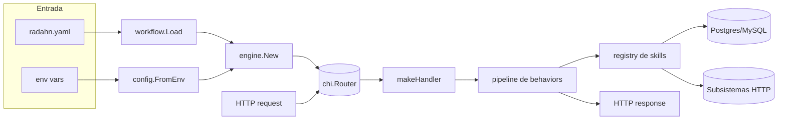

Pacotes (Go module `radahn`):

| Pacote | Papel |
|--------|-------|
| `cmd/radahn` | `main.go` — entrypoint, servidor HTTP, shutdown |
| `internal/config` | resolve configuração a partir de variáveis de ambiente |
| `internal/workflow` | modelo do `ApplicationWorkflow` + loader/validação do YAML |
| `engine` | roteamento, pipeline, hooks de ciclo de vida, interpolação, banco |
| `engine/skills/*` | implementações de skills em sub-pacotes (`skills`, `http`, `database`, `cache`, `aws`, `system`) |

> **Nota:** a árvore ativa é `app/engine/` (skills recebem `skillctx.Context`). A antiga
> `app/internal/engine/` foi **removida**.

---

## 2. Ciclo de vida do processo (`main.go`)

`@cmd/radahn/main.go` é curto e orquestra o startup:

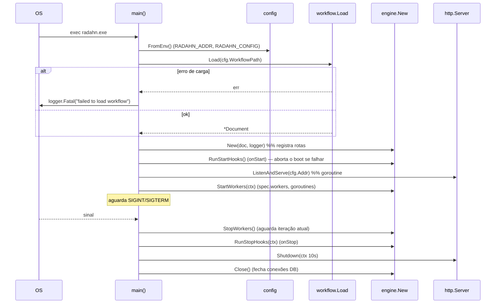

Pontos-chave do código:
- O logger (`app/internal/logging`, adapter sobre zerolog) emite **uma linha JSON por evento**, com
  `tool: "radahn"`, `level`, `timestamp` (RFC3339) e campos estruturados (`component`, `phase`,
  `worker`, ...). O motor só conhece a interface `engine.Logger` (`app/engine/logger.go`).
  Ver `docs/HOW-TO-OBSERVE.md` §2 e o playbook em `../agent/radahn-agent.md`.
- **Fail-fast no startup:** se `workflow.Load` falhar, o processo emite uma linha `level: "fatal"`
  (`logger.Fatal("failed to load workflow", ...)`) e encerra com exit code 1.
- **Hooks `onStart`:** logo após `engine.New`, o `main` chama `eng.RunStartHooks()` **antes** de
  subir o servidor HTTP. Se um hook falhar (ex.: `onFailure: StopApplication`), o processo encerra
  com código != 0 e a porta HTTP **nunca** abre.
- O servidor sobe em uma **goroutine**; a `main` bloqueia em um canal aguardando sinal do SO.
- **Workers em segundo plano:** logo após subir o servidor, o `main` chama `eng.StartWorkers(ctx)`
  para iniciar os processos declarados em `spec.workers` (um por goroutine). Eles rodam **enquanto
  o servidor HTTP está exposto**. Ver seções [4.6](#46-workers-em-segundo-plano-specworkers) e
  [6.4](#64-o-runtime-de-workers-engineworkersgo).
- **Hooks `onStop` + shutdown gracioso:** ao receber `SIGINT`/`SIGTERM`, o `main` primeiro cancela
  o contexto dos workers e chama `eng.StopWorkers()` (aguarda a iteração em andamento terminar),
  **depois** executa `eng.RunStopHooks(ctx)` **antes** de `srv.Shutdown(ctx)` (timeout de 10s) e
  `eng.Close()` via `defer`. Ver seção [4.5](#45-hooks-de-ciclo-de-vida-spechooks).
- `ReadHeaderTimeout: 10s` protege contra clients lentos.

---

## 3. Camada de configuração (`internal/config`)

`@internal/config/config.go` centraliza a leitura do ambiente. **Nada sensível vem do YAML.**

- `FromEnv()` → `RADAHN_ADDR` (default `:8080`), `RADAHN_CONFIG` (default `radahn.yaml`).
- `PostgresDB()` → prefere `POSTGRES_DB_*`, cai para `DB_*`, default host `localhost`/port `5432`.
- `MySQLDB()` → prefere `MYSQL_DB_*`, cai para `DB_*`, default port `3306`.
- `HTTPAuthorize()` → `HTTP_AUTHORIZE_URL|CLIENT_ID|CLIENT_SECRET`.
- Helpers: `withDefault(key, def)` e `firstNonEmpty(values...)`.

A resolução `POSTGRES_*`/`MYSQL_*` com fallback para `DB_*` é o que permite um único workflow
apontar para dois bancos simultaneamente.

---

## 4. Camada de workflow (`internal/workflow`)

`@internal/workflow/model.go` define o **modelo** e o **loader**.

### 4.1 Modelo (structs)

```
Document  { Kind, Spec }
Spec      { RequiredSkills []string, Timezone, Hooks *Hooks,
            Workers map[string]WorkerCfg,
            Routes map[string]Route, Behaviors map[string][]Behavior }
Hooks     { OnStart []Behavior, OnStop []Behavior }
WorkerCfg { LoopWait string, BreakOnFailure bool }
Route     { Method, URL, QueryParameters []Param, PathParameters []Param }
Param     { Name, Type, Required, Default }
Behavior  { Name, Kind, CorrelatedFields, LogicalOperator, JsonValidation,
            MysqlQuery*, PostgresQuery*, HttpAuthorize*, HttpSearch*, HttpProblemDetailsResponse*,
            SqsGetMessages*, SqsDeleteMessage*, Command*, UnzipFile*, Parallel*,
            Fields[], OutputTransformer[], MergeLocalStore[], OnSuccess, OnFailure }
Query     { ResultType, SQL, Parameters[] }
```

Um `Behavior` carrega **todos** os blocos de config possíveis; apenas o correspondente ao `Kind`
é usado em runtime. Ponteiros (`*Query`, `*HttpSearch`, ...) permitem detectar "config ausente"
(`nil`).

### 4.2 Campos polimórficos (custom `UnmarshalYAML`)

Dois campos aceitam formas diferentes no YAML e têm decodificação custom:

**`OnSuccess`** — pode ser um escalar (`NextStep`/`Finish`) **ou** um mapa (`{localStore: nome}`):

```go
func (o *OnSuccess) UnmarshalYAML(value *yaml.Node) error {
    if value.Kind == yaml.ScalarNode { o.Action = value.Value; return nil }
    var m map[string]string; value.Decode(&m)
    if ls, ok := m["localStore"]; ok { o.Action = ActionLocalStore; o.LocalStore = ls }
    return nil
}
```

Constantes: `ActionNextStep = "NextStep"`, `ActionFinish = "Finish"`,
`ActionLocalStore = "localStore"`.

**`OnFailure`** — normaliza `statusCode` **e** `status` no mesmo campo, e converte tipos com
`toInt` (aceita int/int64/float64/string):

```go
if v, ok := m["statusCode"]; ok { o.StatusCode = toInt(v) }
if v, ok := m["status"];     ok { o.StatusCode = toInt(v) }
if v, ok := m["message"];    ok { o.Message = fmt.Sprint(v) }
```

### 4.3 Loader e validação

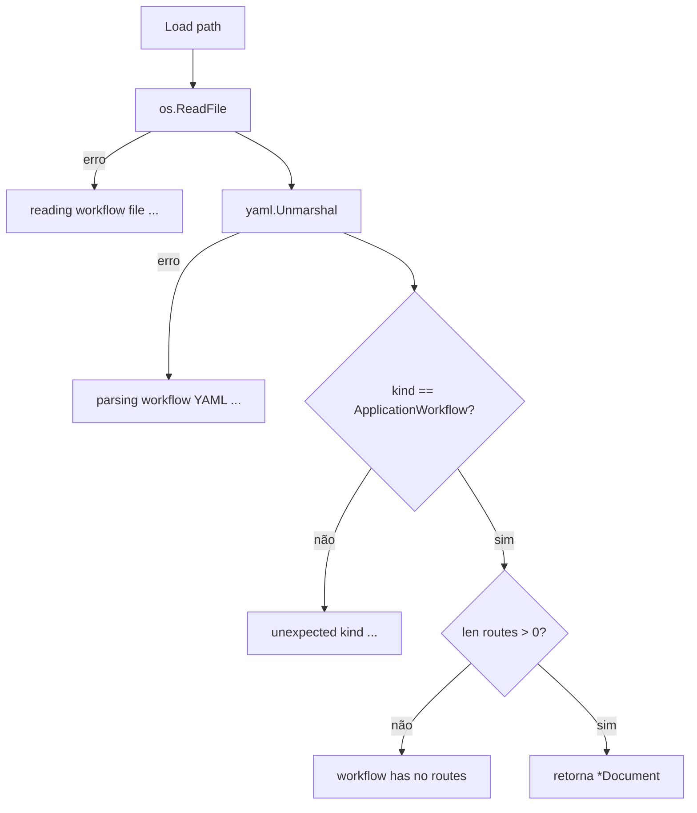

> **Nota de contribuição:** hoje a validação é mínima (kind + existência de rotas). Skills e
> campos inválidos só falham em runtime. Endurecer o loader (validação de esquema no startup) é
> um item de roadmap.

### 4.4 `Behavior.Transformer()`

Helper que aceita `outputTransformer:` **ou** `fields:` como fonte do mapeamento (retorna o
primeiro não vazio). É o que permite as duas grafias no YAML.

### 4.5 Hooks de ciclo de vida (`spec.hooks`)

`spec.hooks` declara pipelines executados **fora de qualquer requisição HTTP**, reutilizando a
mesma maquinaria de skills:

- **`onStart`** — roda no boot, logo após `engine.New` e **antes** do servidor HTTP subir.
- **`onStop`** — roda no desligamento gracioso (`SIGINT`/`SIGTERM`), **antes** do `srv.Shutdown`.

```yaml
spec:
  hooks:
    onStart:
      - name: PreparaCertificados
        kind: Command
        command:
          - "update-ca-certificates 2>/dev/null"
        onSuccess: NextStep
        onFailure: StopApplication
      - name: ExtraiPacote
        kind: UnzipFile
        unzipFile: { from: certs.zip, to: /opt/certs }
        onSuccess: Finish
        onFailure: StopApplication
    onStop:
      - name: Desligamento
        kind: Command
        command: ["echo bye"]
        onSuccess: Finish
```

Características do runner (`engine/hooks.go`, `RunStartHooks`/`RunStopHooks` → `runHookPipeline`):

- Executa com uma **sessão sintética** (sem body/params de rota); skills que dependem da
  requisição não fazem sentido em hooks.
- Fluxo idêntico ao de rotas: `onSuccess: NextStep | Finish | { localStore }`. O mesmo teto
  anti-loop de 100 execuções se aplica.
- **`onFailure: StopApplication`** é um statement **exclusivo de hooks**: aborta o hook e, no
  `onStart`, encerra o processo (boot falha, HTTP não sobe). `onFailure: <step>` redireciona para
  outro step; sem destino, a falha aborta o hook.

As skills `Command` (shell) e `UnzipFile` (extração de zip) foram criadas para hooks, mas são
skills normais do `registry` e também podem ser usadas em rotas.

### 4.6 Workers em segundo plano (`spec.workers`)

`spec.workers` declara **processos contínuos** que rodam em segundo plano **enquanto o servidor
HTTP está exposto**. Cada chave **deve casar** com um pipeline homônimo em `spec.behaviors`; o
motor executa esse pipeline **em loop**, reutilizando a mesma maquinaria de skills das rotas
(`runPipeline` — ver [6.4](#64-o-runtime-de-workers-engineworkersgo)).

```yaml
spec:
  workers:
    consolidarPosicoesRendaFixa:
      loopWait: "5s"           # duração Go (obrigatória e positiva): "500ms", "1m", ...
      breakOnFailure: false    # false (default): loga a falha e continua; true: para o worker
  behaviors:
    consolidarPosicoesRendaFixa:
      - name: ObterMensagens
        kind: SqsGetMessages
        sqsGetMessages: { queueUrl: "...", maxNumberOfMessages: 10, putInto: $mensagens }
        onSuccess: NextStep
        onFailure: { statusCode: 500, message: "falha ao consumir" }
      # ... ForEach + processamento ...
```

- **`loopWait`** (obrigatório) é o intervalo entre iterações; um valor ausente/inválido/não
  positivo faz o `Validate()` do documento falhar no boot.
- **`breakOnFailure`**: `true` para o worker na primeira iteração que falha; `false` (default)
  apenas loga e aguarda `loopWait` para a próxima iteração.
- A validação (`Validate` em `model.go`) garante que todo worker tem um behavior correspondente e
  que `loopWait` é uma duração válida.

---

## 5. O Engine (`engine/engine.go`)

### 5.1 Estruturas centrais

```go
type Engine struct {
    doc    *workflow.Document
    router chi.Router
    db     *dbManager
    http   *http.Client   // timeout 30s, compartilhado
    log    Logger         // interface: Event (ciclo de vida) + Line (log de step)
}

type session struct {
    vars          map[string]interface{} // $codigoCliente, $accessToken, ...
    data          interface{}            // "resultado atual" que flui entre steps
    store         map[string]interface{} // acumulador de localStore p/ MergeLocalStore
    respHeaders   map[string]string      // headers de resposta acumulados
    successStatus int                    // status custom (HttpStatusCodeResult)
}

// As skills recebem um skillctx.Context (não o *Engine diretamente), evitando
// import cycles entre o engine e os sub-pacotes de skills.
type skillFunc func(ctx skillctx.Context, b *workflow.Behavior) (bool, error)
```

- **`Engine`** é criado uma vez e é **compartilhado** por todas as requisições.
- **`session`** é criada **por requisição** — todo o estado mutável do pipeline vive aqui.
- **`skillFunc`** é o contrato de toda skill: retorna `(success, err)`.
  - `err != nil` → log `skill error` + `onFailure`.
  - `success == false` (sem erro) → `onFailure` (validação reprovada).
  - `success == true` → segue o `onSuccess`.

### 5.2 `New` e registro de rotas

`New` monta o `Engine` e chama `registerRoutes`, que:

1. Registra sempre `GET /healthz`.
2. Para cada rota no `doc.Spec.Routes`:
   - **Remove a query string** da URL (só o *path* participa do roteamento):
     `if i := strings.IndexByte(path, '?'); i >= 0 { path = path[:i] }`.
   - Converte `$var` → `{var}` (padrão do chi) via regex `namedVar`.
   - Resolve o método (default `GET`).
   - Cria o handler com `makeHandler(name, route, behaviors)`.
   - Loga `route registered: GET /... (nome, N steps)`.

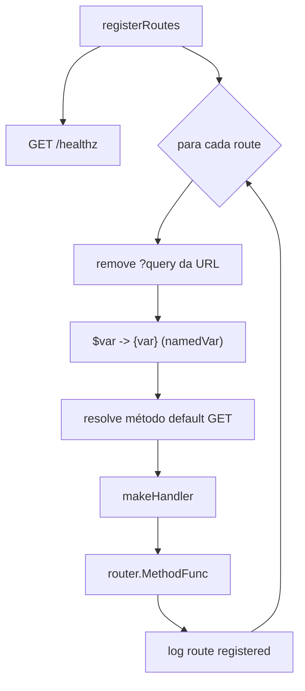

---

## 6. Ciclo de vida de uma requisição

O coração do motor é `makeHandler`. Ele cria a `session`, resolve os parâmetros e roda o
**loop de steps**.

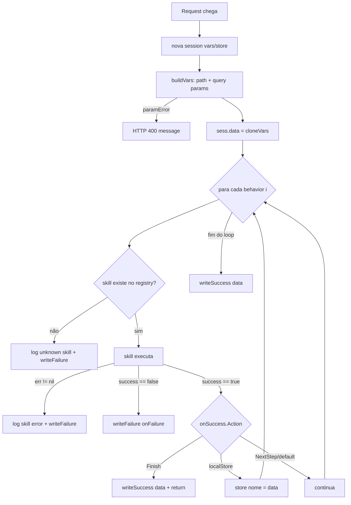

### 6.1 `buildVars` — resolução de parâmetros

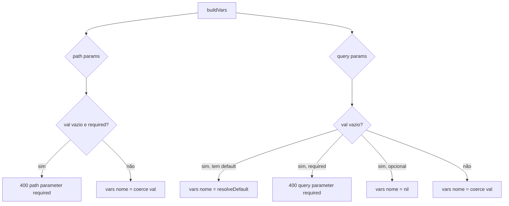

Detalhes importantes:
- **`coerce(val, typ)` é hoje um no-op**: retorna a string como está. O `type` do parâmetro é
  informativo; os valores fluem como **string** (facilita interpolação). Este é o ponto natural
  para evoluir validação/normalização por tipo.
- **`resolveDefault`**: se `default == "today"`, resolve para início do dia (`00:00:00`) ou fim
  do dia (`23:59:59`) quando o nome do parâmetro contém `final`/`fim`/`end`. Formato
  `2006-01-02 15:04:05`. Qualquer outro `default` é usado literalmente.
- **`sess.data = cloneVars(sess.vars)`**: o *input* do **primeiro step** é uma cópia do mapa de
  variáveis de entrada. Assim, um `OutputTransformer` logo no início pode mapear parâmetros.

### 6.2 O loop de steps (`runPipeline`)

`makeHandler` delega a execução ao método `runPipeline(ctx, steps, execCount)`, que roda o
**loop de steps** e devolve um `pipelineResult` (sucesso, falha com/sem `statusCode`, estouro do
anti-loop, ou `kind` desconhecido). O handler traduz esse resultado na resposta HTTP (preservando
o envelope de `debug`). Para cada `behavior`:
1. Incrementa o **contador atômico** `execCount`; se passar de 100 → `pipelineResult{limitExceeded}`.
2. Se `b.Kind == "Parallel"` → chama `runParallel` (seção 6.3). Senão, busca a implementação em
   `registry[b.Kind]` (ausente → `unknownKind`) e executa via `executeWithRetry`.
   - `err` → log `skill error` + `onFailure`.
   - `!success` → `onFailure`.
3. Trata `b.OnSuccess.Action`:
   - `Finish` → encerra o pipeline (no topo → `writeSuccess`; dentro de branch → encerra a branch).
   - `localStore` → `sess.store[nome] = sess.data` e **continua**.
   - `NextStep`/vazio → **continua** (a `data` produzida pelo step vira input do próximo).
4. Ao terminar o loop sem `Finish`, retorna sucesso → `writeSuccess(sess.data)`.

> **Observação:** o resultado que "flui" é sempre `sess.data`. Skills de consulta/HTTP
> **substituem** `sess.data`; validações **não alteram** `sess.data` (apenas aprovam/reprovam);
> `MergeLocalStore` recompõe `sess.data` a partir do `store`.

### 6.3 O control step `Parallel` (`runParallel`, em `parallel.go`)

`Parallel` **não** é uma skill do `registry` — é um **control step** interceptado por `runPipeline`.
Ele executa `parallel.branches` (cada branch é um sub-pipeline ordenado) concorrentemente:

- Cada branch roda `runPipeline` sobre um **clone profundo** da sessão (`cloneSession`: `vars`,
  `data` e `store` são deep-copiados), garantindo isolamento — não há corrida de dados. Os clientes
  de infra (`*sql.DB`, AWS, Redis, `*http.Client`) são pools thread-safe e permanecem compartilhados.
- A concorrência é limitada por `maxConcurrency` (default = nº de branches) via um `semaphore.Weighted`
  (`golang.org/x/sync`). Com `failFast: true` (default), a primeira branch que falha cancela o
  contexto de aquisição, impedindo o início de branches ainda enfileiradas.
- O **teto anti-loop de 100 execuções** usa o **mesmo `*int32` atômico** do pipeline pai, então o
  fan-out não fura o limite.
- Ao fim (`sync.WaitGroup.Wait`), se alguma branch falhou, `runParallel` retorna `(false, err)` e o
  step cai no `onFailure` do `Parallel`. Caso contrário, os resultados (o `data` de cada branch, na
  ordem declarada) são consolidados por `consolidate.strategy`:
  - `object` (default): `{ "<branch>": <data>, ... }`.
  - `collect`: `[]interface{}` na ordem declarada.
  - `merge`: merge raso (arrays concatenam; chaves de objeto sobrescrevem na ordem das branches).
- O consolidado é gravado por `putInto` (vazio/`$` → `sess.data`; `$var` → variável de sessão).

### 6.4 O runtime de workers (`engine/workers.go`)

Os workers reaproveitam **o mesmo `runPipeline`** das rotas — não há um interpretador paralelo.
`engine/workers.go` só orquestra o **loop** e o ciclo de vida das goroutines:

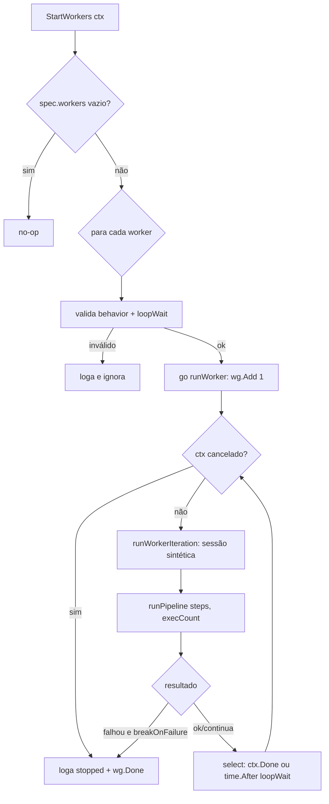

Pontos-chave (`StartWorkers`, `StopWorkers`, `runWorker`, `runWorkerIteration`):

- **Sessão sintética por iteração:** cada volta cria uma `session` nova (`vars`/`store` vazios,
  `successStatus = 200`, **sem** body/params de rota) — igual aos hooks. O resultado de uma
  iteração **não** vaza para a próxima.
- **Reuso total da API de pipeline:** `runWorkerIteration` chama `runPipeline`, então
  `onSuccess`/`onFailure`, `Finish`/`Continue`/`NextStep`/`localStore`, os control steps
  `ForEach`/`Parallel`, `retry` e o **teto anti-loop de 100 execuções por iteração** valem igual.
- **`breakOnFailure`:** o `pipelineResult` é inspecionado (`limitExceeded`, `unknownKind`,
  `failed`); qualquer falha loga e, se `breakOnFailure` for `true`, encerra o worker.
- **Parada graciosa:** `StartWorkers(ctx)` guarda um `workerHandle{ wg sync.WaitGroup }`.
  `runWorker` faz `select` entre `ctx.Done()` e `time.After(loopWait)`, então o cancelamento do
  contexto interrompe a espera. `StopWorkers()` faz `wg.Wait()`, bloqueando até todas as goroutines
  terminarem a **iteração corrente** — por isso o `main` chama `StopWorkers()` **antes** do
  `onStop`, garantindo que o hook de desligamento veja o processo já quiescente.
- **Ordem no ciclo de vida:** workers iniciam **depois** de `onStart` (que roda antes do servidor)
  e param **antes** de `onStop`.

---

## 7. Skills (`engine/skills.go` + `engine/skills/`)

### 7.1 O registry

O `registry` (em `engine/skills.go`) mapeia cada `Kind` para uma função implementada nos
sub-pacotes de `engine/skills/`:

```go
var registry = map[string]skillFunc{
    "LogicalOperator":   skills.LogicalOperator, // alias retrocompat: "StaticValidation"
    "EmptyValidation":   skills.EmptyValidation,
    "JsonValidation":    skills.JsonValidation,
    "OutputTransformer": skills.OutputTransformer,
    "MergeLocalStore":   skills.MergeLocalStore,
    "PostgresQuery":     dbskills.PostgresQuery,
    "MySqlQuery":        dbskills.MySQLQuery,
    "HttpAuthorize":     httpskills.Authorize,
    "HttpSearch":        httpskills.Search,
    // ... aws/cache skills ...
    "Command":           systemskills.Command,   // shell (hooks e rotas)
    "UnzipFile":         systemskills.UnzipFile,  // extração de zip
}
```

> `Parallel` **não** aparece no registry — é um control step interceptado por `runPipeline`.

Adicionar uma skill = adicionar uma entrada aqui + a função no sub-pacote adequado (seção 13).

### 7.2 Validações

**`StaticValidation`** — a expressão é a **condição de ERRO**.
- Divide em 3 tokens (`strings.Fields`): `lhs op rhs`. Se não tiver 3 → erro
  `unsupported staticValidation expression`.
- Resolve `lhs`/`rhs` com `resolveVar` ($var ou literal).
- `errCondition := compareValues(lhs, rhs, op)` → retorna `!errCondition` (true = passou).
- Expressão vazia → passa.

**`EmptyValidation`** — `return !isEmpty(s.data), nil`. `isEmpty` cobre `nil`, string vazia,
slice/map vazios e zero numérico.

**`JsonValidation`** — serializa `s.data`, valida contra o JSON Schema embutido
(`gojsonschema`). Se inválido, junta as mensagens em `s.vars["jsonValidationErrors"]` e retorna
`(false, nil)` → cai no `onFailure` (você pode usar `message: $jsonValidationErrors`).

### 7.3 Banco de dados

`skillPostgresQuery` e `skillMySQLQuery` seguem o mesmo esqueleto:

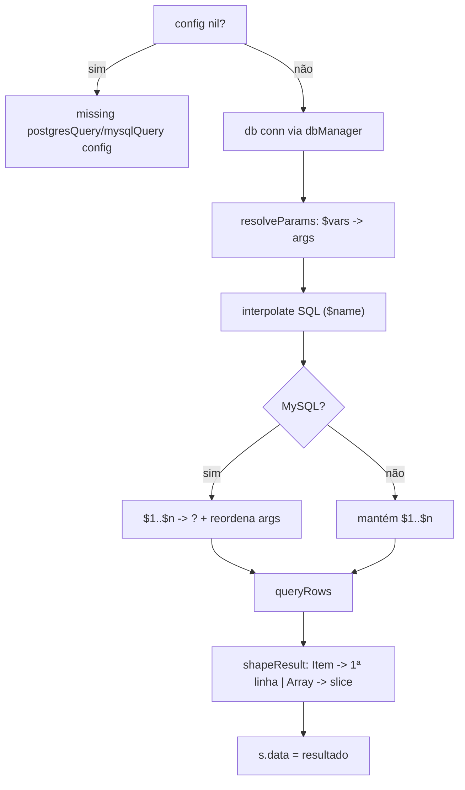

Detalhes:
- **`resolveParams`** transforma a lista `parameters:` (`$codigoCliente`, ...) nos `args`
  posicionais passados ao driver.
- **`interpolate` no SQL** substitui `$name` (letras) — os placeholders `$1..$n` **não** são
  tocados (o regex exige início com letra). Postgres usa `$1..$n` nativamente; MySQL reescreve
  para `?` via `mysqlPlaceholders`.
- **Segurança:** `parameters` viram *bind parameters* (seguros). Já `$name` interpolado
  diretamente no texto do SQL é **substituição textual** — não use `$name` para injetar valores
  de usuário no corpo do SQL; use a lista `parameters` + `$1..$n`.
- **`shapeResult`**: `Item` → primeira linha (ou `nil` se vazio); `Array` → `[]interface{}`.

### 7.4 HTTP (BFF)

**`HttpAuthorize`** (OAuth2 client_credentials):

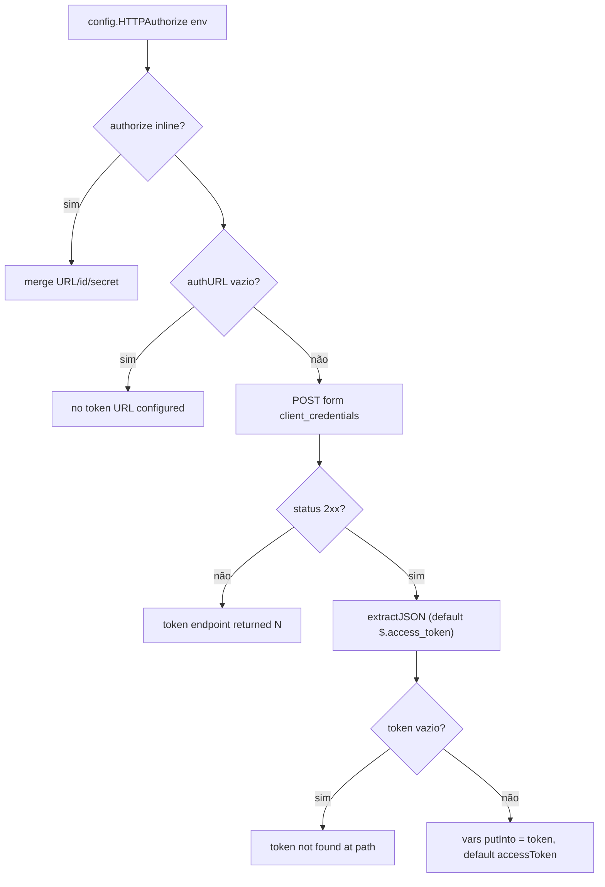

**`HttpSearch`** (consulta a subsistema):
- Método default `GET` (aceita `OPTIONS`).
- URL interpolada com **`interpolateURL`** (URL-encode dos valores — ex.: datas com espaço).
- `bearerToken` interpolado com `interpolate` → header `Authorization: Bearer ...`.
- `doHTTP` executa; status fora de 2xx → erro `HttpSearch: <M> <url> returned N`.
- `extractJSON(body, extractResult|"$")` → `s.data`. Opcional `putInto` também grava em `vars`.

**`doHTTP`** — usa o `*http.Client` compartilhado (timeout 30s), lê o corpo inteiro e retorna
`(body, status, err)`.

### 7.5 Transformação e agregação

**`OutputTransformer`** — aplica o mapeamento `from → to`:

```mermaid
flowchart TD
    A[Transformer mappings] --> B{tipo de s.data}
    B -->|[]interface{}| C[transforma cada elemento]
    B -->|[]map| D[transforma cada elemento]
    B -->|map| E[transforma o objeto]
    B -->|nil| F[não faz nada]
    B -->|outro| G["asMap(v) e transforma"]
    C --> H[novo []interface{}]
    D --> H
    E --> I[novo map]
```

`transformRecord` cria um **novo** map: para cada mapeamento, `getPath(rec, from)` (leitura por
caminho pontuado, ex.: `canal.codigo`) e, se existir, `setPath(out, to, val)` (escrita por
caminho pontuado, ex.: `meta.origem`, criando mapas intermediários). Campos ausentes são
simplesmente omitidos.

**`MergeLocalStore`** — concatena os valores previamente guardados no `store`:
- `[]interface{}` → espalhado (`append(merged, t...)`).
- `[]map[string]interface{}` → cada elemento adicionado.
- qualquer outro (ex.: um **objeto** guardado) → adicionado como **um elemento**.
- Resultado vira `s.data` (sempre um `[]interface{}`).

**`StringOperator`** — aplica uma cadeia de transformações de texto declaradas no YAML.

```mermaid
flowchart TD
    A[ResolveExtract(extractFrom)] -->|nil| B["\"\""]
    A -->|valor| C[fmt.Sprint]
    B --> C
    C --> D[para cada operation]
    D --> E{function?}
    E -->|trim/lower/upper| F[strings.*]
    E -->|substring/lpad/rpad| G[operação por runas]
    E -->|replace/regex*| H[replaceAll/regexp.ReplaceAll]
    E -->|split/contains| I[strings.Split/Contains]
    F --> J[SetData + SetVar putInto]
    G --> J
    H --> J
    I --> J
```

- Implementação em `engine/skills/string_operator.go` (`StringOperator`, `applyStringOperation`, `normalizeArgs`, `padString`).
- O registro do `kind: StringOperator` fica em `engine/skills.go`; a config (`StringOperatorCfg`/`StringOperation`) vive em `internal/workflow/model.go`.
- `StringOperator` valida a configuração, resolve `extractFrom` com `ctx.ResolveExtract` e converte `nil` para string vazia antes de iniciar a cadeia.
- `normalizeArgs` converte cada `args` do YAML para `[]string`; `applyStringOperation` despacha por `function` e valida o número mínimo de argumentos.
- `substring` e `lpad`/`rpad` trabalham em `[]rune`; `substring` trunca índices fora dos limites (incluindo negativos) e `lpad`/`rpad` usam a primeira runa do `padString`.
- O resultado final vira `s.data` e, quando `putInto` está presente, também é gravado em `vars`.

### 7.6 Helpers de comparação/tipos

- `compareValues(a,b,op)`: `==` compara via `fmt.Sprint`; senão tenta **float**, depois **time**
  (`timeFormats`), e por fim **string** lexicográfica.
- `compareOrdered`/`compareStrings`: operadores `>`, `<`, `>=`, `<=` e aliases `gt`, `gte`, `lte`.
- `toFloat`/`toTime`: coerção tolerante (string→float; string→time em múltiplos formatos).
- `isEmpty`, `asMap`, `firstNonEmpty`: utilidades de dados.

### 7.7 Mensageria AWS (SQS) e o padrão *delete-after-processing*

As skills SQS vivem em `engine/skills/aws/` e usam o **AWS SDK for Go v2**. O client é obtido via
`ctx.AWS().SQS(...)`; credenciais/região vêm da cadeia padrão da AWS (`AWS_*`) e o endpoint pode
ser sobrescrito por `SQS_ENDPOINT` (emuladores/mocks). **Nada sensível vem do YAML.**

- **`SqsGetMessages`** (`sqs_get_messages.go`) — faz `ReceiveMessage` e grava em `s.data` um
  **array** de `{messageId, receiptHandle, body}` (também em `putInto`, opcional), pronto para um
  `ForEach`. `maxNumberOfMessages` (1..10, default 1), `waitTimeSeconds` (long polling 0..20) e
  `visibilityTimeout` são repassados ao SDK. `deleteAfterRead: true` deleta cada mensagem logo
  após a leitura (ack imediato); um poll vazio **sucede** com array vazio.
- **`SqsDeleteMessage`** (`sqs_delete_message.go`) — faz `DeleteMessage` de **uma** mensagem pelo
  `receiptHandle` (aceita literal, `$var` ou `$.jsonpath` como `$.receiptHandle`, resolvido por
  `ctx.ResolveExtract`). `queueUrl`/`receiptHandle` vazios falham o step.

**Padrão *delete-after-processing* (ack só após sucesso):** deixe `deleteAfterRead: false` no
`SqsGetMessages`, itere com `ForEach` e, **depois** do processamento bem-sucedido de cada item,
chame `SqsDeleteMessage` com `receiptHandle: $.receiptHandle`. Assim, se o processamento falhar,
a mensagem **não** é removida e volta a ficar visível na fila (após o `visibilityTimeout`) para
uma nova tentativa. É o modo típico de um `spec.workers` consumidor de fila.

---

## 8. Interpolação e JSONPath (`engine/interpolate.go`)

- **`namedVar`** = regex `\$([A-Za-z_][A-Za-z0-9_]*)` — casa `$nome`, **nunca** `$1` posicional.
- **`interpolate(s, vars)`** — substitui `$nome` pelo `fmt.Sprint(valor)`. Variável desconhecida
  fica intacta.
- **`interpolateURL(s, vars)`** — igual, mas aplica `url.QueryEscape` em cada valor (URLs válidas).
- **`resolveVar(token, vars)`** — se começa com `$nome`, retorna o valor da variável (ou `nil`);
  senão retorna o literal (sem aspas). Usado por SQL params e StaticValidation.
- **`jsonPathToGjson(path)`** — converte `$`/`$.a.b` para o dialeto do `gjson` (`@this`, `a.b`).
- **`extractJSON(raw, path)`** — aplica o path com `gjson.GetBytes`; `!Exists()` → `nil`.
- **`getPath(record, path)`** / **`setPath(dst, path, value)`** — leitura/escrita por caminho
  pontuado em `map[string]interface{}` (suporta aninhamento como `canal.codigo`, `meta.origem`).

> **Encoding:** o Go trabalha com strings UTF-8 e o `writeJSON` emite UTF-8. Mojibake em terminal
> costuma ser artefato do cliente (ex.: `python -m json.tool` no Windows lendo stdin como cp1252),
> não do motor.

---

## 9. Camada de banco (`engine/db.go`)

- **`dbManager`** mantém um `map[string]*sql.DB` protegido por `sync.Mutex`. `get(key, dsnFn)`
  abre a conexão **sob demanda** e **cacheia** (`postgres`/`mysql`). Faz `Ping` na abertura.
- **DSNs**: Postgres `host=.. port=.. dbname=.. user=.. password=.. sslmode=<DB_SSL_MODE>`; MySQL `user:pass@tcp(host:port)/db?parseTime=true&tls=<DB_SSL_MODE>` (fallback para MySQL é `MYSQL_DB_SSL_MODE`). `DB_SSL_MODE` é compartilhado entre os drivers; `POSTGRES_DB_SSL_MODE` e `MYSQL_DB_SSL_MODE` fazem override. Valores são textos passados diretamente: Postgres (`disable`, `allow`, `prefer`, `require`, `verify-ca`, `verify-full`) e MySQL (`true`, `false`, `skip-verify`, `preferred`). É responsabilidade do autor informar um valor válido.
- **`queryRows`**: executa a query e escaneia cada linha genericamente:

```go
holders := make([]interface{}, len(cols))
ptrs := make([]interface{}, len(cols))
for i := range holders { ptrs[i] = &holders[i] }
rows.Scan(ptrs...)
// rec[col] = normalizeValue(holders[i])
```

- **`normalizeValue`**: converte `[]byte` (texto de driver) em `string` — evita que colunas de
  texto virem base64 no JSON.
- **`mysqlPlaceholders`**: regex `\$(\d+)` reescreve `$1..$n` para `?` e **reordena** os args na
  ordem de aparição no SQL.

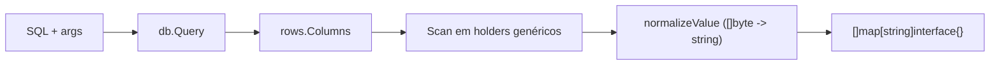

---

## 10. Escrita da resposta HTTP

Três funções em `engine.go`:

- **`writeJSON(w, status, body)`** — seta `Content-Type: application/json; charset=utf-8`,
  escreve o status e codifica o corpo.
- **`writeSuccess(w, data)`** — `data == nil` → `200 {}`; senão `200 <data>`.
- **`writeFailure(w, b, sess)`** — status do `onFailure` (default `500`); se `204` **ou**
  mensagem vazia → só o header (corpo vazio); senão `{"message": <interpolada>}` (interpola com
  `sess.vars`).

Mapa de status resultante:

| Origem | Status |
|--------|--------|
| parâmetro required ausente / StaticValidation | `400` |
| EmptyValidation configurada com 404/204 | `404`/`204` |
| JsonValidation | `422` (por convenção do YAML) |
| erro de skill / default de `onFailure` | `500` |
| `Finish` ou fim do pipeline | `200` |

---

## 11. Trace ponta a ponta

Exemplo (baseado no cenário 3, resumido): `GET /clientes/{id}/termos-assinados`.

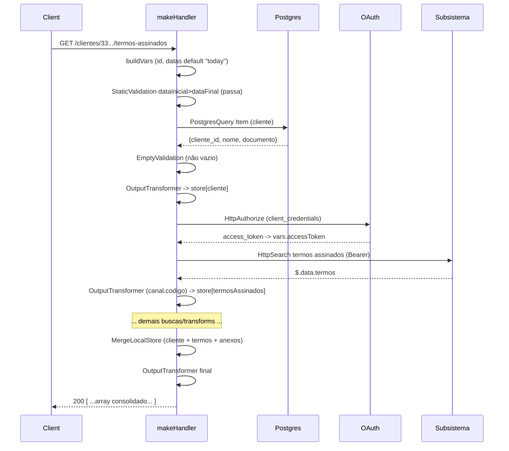

---

## 12. Concorrência e ciclo de vida

- **Compartilhado entre requisições:** `Engine`, `chi.Router`, `*http.Client` e o pool de
  conexões (`*sql.DB` é seguro para uso concorrente). Não guardam estado por requisição.
- **Por requisição:** a `session` (`vars`/`data`/`store`) é criada em `makeHandler` e não é
  compartilhada — o pipeline é sequencial e single-goroutine por request.
- **Workers em segundo plano:** cada worker roda em sua própria goroutine (iniciada por
  `StartWorkers`) com uma `session` sintética **por iteração** — o mesmo isolamento de uma
  requisição. Os clientes de infra (DB/AWS/Redis/HTTP) são pools thread-safe compartilhados.
  `StopWorkers` (via `sync.WaitGroup`) garante o encerramento gracioso antes do `onStop`.
- **Cuidado ao contribuir:** não adicione estado mutável de request no `Engine`; use a `session`.
  Skills devem ser **stateless** além do que recebem via `session` (vale para rotas, hooks e workers).
- **Recursos externos:** conexões DB são lazy e cacheadas; fechadas no `eng.Close()` (shutdown).

---

## 13. Como adicionar uma nova skill

Exemplo: uma skill hipotética `HttpCommand` (POST/PUT/PATCH/DELETE).

1. **Modelo** (`internal/workflow/model.go`): adicione o bloco de config no `Behavior`
   (ex.: `HttpCommand *HttpCommand \`yaml:"httpCommand"\``), a struct correspondente e registre o
   `Kind` em `knownSkills`.
2. **Implementação** (sub-pacote de `engine/skills/`, ex.: `engine/skills/http/`): escreva
   `func HTTPCommand(ctx skillctx.Context, b *workflow.Behavior) (bool, error)` seguindo o
   contrato — valide config (`nil` → erro), execute, atualize `ctx.SetData`/`ctx.SetVar`, retorne
   `(true, nil)` no sucesso ou `(false, nil)`/`(false, err)` na falha. Acesse o mundo externo
   **apenas** via `skillctx.Context` (nada de `os.Getenv`/DB/HTTP direto).
3. **Registro**: adicione `"HttpCommand": httpskills.HTTPCommand` no `registry` (`engine/skills.go`).
4. **Interpolação**: use `interpolate`/`interpolateURL`/`resolveVar` e `extractJSON` para manter
   consistência.
5. **Docs**: atualize `README.md` (catálogo de skills), este `HOW-IT-WORKS.md` e a base do agente
   `../agent/radahn-agent.md` (catálogo + gotchas).
6. **Testes/cenário**: adicione um cenário em `test/scenarioN/` e verifique ponta a ponta.

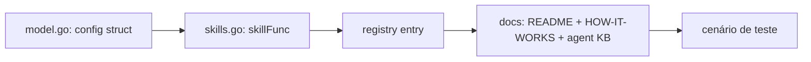

Regras de ouro para skills: **stateless**, sem segredos no YAML (use env via `config`), erros
claros (a mensagem aparece no log `[rota/step] skill error: ...`), e não faça a skill decidir o
status HTTP — isso é responsabilidade do `onFailure`.

---

## 14. Índice de arquivos e funções

| Arquivo | Símbolos principais |
|---------|---------------------|
| `cmd/radahn/main.go` | `main` (startup, `RunStartHooks`, servidor, `StartWorkers`/`StopWorkers`, `RunStopHooks`, shutdown) |
| `internal/config/config.go` | `FromEnv`, `PostgresDB`, `MySQLDB`, `HTTPAuthorize`, `withDefault`, `firstNonEmpty` |
| `internal/workflow/model.go` | `Document`, `Spec`, `Hooks`, `WorkerCfg`, `Route`, `Param`, `Behavior`, `SqsGetMessages`, `SqsDeleteMessage`, `CommandCfg`, `UnzipFile`, `Query`, `OnSuccess`/`OnFailure` (+`UnmarshalYAML`), `Load`, `Validate`, `Transformer` |
| `engine/engine.go` | `Engine`, `session`, `skillFunc`, `New`, `registerRoutes`, `makeHandler`, `runPipeline`, `buildVars`, `writeSuccess`, `writeFailure`, `writeJSON` |
| `engine/hooks.go` | `RunStartHooks`, `RunStopHooks`, `runHook`, `runHookPipeline` (statement `StopApplication`) |
| `engine/workers.go` | `StartWorkers`, `StopWorkers`, `runWorker`, `runWorkerIteration`, `workerHandle` (loop de `spec.workers` sobre `runPipeline`) |
| `engine/skills.go` | `registry` (mapeia `Kind` → função dos sub-pacotes) |
| `engine/skills/` | `skills` (gerais), `http`, `database`, `cache`, `aws` (`SqsGetMessages`, `SqsDeleteMessage`, ...), `system` (`Command`, `UnzipFile`) |
| `engine/skillctx/context.go` | interface `skillctx.Context` recebida por toda skill |
| `engine/interpolate.go` | `namedVar`, `interpolate`, `interpolateURL`, `resolveVar`, `jsonPathToGjson`, `extractJSON`, `getPath`, `setPath` |
| `engine/db.go` | `dbManager`, `postgres`, `mysql`, `get`, `Close`, `mysqlPlaceholders`, `queryRows`, `normalizeValue` |

Para o fluxo de contribuição (branches, PRs, versionamento), veja
[`CONTRIBUTING.md`](CONTRIBUTING.md).
