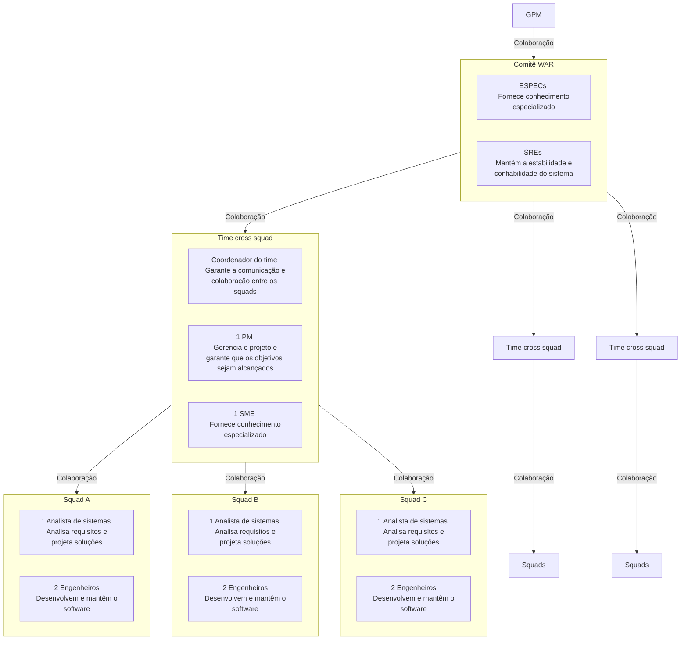

# TOPOLOGIA DE TIME no HLP method.

## Time cross squad
- Especialista: Responsável por fornecer conhecimento especializado em uma área específica, auxiliando na tomada de decisões técnicas.
- SRE: Responsável por manter a estabilidade e confiabilidade do sistema, monitorando e respondendo a incidentes.
- PM: Responsável por gerenciar o projeto, garantindo que os objetivos sejam alcançados dentro do prazo e orçamento.

## Squad
- Engenheiro: Responsável pelo desenvolvimento e manutenção do software, implementando novas funcionalidades e corrigindo
- Analista de sistemas: Responsável por analisar os requisitos do sistema, projetar soluções e garantir que o software atenda às necessidades do usuário.
- SME: Subject Matter Expert, responsável por fornecer conhecimento especializado em uma área específica, auxiliando na tomada de decisões técnicas.

## Topologia

1. **Time cross squad**: A topologia de time cross squad envolve a colaboração entre diferentes squads, permitindo que especialistas de diferentes áreas trabalhem juntos para alcançar objetivos comuns. Essa abordagem promove a troca de conhecimento e a resolução de problemas complexos.

2. **Squad**: A topologia de squad é composta por um grupo de profissionais com habilidades complementares, trabalhando juntos para desenvolver e manter o software. Cada membro do squad tem responsabilidades específicas, garantindo que todas as áreas do projeto sejam cobertas.

## Modelo de estrutura de time

