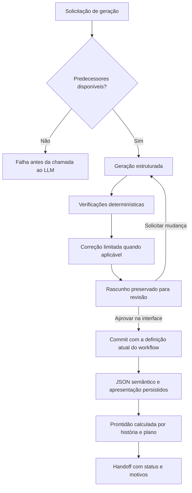

# IT26019 — Resposta técnica baseada na implementação atual do SENPAI

**Versão:** 1.0 — primeira versão para revisão dos inventores  
**Data:** 7 de outubro de 2026  
**Base de código:** `9c5678c83a9e52f9130d8a00718986cc60c81988` e arquivos presentes no checkout durante a análise  
**Documento respondido:** [IT26019 — Argumentos Técnicos](<IT26019 - Argumentos Tecnicos.pdf>), oito páginas  
**Objeto:** responder às perguntas técnicas, confrontar as teses com o software implementado e identificar características da versão atual que merecem exame específico.

## 1. Posição técnica

**A versão atual do SENPAI oferece evidências executáveis para uma defesa mais específica do que a apresentada no documento.** Há código e testes para avaliação determinística da prontidão de histórias, verificação de referências entre artefatos, cobertura dos critérios de aceitação por cenários e testes planejados, correção automática limitada, preservação de decisões entre gerações, recuperação de aprovações e transporte íntegro do conjunto de trabalho. Essas características podem ser descritas por estruturas de dados, algoritmos e transições observáveis, superando a limitação de uma descrição apenas funcional.

**A tese deve, entretanto, refletir o alcance real da implementação.** O checkout analisado corresponde ao SENPAI Refiner: um sistema de refinamento, revisão e preparação de especificações para desenvolvimento. Não foi localizado nele um executor que receba histórias aprovadas, implemente código em um repositório alvo, execute seus testes e avance autonomamente pelas dependências. Além disso, o handoff exporta histórias classificadas como `nao_pronta`, preservando seus bloqueios e orientando o consumidor a obter decisão humana antes de implementá-las. A rejeição explícita de uma feature é a exclusão implementada no pacote. [E01, E06]

Assim, a formulação atualmente demonstrável é:

> O SENPAI transforma fontes e decisões de engenharia em um conjunto persistente de especificações estruturadas; verifica relações entre requisitos, arquitetura, contratos, cenários e planos; utiliza os resultados dessas verificações para orientar uma correção automática limitada e uma revisão humana recuperável; e produz um pacote de desenvolvimento com rastreabilidade e prontidão explicitadas.

O núcleo técnico a destacar ao avaliador é a **combinação desses mecanismos sobre representações compartilhadas e persistidas**. A simples enumeração de agentes, templates, aprovações e pastas não captura o que o código efetivamente faz. Por outro lado, a existência dessa implementação, por si só, não demonstra que a combinação seja inédita ou inventiva frente a todo o estado da técnica. Este relatório fornece o suporte técnico para essa avaliação, sem antecipar sua conclusão.

## 2. Base da análise e força das evidências

A análise priorizou `workflows/`, o backend Go de `app/`, os módulos do frontend responsáveis por revisão e recuperação, os testes existentes e o histórico Git dos mecanismos relevantes. Foram conferidos também os textos publicados das três patentes citadas, nos pontos indicados na seção 7.

As referências **E01 a E24**, na seção 10, identificam arquivos, símbolos e linhas da versão examinada. O anexo de evidências registra hashes dos arquivos citados e resultados de validação. Os números de linha referem-se a este checkout; os hashes permitem reconhecer mudanças posteriores.

Foram adotados três níveis de afirmação:

| Nível | O que significa neste relatório |
|---|---|
| Demonstrado por código e teste | O comportamento tem implementação localizada e um teste pertinente executado nesta análise. |
| Demonstrado por inspeção | O caminho de código foi localizado, mas a experiência completa de uso ou integração não foi reproduzida. |
| Não demonstrado nesta análise | Não há suporte suficiente para a afirmação no material efetivamente examinado. Não equivale a afirmar que o recurso nunca existiu em outra versão. |

Nenhum work-item real foi acessado. Os testes de workflows foram executados em uma cópia temporária da árvore de fontes, com suas próprias fixtures sintéticas; os testes Go utilizam diretórios temporários. Não foram analisados logs de produção, dados de clientes ou métricas de projetos reais. Portanto, números de redução de custo, retrabalho ou falhas de produção não são atribuídos ao produto neste relatório.

Na abertura da análise havia uma alteração local no binário `app/embedded/bin/mhl-darwin-arm64` e o PDF de referência estava sem rastreamento Git. Essa condição importa para a reprodutibilidade: o teste Go usa o binário embarcado presente no checkout, enquanto os testes diretos de workflows usaram o MHL instalado, versão `1.5.0-alpha.2`. A comparação de conteúdo confirmou igualdade dos **136 arquivos** entre `workflows/` e `app/embedded/workflows/`.

## 3. Resposta ao Argumento 1: gateway e prontidão da especificação

### 3.1. O que está concretamente implementado

O controle atual distribui-se por mecanismos com funções distintas. Tratá-los como uma única aprovação global esconderia tanto seus méritos quanto seus limites.

| Mecanismo | Entrada e decisão | Efeito efetivamente implementado |
|---|---|---|
| Predecessores obrigatórios | `Require` verifica a disponibilidade do conteúdo exigido pela etapa. | A geração falha antes de chamar o LLM quando falta um predecessor obrigatório. |
| Revisão do rascunho | `ArtifactFlow` mantém `pending_data`; em modo Buddy, pausa antes do commit. | O usuário aprova ou solicita nova geração com feedback. A interface de artefatos fixa `buddy: true`. |
| Revisão de feature | `FeatureReview` persiste `pendente`, `aprovada` ou `rejeitada`. | Uma feature rejeitada impede geração e aprovação de suas histórias e planos; suas histórias ficam fora do handoff. |
| Definition of Ready | `Readiness` combina verificações da história e do plano e produz bloqueios e ressalvas. | Classifica cada história como `nao_pronta`, `pronta_com_ressalvas` ou `pronta`; o resultado acompanha a entrega. |
| Handoff | `Handoff.build` lê as histórias e sua prontidão. | Exporta também histórias não prontas de features não rejeitadas, com as razões correspondentes. |

**Evidências:** E01 a E06 e E23. Os testes de Discovery e Delivery verificam a falha por predecessor ausente; `FeatureReviewSpec` verifica rejeição e reabertura; `ReadinessSpec` verifica os três resultados; `HandoffSpec` verifica a apresentação dos bloqueios e a exclusão de histórias de features rejeitadas.

### 3.2. Respostas às perguntas da página 5

**Pergunta 1 — O gateway é automático, humano ou híbrido? Qual parte é feita pela máquina?**

**O processo atual é híbrido.** A máquina aplica regras de predecessor, conformidade e prontidão, pode solicitar uma correção ao modelo e preserva o rascunho. A pessoa revisa o resultado e decide sua publicação. Para artefatos gerados pela tela principal, essa revisão é acionada por `buddy: true`; a autorrevisão também é ligada pela interface. A rejeição de uma feature tem efeito executável sobre os passos subsequentes. [E01, E02, E04]

Há duas qualificações necessárias. Primeiro, `ArtifactFlow` declara `buddy: false` como valor padrão, de modo que a revisão humana obrigatória é uma política do caminho normal da interface, não uma propriedade de toda invocação possível do workflow. Segundo, a aprovação de um rascunho recuperado entra diretamente em `Commit`: ela não executa novamente a geração nem equivale a uma verificação global de prontidão. O produto permite publicar um artefato com avisos para que ele continue sendo refinado. [E01, E10]

**Pergunta 2 — Como são avaliadas a clareza dos critérios e as ambiguidades críticas?**

**Uma parte relevante da qualidade da especificação foi traduzida em regras determinísticas.** Não depende exclusivamente de pedir ao modelo que julgue sua própria resposta. Exemplos localizados:

| Regra | Exemplo de defeito detectado | Código |
|---|---|---|
| Cenários completos | Cenário sem Dado, Quando ou Então. | `Scenarios.check` |
| Cobertura por cenário | A história contém `CA1` e `CA2`, mas nenhum cenário cobre `CA2`. | `Scenarios.check` |
| Referências válidas aos critérios | Cenário ou tarefa cita um `CAn` inexistente. | `Scenarios.check`, `PlanoModel.check` |
| Cobertura por teste planejado | Critério não aparece em tarefa do tipo teste nem na estratégia de testes. | `PlanoModel.check` |
| Ordem das tarefas | Tarefa depende de outra inexistente ou situada depois dela; IDs se repetem. | `PlanoModel.check` |
| Coerência de interfaces | Parâmetro `{id}` sem declaração; endpoint sem resposta 2xx; evento sem payload; integração sem tratamento de falha. | `Contracts.check` |
| Rastreabilidade entre artefatos | História cita requisito, ADR, entidade ou contêiner ausente do conjunto conhecido. | `Traceability.check` |
| Coerência entre histórias | Dependência para destino desconhecido, dependência circular direta ou divergência entre endpoints de gateway e backend associados. | `DependencyRules.check_batch` |
| Adequação ao tipo de trabalho | História habilitadora sem resultado técnico; spike sem pergunta, limite de tempo ou evidência de saída. | `StoryRules.check` |

**Evidências:** E03, E07, E08 e E09. Os resultados alimentam `ArtifactChecks`, a autorrevisão e a classificação de prontidão.

O alcance deve ser descrito com precisão: essas regras verificam propriedades formais e relações explícitas. Elas **não provam que todo texto em linguagem natural seja inequívoco**, nem que o teste planejado seja suficiente ou tenha sido executado. Lacunas e questões abertas geram ressalvas, e não necessariamente bloqueios. Categorias sem um conjunto conhecido de referências ficam sem conferência em `Traceability.missing`. A defesa deve substituir a expressão absoluta “ausência de ambiguidades críticas” pela descrição das classes de inconsistência efetivamente detectadas, preservando a revisão humana para a avaliação semântica. [E03, E07]

**Pergunta 3 — Há registros de quantos work-items foram bloqueados e de qual retrabalho isso evitou?**

**Há instrumentação e há prova funcional; não foi obtida prova quantitativa de retrabalho evitado.** O sistema registra chamadas, tokens, custo com procedência, pedidos de mudança e eventos do ciclo de revisão. `Readiness` calcula o resultado a partir dos arquivos persistidos; não foi localizado nesse mecanismo um ledger histórico específico de cada avaliação de prontidão e seu impacto posterior. Um contador de aprovações ou de gerações não mede causalmente retrabalho evitado. [E03, E18]

O relatório pode sustentar que um predecessor ausente impede a chamada de geração, que determinadas inconsistências produzem `nao_pronta` e que uma aprovação recuperada não regenera o conteúdo. Para sustentar percentuais ou economias em produção, será necessário um conjunto de medições identificado e autorizado, com comparação antes/depois ou controle equivalente. A seção 9 especifica a evidência faltante.

### 3.3. Formulação defensável para o avaliador

> A implementação atual contém verificadores executáveis de prontidão da especificação. Eles relacionam critérios de aceitação, cenários, tarefas de teste planejadas, contratos e referências arquiteturais; produzem motivos explícitos de bloqueio ou ressalva; e compartilham os resultados com o fluxo de correção e revisão. Esse funcionamento pode ser reproduzido por testes. Seu efeito atual é controlar etapas do refinamento e qualificar o handoff, sem demonstrar um intertravamento universal com um executor autônomo de código.

## 4. Resposta ao Argumento 2: estado persistente e continuidade

### 4.1. A persistência é demonstrável, mas a descrição do estado precisa ser atualizada

**A implementação sustenta fortemente a existência de uma unidade de trabalho persistente e transportável.** O estado relevante está distribuído entre metadados do work-item, fontes, wiki, artefatos estruturados, histórico de mudanças, status de features e checkpoints de execução. Não se resume a um único “arquivo de configuração de ambiente”. [E05, E10, E11, E18]

| Camada | Representação atual | Papel na continuidade |
|---|---|---|
| Identidade | `project.json`, com UUID v7, tipo, nível, data e arquivamento. | Identifica a unidade de trabalho e o pipeline aplicável. |
| Fontes e memória documental | `raw/`, `wiki/`, `.index-state.json`. | Conservam insumos e conhecimento sintetizado. |
| Especificação | `artifacts/`, com JSON e HTML adjacentes. | Reutiliza a representação semântica nas etapas seguintes e apresenta uma projeção legível. |
| Decisão sobre feature | `artifacts/features/<id>/status.json`. | Conserva aprovação ou rejeição e o motivo da rejeição. |
| Diretivas de revisão | `changes.jsonl`, filtrado por artefato e escopo. | Reinjeta o histórico pertinente nas novas gerações. |
| Atividade e consumo | `activity.jsonl`, `usage.jsonl`, `prompt_log.jsonl`. | Permitem acompanhar revisão e inspecionar chamadas. |
| Execução pausada | Estado durável do MHL e variáveis como `pending_data`. | Conserva o rascunho necessário à aprovação posterior. |

**Correção de terminologia:** o work-item raiz usa UUID v7. Os códigos sequenciais `FT001`, `US001` e `ADR-001` são atribuídos aos artefatos correspondentes. A identificação sequencial não deve ser atribuída indistintamente à raiz do projeto. [E05]

### 4.2. Respostas às perguntas da página 6

**Pergunta 1 — Quais estados existem e quais transições são controladas?**

Existem três dimensões complementares. A execução do workflow tem estados como `queued`, `working`, `paused`, `completed`, `failed` e `canceled`. A feature tem `pendente`, `aprovada` e `rejeitada`. A história tem uma prontidão calculada: `nao_pronta`, `pronta_com_ressalvas` ou `pronta`. O metadado do work-item conserva ainda `archived`. Esses estados não constituem uma única máquina global discovery → aprovado → executor de código. [E01, E03, E04, E05, E10]

O diagrama representa o caminho normal da interface. A correção automática depende da presença de avisos e do tipo de artefato. A rejeição de feature acrescenta um bloqueio antes da geração e do commit de histórias e planos, e exclui suas histórias do handoff. [E02, E04, E06]

**Pergunta 2 — O estado é relido a cada sessão? A retomada em outro editor está comprovada?**

**A reconstrução de contexto a partir do disco está implementada.** `Context.artifact` prefere o JSON semântico do predecessor persistido; `ContextSlice` seleciona referências do conjunto atual; `ChangesBlock` recupera todas as diretivas pertinentes ao artefato e ao seu escopo. Isso reduz a dependência da memória transitória de uma conversa. [E11, E12, E18]

O mecanismo de recuperação de aprovação é particularmente concreto: a interface extrai o `pending_data` do checkpoint, inicia uma execução nova com `approved: true` e `approval_data`, espera seu término e só depois tenta cancelar o checkpoint antigo. Se o commit falha, mantém a execução pausada original disponível. O workflow atual vai de `Dispatch` a `Commit`, sem chamar o gerador. Há teste de integração que verifica persistência do rascunho, preservação dos metadados de tokens e ausência de log de chamada ao LLM nesse caminho. [E10]

**A portabilidade comprovada é a do work-item e dos arquivos de handoff.** A exportação/importação de projeto utiliza manifesto versionado, checksums SHA-256 e restauração dos horários de modificação. Em colisão de identidade, importa uma cópia com novo UUID. Essa preservação dos horários mantém a informação usada para sinalizar artefatos desatualizados. Os testes verificam round-trip, horários e rejeição de pacotes inválidos. [E13, E14]

O pacote portátil não inclui o estado de execução do MHL, os logs de prompts ou os logs de runs. Portanto, transportar o projeto não equivale a transportar uma execução pausada. Também não foi reproduzida uma retomada completa em VSCode, Copilot ou StackSpot. Os formatos abertos facilitam esse consumo, mas a interoperabilidade operacional de cada ferramenta permanece por demonstrar.

### 4.3. Formulação defensável para o avaliador

> O SENPAI conserva o estado necessário ao refinamento em uma estrutura persistente por work-item, incluindo dados semânticos, diretivas e decisões. A recuperação de uma aprovação desacopla o rascunho revisado da versão do workflow que o gerou, permitindo publicá-lo pela definição atual sem nova inferência. A transferência do projeto preserva a integridade dos arquivos e os metadados temporais usados na avaliação de atualização das dependências.

## 5. Resposta ao Argumento 3: dependências, agentes e impedimentos

### 5.1. O que o repositório permite afirmar

**Há orquestração executável de refinamento e geração de planos.** Os workflows escolhem geradores e persistidores por tipo de artefato; os planos contêm tarefas, critérios e dependências; e o handoff publica essa ordem em arquivos de especificação e checklist. Existe também avaliação de aderência ao Radahn, com produção de um rascunho de configuração quando aplicável. [E01, E08, E15]

**Não foi localizado um loop de implementação autônoma do software alvo.** A presença de uma fila de chamadas ao LLM, de um arquivo `tasks.md`, de um plano ou de YAML gerado não demonstra um scheduler que implemente cada tarefa, execute os testes da aplicação e atualize seu estado de entrega. Os pontos de entrada examinados são Wiki, WorkItem, Discovery, Delivery, ArtifactPreview e ArtifactSave; os caminhos de geração terminam em persistência de artefatos ou preparação de handoff.

### 5.2. Respostas às perguntas da página 7

**Pergunta 1 — Quais agentes são acionados no loop em produção? O modo autônomo já opera?**

O backend de produção declarado pelo repositório é **Devin**. O adaptador `Writer` o utiliza para geração de conteúdo estruturado. Há adaptadores auxiliares para outros CLIs, mas isso não demonstra especialização de agentes executores nem uso desses backends em produção. A configuração efetivamente instalada nos usuários não foi inspecionada. [E19]

No código atual, a geração de plano e a avaliação Radahn são etapas do refinamento. Não há evidência suficiente para responder que o loop autônomo descrito no Forms esteja operando nesta versão. A resposta tecnicamente correta é: **o refinamento orquestrado está implementado; a implementação autônoma posterior ao handoff não foi demonstrada neste repositório**.

**Pergunta 2 — Como o impedimento é registrado e o que acontece com as tarefas dependentes?**

As histórias possuem dependências e impedimentos estruturados. A verificação detecta alguns destinos inconsistentes e ciclos diretos entre histórias; o plano verifica referências e ordem de suas tarefas. Na prontidão, a dependência de outra história não pronta do mesmo grupo, encontrada por título, acrescenta uma ressalva à dependente. Não é uma propagação transitiva geral de bloqueios sobre um grafo de execução. [E03, E08, E09]

Uma feature explicitamente rejeitada constitui um caso de bloqueio efetivo: a geração e a aprovação de suas histórias e planos falham até a reabertura, e suas histórias são excluídas do pacote. Para uma história não pronta por outra razão, o handoff conserva a especificação e informa os motivos. [E04, E06]

Não foi identificado um estado operacional de tarefa “em execução / concluída / impedida” mantido por um executor de código, nem escalonamento automático de impedimentos de implementação a um humano. A resposta ao parecer deve descrever a gestão dos impedimentos da especificação, sem atribuir-lhe essas funções adicionais.

## 6. Características técnicas da versão atual que merecem destaque

Os itens abaixo são **candidatos a diferenciação técnica**, sustentados pela implementação. Sua novidade jurídica precisa ser examinada como combinação e com o recorte temporal pertinente.

### 6.1. Especificação compartilhada que alimenta validação e múltiplas saídas

O SENPAI conserva JSON semântico e produz representações derivadas por código: apresentação HTML, contratos OpenAPI/AsyncAPI e cenários Gherkin. Os cenários carregam identificadores `CAn`, que também são usados pelo plano para associar tarefas e testes planejados aos critérios. Assim, há relações verificáveis entre entregáveis diferentes. [E07, E08, E11]

**Efeito demonstrável:** mudar um campo estruturado altera a projeção correspondente de modo previsível; referências inexistentes e critérios sem cobertura podem ser sinalizados antes da implementação. Os testes verificam geração dos contratos, tags Gherkin e identificação de referências inválidas. Isso não significa que os contratos tenham passado por validadores externos completos ou que os cenários já sejam testes executáveis com suas implementações de passos.

### 6.2. Correção do LLM controlada por verificadores e orçamento de chamadas

`AutoReview.execute` gera uma primeira resposta, prepara seus dados e executa verificadores. Havendo avisos e estando habilitada a revisão, faz uma segunda chamada com a resposta anterior e os avisos. Só adota a revisão se houver **menos avisos**; resposta inválida ou erro preserva a versão original. O código é sequencial, sem laço de refinamento ilimitado. [E02]

**Efeito demonstrável:** o número de chamadas lógicas ao gerador dentro de uma invocação de `AutoReview` é limitado a duas. Há testes para persistência de avisos, melhora, resposta inválida e falha da revisão. O orçamento não deve ser generalizado para uma ação completa: a paginação, a avaliação Radahn e as retentativas do adaptador podem produzir chamadas adicionais. A diminuição da quantidade de avisos também não garante melhora semântica global.

### 6.3. Recuperação da decisão humana após mudança do workflow

A aprovação reaproveita os dados revisados numa nova execução destinada ao commit, preservando o checkpoint anterior até a conclusão. O conteúdo aceito não precisa ser novamente submetido ao modelo para adaptar-se a uma definição nova do pipeline. [E10]

**Efeito demonstrável:** evita uma nova geração no caminho de aprovação recuperada e conserva o rascunho se a publicação substituta falhar. Esse mecanismo fornece uma resposta técnica mais específica ao problema de perda de contexto do que a simples existência de um arquivo de configuração.

### 6.4. Modelo arquitetural editável como origem de diagramas derivados

`ArchModel.views` projeta visões de contexto e contêiner a partir do modelo persistido. A geração opcional de diagramas filtra representações concorrentes desses níveis. O commit do modelo redesenha suas visões; detalhes criados pelo usuário são preservados quando o modelo é regenerado, e a perda de um elemento de origem gera aviso de orfandade. [E16]

**Efeito demonstrável:** as visões derivadas refletem o modelo salvo sem exigir uma nova chamada ao LLM para redesenhá-las. Os testes verificam propagação do nome de origem e preservação de detalhes órfãos. Não há garantia de que o próprio modelo descreva corretamente o sistema real; essa correção depende das fontes e da revisão.

### 6.5. Verificação cruzada da arquitetura com o backlog

`ArchConformance` verifica referências tipadas de features e enablers contra contêineres, entidades, ADRs e atributos conhecidos. O mecanismo também verifica se o lote de backlog deixa ADRs ou restrições arquiteturais sem materialização explícita. Os avisos por item entram na autorrevisão; os avisos de cobertura do lote são apresentados no mapa de dependências. [E17]

**Efeito demonstrável:** a conformidade considera relações entre artefatos, e não somente preenchimento de seções de um documento. Exemplos de teste incluem entidade ausente do DER, referência inventada e enabler arquitetural sem ADR. Artefatos legados sem o campo e categorias sem base conhecida possuem exceções explícitas.

### 6.6. Contexto selecionado por referências, com preservação de restrições transversais

`ContextSlice` coleta fontes e rastreabilidade e seleciona requisitos e ADRs citados. Preserva restrições arquiteturais e obrigações de compliance ao recortar atributos, mantém diagramas de contexto e contêiner e conserva o DER no contexto técnico. Na ausência de determinadas referências, utiliza contexto mais abrangente. [E12]

**Efeito demonstrável:** o código define quais dados entram no prompt seguinte e conserva elementos considerados transversais. Os testes verificam inclusão e exclusão esperadas. A redução de volume é dependente do conteúdo; não há neste relatório um percentual medido de economia de tokens ou de melhora da resposta.

### 6.7. Continuidade de decisões e indicação de dependências desatualizadas

`ChangesBlock` mantém um histórico cumulativo por artefato e escopo. Cada nova geração recebe os predecessores atuais e as diretivas anteriores pertinentes, em ordem. O frontend compara os horários de modificação de dependências para indicar quando um artefato foi produzido antes da informação que agora o alimenta. [E14, E18]

**Efeito demonstrável:** pedidos anteriores continuam disponíveis entre execuções distintas; a interface identifica quais predecessores estão mais recentes. A sinalização usa timestamps e tolerância de dois segundos, não hashes de conteúdo nem invalidação transitiva completa. Tampouco há garantia de que o LLM obedeça a todas as diretivas; o mecanismo garante sua inclusão no contexto.

### 6.8. Transferência que preserva integridade e relações temporais

O pacote do work-item contém um manifesto versionado com hash e horário de cada arquivo. A importação verifica os checksums, restaura os horários e conclui a instalação a partir de um diretório temporário. Preservar esses horários mantém o dado usado para detectar desatualização após a transferência. [E13, E14]

**Efeito demonstrável:** os testes cobrem conteúdo, colisão de ID, horários e pacotes corrompidos. Hashes garantem a conferência de integridade frente ao manifesto, não autoria ou autenticidade criptográfica; não há assinatura do pacote demonstrada.

### 6.9. Captura do sistema existente com preservação literal de estruturas

`RepoSnapshot` produz fontes a partir de informações versionadas do repositório: estrutura, linguagens, manifestos, regras e decisões. O resultado identifica o commit de origem. `LiteralBlocks` extrai trechos marcados diretamente da fonte e os anexa à wiki por código depois da síntese, preservando conteúdo estruturado que uma sumarização poderia omitir. A ingestão também registra a natureza da fonte, distinguindo sistema atual, pedido novo ou ambos. [E20, E21]

**Efeito demonstrável:** determinados blocos não dependem da capacidade do LLM de reproduzi-los. Há testes de extração, gravação da wiki e snapshot de um repositório Git sintético. A classificação semântica da natureza da fonte continua dependendo da geração; a preservação literal aplica-se aos blocos marcados, não a todo conteúdo ingerido. Os filtros de arquivos e linhas sensíveis são heurísticos e não justificam alegação de ausência absoluta de segredos.

### 6.10. Planejamento seguido de avaliação de implementação declarativa

A avaliação Radahn recebe um plano já produzido e verifica sua aderência a um catálogo de capacidades. Quando aplicável, produz um rascunho `radahn.yaml`; verificadores próprios detectam capacidades desconhecidas e certas inconsistências, e a saída acompanha o handoff. O plano é preservado mesmo quando a chamada de avaliação falha, com registro do erro. [E15]

**Efeito demonstrável:** a decisão sobre uma alternativa declarativa utiliza a especificação e o plano concreto. O SENPAI não inicializa o motor Radahn para validar ou executar esse YAML no caminho examinado. Além disso, o erro registrado entra nas verificações do plano e pode afetar sua prontidão, mesmo quando a geração do plano foi concluída.

## 7. Resposta ao Argumento 4 e confronto com as anterioridades

**A defesa por “diferença de finalidade” precisa ser complementada por diferenças verificáveis de mecanismo.** O fato de um documento tratar de conformidade ou de não empregar IA não basta, tecnicamente, para excluir a possibilidade de reutilizar seu controle em outro sistema. A resposta deve explicitar quais relações de dados, regras e transições ainda não foram demonstradas pelo mapeamento do parecer.

| Documento | Ponto confirmado no texto publicado | Consequência para a resposta |
|---|---|---|
| D1 — Presidio | Descreve captura antecipada de detalhes para reduzir esclarecimentos, aprovação/edição de tarefas e interação humana em várias fases. | A caracterização de D1 como exclusivamente reativo é ampla demais. A comparação deve descer ao mecanismo implementado. [Texto de D1](https://patents.google.com/patent/US20260133770A1/en), descrição geral e metodologia de tarefas discretas. |
| D2 — JPMorgan | Descreve planejamento com subtarefas, critérios de aceitação e esforço; mantém dados de requisitos, tarefas e testes em bases. | Critérios de aceitação e persistência genérica não devem ser apresentados como diferenciais isolados. [Texto de D2](https://patents.google.com/patent/US20240411674A1/en), Fig. 4, etapa S404, e Fig. 5. |
| D3 — Morgan Stanley | Prevê aprovação de alterações e aprovação automática de mudanças de baixo risco. | A presença de automação e aprovação humana é insuficiente para distinguir o SENPAI. [Texto de D3](https://patents.google.com/patent/US10922075B2/en), Fig. 6, etapas 604–616. |

O mapeamento fornecido não demonstra, de forma individualizada, a combinação dos seguintes mecanismos que agora pode ser apresentada ao avaliador:

1. Modelo estruturado persistido que origina contratos, cenários e apresentação, compartilhando identificadores de critérios com o plano.
2. Verificadores de relações entre esses artefatos, com resultados reutilizados na autorrevisão e na prontidão.
3. Correção de geração limitada por código e adoção da revisão condicionada à redução dos avisos.
4. Aprovação recuperável que publica o rascunho em uma execução nova, sem repetir a inferência.
5. Preservação de diretivas, integridade e relações temporais que sustentam a continuidade do refinamento.

Essa é uma **delimitação técnica proposta para comparação**, e não uma afirmação de que nenhuma anterioridade descreva tais elementos. O exame precisa considerar a combinação completa e seu suporte na documentação da invenção na data relevante.

**Resposta à pergunta da página 8 — Há registros históricos de falhas por especificação incompleta que motivaram o gateway?**

Há comentários no código descrevendo problemas observados de perda de diretivas, inconsistência entre artefatos e truncamento de respostas. O histórico Git registra evolução desses mecanismos. Isso oferece rastreabilidade de engenharia, mas não prova, isoladamente, que falhas de um executor autônomo motivaram o gateway originalmente reivindicado. [E18, E22]

Para essa alegação específica, ainda são necessários registros datados do piloto ou versão histórica correspondente, associados a uma especificação incompleta, à execução afetada e à decisão de introduzir o controle. A presente análise não acessou esses registros.

## 8. Revisão do mapeamento das onze etapas

| Etapa do documento | Resposta à luz do checkout atual |
|---|---|
| 1. Fases sequenciais | Implementadas como dependências entre artefatos de refinamento. Discovery e Delivery são níveis/pipelines selecionados pelo tipo do work-item; não foi identificada uma transição global automática entre ambos. |
| 2. Gestão de work-items | Implementada com UUID v7 na raiz, códigos sequenciais nos artefatos e estado distribuído em arquivos e checkpoints. |
| 3. Ingestão de insumos | Implementada; a versão atual acrescenta snapshot de repositório, natureza da fonte e preservação literal de blocos selecionados. |
| 4. Templates | Implementados; o dado estruturado também origina contratos e cenários por código. |
| 5. Validação estrutural | Implementada e ampliada para relações explícitas entre critérios, cenários, planos e arquitetura. |
| 6. Refinamento técnico | Implementado com histórico cumulativo, correção limitada e revisão humana de rascunhos. |
| 7. Decomposição em tarefas | Implementada no plano, com critérios, testes planejados e verificações de dependências e ordem. |
| 8. Gateway antes da execução | Há controles de refinamento, rejeição e classificação de prontidão. O bloqueio universal da implementação automática não foi demonstrado. |
| 9. Loop autônomo por dependências | Não localizado para implementação de código. Há orquestração de geração e pacote de handoff com tarefas. |
| 10. Revisão, memória e telemetria | Implementadas com efeito sobre novas gerações, recuperação de aprovação e indicação de desatualização; a memória participa do comportamento do sistema. |
| 11. Distribuição | Aplicação desktop com workflows e runtime embarcados, mais exportação de projetos e handoff. A distribuição, isoladamente, é um argumento técnico secundário. |

## 9. Limitações que devem ser resolvidas ou explicitadas na defesa

Estas observações delimitam o que pode ser afirmado com segurança sobre a implementação atual; não constituem pedido de alteração do produto nesta primeira versão.

| Alegação a evitar | Evidência atual e formulação adequada |
|---|---|
| “Nenhum item incompleto consegue chegar ao desenvolvimento.” | O handoff inclui histórias não prontas. Descrever classificação, motivos e decisão humana do consumidor. |
| “Existe um gateway único e obrigatório para toda execução.” | Os controles são distribuídos; Buddy é padrão da interface, mas é opcional no contrato do workflow. |
| “O gateway garante ausência de ambiguidades.” | As regras cobrem classes específicas de inconsistência. Avaliação semântica abrangente não foi demonstrada. |
| “O estado está num arquivo único de ambiente.” | O estado está distribuído entre projeto, artefatos, históricos e runtime. |
| “A aprovação certifica a integridade atual de todos os predecessores.” | O caminho recuperado vai diretamente ao commit. Avisos contextuais são em parte calculados na geração; não há recertificação global nem snapshot imutável de todos os predecessores nesse caminho. |
| “A prontidão mostrada na interface sempre coincide com a do pacote.” | `readinessFor` acrescenta na interface o bloqueio de plano mais antigo que a história. O handoff usa `Readiness.batch`, que não faz essa verificação temporal. Há uma diferença concreta de alcance entre os dois caminhos. [E03, E06, E14] |
| “Toda referência inventada será rejeitada.” | Conjuntos conhecidos vazios e formatos legados têm exceções; parte das verificações produz avisos persistidos. |
| “Toda dependência bloqueada interrompe tarefas descendentes.” | A prontidão acrescenta ressalva em casos locais; não há executor com propagação transitiva geral demonstrado. |
| “A correção usa no máximo duas chamadas em toda a operação.” | O limite vale por invocação lógica de `AutoReview`, não pelo conjunto paginado, pelo assessment ou pelas retentativas. |
| “A escrita de artefatos é uma transação atômica.” | JSON é escrito antes do HTML e coleções podem ser substituídas. Isso não prova atomicidade do conjunto nem proteção contra toda leitura concorrente. |
| “O isolamento do agente é garantido pelo runtime.” | Os acessos das tools são orientados por `project_id`, mas o adaptador Devin está com `--config` de restrição removido. Não atribuir ao processo externo isolamento que o caminho atual não aplica. [E19] |
| “As economias de custo/retrabalho estão comprovadas.” | Os mecanismos e certos limites de chamadas são verificáveis; métricas causais de produção não foram obtidas. |
| “Todos os mecanismos atuais já existiam em 2025.” | Commits examinados incluem evoluções de setembro e outubro de 2026. É necessária correspondência documental com a versão e a data da invenção alegada. [E22] |

Para uma segunda versão, as evidências prioritárias são:

1. **Vínculo temporal:** matriz entre cada característica defendida, primeiro código/registro datado, Formulário de Submissão e relatório histórico. Datas de commits devem ser tratadas como registros do repositório, não como prova autossuficiente de divulgação pública.
2. **Efeito operacional:** avaliações de prontidão versionadas, com identificador da história, conteúdo ou hash avaliado, regras aplicadas, motivos e decisão humana. Esses dados permitiriam contar bloqueios sem confundi-los com simples revisões.
3. **Economia mensurável:** comparar chamadas, tokens e correções de implementação em condições equivalentes, informando amostra e critério de medição.
4. **Continuidade entre ferramentas:** demonstração reproduzível de exportação, consumo em ferramenta externa e retomada, distinguindo arquivos portáveis de checkpoints de execução.
5. **Execução autônoma, se integrar a tese:** localizar e identificar a versão do executor, a chamada do gateway, os estados das tarefas e testes que provem recusa de itens não aprovados. Sem essa evidência, limitar a formulação ao refinamento e handoff implementados.

## 10. Catálogo de evidências de código

Os links desta seção apontam para as cópias congeladas em `IT26019-evidencias-v1/code/`, relativas à pasta `docs/`. Os 42 arquivos citados foram preservados integralmente, com a estrutura de diretórios e a numeração de linhas originais, e conferidos contra os hashes registrados na análise. O manifesto `fontes-sha256.json` relaciona cada caminho original à sua `copia_congelada`. A linha indicada serve como ponto de entrada; os símbolos nomeados delimitam o comportamento examinado.

| ID | Fonte e localização | O que sustenta |
|---|---|---|
| E01 | [artifact_flow.mh](IT26019-evidencias-v1/code/workflows/artifact_flow/artifact_flow.mh), `ArtifactFlow`, linhas 47, 91, 111, 122 e 138; [tab-artefatos.js](IT26019-evidencias-v1/code/app/frontend/src/views/tab-artefatos.js), `generate`, linha 2768. | Geração, pausa, aprovação, commit e política Buddy da interface. |
| E02 | [auto_review.mh](IT26019-evidencias-v1/code/workflows/shared/artifacts/auto_review.mh), `execute`, linha 32; `AutoReviewSpec`, linha 103. | Correção limitada, comparação de avisos, preservação da primeira resposta. |
| E03 | [readiness.mh](IT26019-evidencias-v1/code/workflows/shared/artifacts/readiness.mh), `evaluate`, linha 35; `batch`, linha 81; `with_dependencies`, linha 109; `ReadinessSpec`, linha 128. | Prontidão, bloqueios, ressalvas e dependências locais. |
| E04 | [feature_review.mh](IT26019-evidencias-v1/code/workflows/shared/artifacts/feature_review.mh), linhas 28, 40 e 49; testes, linha 85; [discovery_artifacts.mh](IT26019-evidencias-v1/code/workflows/discovery/discovery_artifacts.mh), linhas 265, 281, 322 e 331. | Persistência da decisão; rejeição aplicada à geração e ao commit. |
| E05 | [actions.mh](IT26019-evidencias-v1/code/workflows/work_item/actions.mh), `create`, linha 16; [paths.mh](IT26019-evidencias-v1/code/workflows/shared/core/paths.mh), linha 6; [artifact_id.mh](IT26019-evidencias-v1/code/workflows/shared/artifacts/artifact_id.mh), linha 14. | Identidade, estrutura de armazenamento e códigos sequenciais. |
| E06 | [handoff.mh](IT26019-evidencias-v1/code/workflows/shared/artifacts/handoff.mh), `agents`, linha 211; `readme`, linha 234; `build`, linha 282; `HandoffSpec`, linha 355. | Pacote, inclusão das histórias não prontas, exclusão por rejeição e motivos. |
| E07 | [historia_spec.mh](IT26019-evidencias-v1/code/workflows/shared/artifacts/historia_spec.mh), `Traceability`, linha 23; `Contracts.check`, linha 349; `Scenarios.check`, linha 484; `SpecFiles`, linha 551; testes, linha 599. | Referências, contratos, cenários, saídas e verificações. |
| E08 | [plano_model.mh](IT26019-evidencias-v1/code/workflows/shared/artifacts/plano_model.mh), `tested_criteria`, linha 83; `check`, linha 119; `check_context`, linha 162; testes, linha 259. | Cobertura dos critérios por testes planejados e ordem das tarefas. |
| E09 | [backlog_rules.mh](IT26019-evidencias-v1/code/workflows/shared/artifacts/backlog_rules.mh), `StoryRules`, `FeatureRules` e `DependencyRules`; `check_batch`, linha 120; [artifact_checks.mh](IT26019-evidencias-v1/code/workflows/shared/artifacts/artifact_checks.mh), linha 14. | Regras por tipo e agregação dos avisos. |
| E10 | [checkpoint-recovery.js](IT26019-evidencias-v1/code/app/frontend/src/checkpoint-recovery.js), linhas 7 e 42; [tab-artefatos.js](IT26019-evidencias-v1/code/app/frontend/src/views/tab-artefatos.js), linha 2710; [app_test.go](IT26019-evidencias-v1/code/app/app_test.go), `TestApprovalRecoveryCommitsPendingDraftWithoutLLM`, linha 180; [mhlbridge.go](IT26019-evidencias-v1/code/app/mhlbridge/mhlbridge.go), linhas 209 e 511. | Estado durável, aprovação recuperada e integração com o runtime. |
| E11 | [artifact_data.mh](IT26019-evidencias-v1/code/workflows/shared/artifacts/artifact_data.mh), linha 11; [artifact_commit.mh](IT26019-evidencias-v1/code/workflows/shared/artifacts/artifact_commit.mh), `page`; [context.mh](IT26019-evidencias-v1/code/workflows/shared/artifacts/context.mh), `artifact`, linha 37. | JSON semântico, projeção HTML e leitura dos predecessores. |
| E12 | [context_slice.mh](IT26019-evidencias-v1/code/workflows/shared/artifacts/context_slice.mh), linhas 26, 77, 93, 107 e 129; testes, linha 153; [discovery_artifacts.mh](IT26019-evidencias-v1/code/workflows/discovery/discovery_artifacts.mh), contexto técnico, linha 255. | Seleção por referência e preservação de contexto transversal. |
| E13 | [project_transfer.go](IT26019-evidencias-v1/code/app/project_transfer.go), manifesto, linha 46; importação, linha 308; [project_transfer_test.go](IT26019-evidencias-v1/code/app/project_transfer_test.go), testes nas linhas 56, 93, 128, 162, 202 e 251. | Integridade, round-trip, timestamps, colisão e rejeição de pacotes inválidos. |
| E14 | [artifacts.js](IT26019-evidencias-v1/code/app/frontend/src/artifacts.js), `computeStaleness`, linha 205; [tab-artefatos.js](IT26019-evidencias-v1/code/app/frontend/src/views/tab-artefatos.js), `readinessFor`, linha 1025, e verificação temporal do plano, linha 1162. | Sinalização de desatualização por dependência e horário; complemento de prontidão aplicado pela interface. |
| E15 | [radahn_assess.mh](IT26019-evidencias-v1/code/workflows/shared/radahn/radahn_assess.mh), linha 36; [radahn_model.mh](IT26019-evidencias-v1/code/workflows/shared/radahn/radahn_model.mh), linhas 76, 92 e 142; [common_drafts.mh](IT26019-evidencias-v1/code/workflows/shared/artifacts/common_drafts.mh), `plano`, linha 191. | Avaliação posterior ao plano, checks e persistência de configuração. |
| E16 | [arch_model.mh](IT26019-evidencias-v1/code/workflows/shared/artifacts/arch_model.mh), `views`, linha 122; testes, linhas 366 e 459; [artifact_commit.mh](IT26019-evidencias-v1/code/workflows/shared/artifacts/artifact_commit.mh), linhas 55 e 65; [common_drafts.mh](IT26019-evidencias-v1/code/workflows/shared/artifacts/common_drafts.mh), linha 91. | Projeções arquiteturais e preservação dos detalhes revisados. |
| E17 | [arch_conformance.mh](IT26019-evidencias-v1/code/workflows/shared/artifacts/arch_conformance.mh), `check`, linha 42; `coverage`, linha 99; testes, linha 188. | Rastreabilidade arquitetural por item e cobertura do backlog. |
| E18 | [changes_log.mh](IT26019-evidencias-v1/code/workflows/shared/artifacts/changes_log.mh), linhas 38 e 62; [activity_log.mh](IT26019-evidencias-v1/code/workflows/shared/artifacts/activity_log.mh), linha 18; [agents.mh](IT26019-evidencias-v1/code/workflows/shared/agents/agents.mh), `Writer.generate`, linha 257. | Memória de diretivas, atividade, consumo e logs de chamadas. |
| E19 | [AGENTS.md](IT26019-evidencias-v1/code/AGENTS.md); [README.md](IT26019-evidencias-v1/code/README.md), arquitetura; [agents.mh](IT26019-evidencias-v1/code/workflows/shared/agents/agents.mh), `Devin`, linha 39; `AgentSelector`, linha 179; `Writer.generate_devin`, linha 212. | Backend de produção declarado, adaptador e limites de isolamento. |
| E20 | [repo_snapshot.mh](IT26019-evidencias-v1/code/workflows/shared/wiki/repo_snapshot.mh), limites, linha 34; `write`, linha 424; testes, linha 449. | Captura determinística e identificação da origem versionada. |
| E21 | [literal_blocks.mh](IT26019-evidencias-v1/code/workflows/shared/wiki/literal_blocks.mh), linha 13; [wiki.mh](IT26019-evidencias-v1/code/workflows/wiki/wiki.mh), linha 109; [wiki_pages.mh](IT26019-evidencias-v1/code/workflows/shared/wiki/wiki_pages.mh), linha 27; [actions.mh](IT26019-evidencias-v1/code/workflows/wiki/actions.mh), testes de literal, linha 164. | Preservação de blocos da fonte na wiki e classificação das fontes. |
| E22 | Histórico Git dos arquivos: `cfc76cd` (07/10/2026, snapshot/literal), `fcb7fd4` (05/10/2026, falha de autorrevisão), `41de826` (02/10/2026, horários na transferência), `441a008` (26/09/2026, plano e especificações). | Exemplos de evolução datada no repositório; não prova de disponibilidade pública nem de versão de 2025. |
| E23 | [require.mh](IT26019-evidencias-v1/code/workflows/shared/artifacts/require.mh), linha 8; [discovery.mh](IT26019-evidencias-v1/code/workflows/discovery/discovery.mh), testes, linha 18; [delivery.mh](IT26019-evidencias-v1/code/workflows/delivery/delivery.mh), testes, linha 20. | Dependências verificadas antes de geração; aprovação sem chamada ao LLM. |
| E24 | [common_drafts.mh](IT26019-evidencias-v1/code/workflows/shared/artifacts/common_drafts.mh), `paginate`, linha 147; [discovery_artifacts.mh](IT26019-evidencias-v1/code/workflows/discovery/discovery_artifacts.mh), geração de features, linha 142. | Paginação e limite de escopo das alegações de orçamento de chamadas. |

## 11. Validação executada

Os resultados reproduzíveis e a identificação das fontes estão em [IT26019-evidencias-v1/validacao.json](IT26019-evidencias-v1/validacao.json) e [IT26019-evidencias-v1/fontes-sha256.json](IT26019-evidencias-v1/fontes-sha256.json).

| Verificação | Resultado |
|---|---|
| `mhl lint workflows` | Aprovado: nenhum problema encontrado. |
| `mhl test workflows` | Aprovado: 64 arquivos examinados, 57 com testes, 60 blocos de teste, 397 casos e 1.181 assertivas aprovadas; nenhuma falha ou incompletude. |
| `go test -short -count=1 -json ./...`, em `app/` | Aprovado nos dois pacotes: 130 testes/subtestes aprovados, um teste de LLM real omitido pelo modo `-short`, nenhuma falha. |
| `go vet ./...`, em `app/` | Aprovado, sem diagnósticos. |
| Correspondência dos workflows embarcados | 136 arquivos comparados, sem divergência em relação a `workflows/`. |
| Cópia congelada da seção 10 | 42 arquivos copiados para `IT26019-evidencias-v1/code/`, com os hashes SHA-256 originais preservados e os links conferidos. |

A primeira tentativa de testes Go foi impedida pelas restrições de abertura de portas locais do ambiente (`bind: operation not permitted`). A execução foi repetida com a permissão necessária para o loopback. Esse impedimento não foi classificado como defeito do SENPAI.

O modo `-short` exclui o teste que chama o LLM real. Consequentemente, os testes sustentam os mecanismos determinísticos e as integrações locais cobertas; não demonstram qualidade das respostas do modelo nem execução em produção. Somente documentação e seus anexos foram produzidos por este trabalho.

## 12. Texto proposto para encaminhamento ao avaliador

> A análise da implementação atual permite complementar substancialmente o material inicialmente examinado. O SENPAI contém verificadores determinísticos da especificação que relacionam critérios de aceitação a cenários e testes planejados, verificam contratos e referências arquiteturais e produzem motivos explícitos de bloqueio ou ressalva. Esses verificadores participam da autorrevisão limitada por código e da classificação de prontidão das histórias.
>
> O estado necessário ao refinamento é persistido por work-item e inclui representações semânticas, fontes, decisões e diretivas de mudança. A aprovação de um rascunho pode ser recuperada por uma nova execução do workflow, sem nova geração pelo LLM. O modelo estruturado também origina documentos, contratos e cenários por transformação determinística, enquanto o modelo arquitetural aprovado mantém suas visões derivadas e os detalhes revisados.
>
> Solicitamos que a comparação técnica considere esses mecanismos e suas relações, identificados e testados no presente relatório. A formulação deve acompanhar o alcance da versão analisada: o produto implementa refinamento, controles de revisão e preparação de handoff; o bloqueio universal de um executor autônomo de código não foi demonstrado neste checkout. A contribuição técnica a examinar está na combinação implementada de representação persistente, verificações cruzadas, controle da correção e continuidade da revisão.
