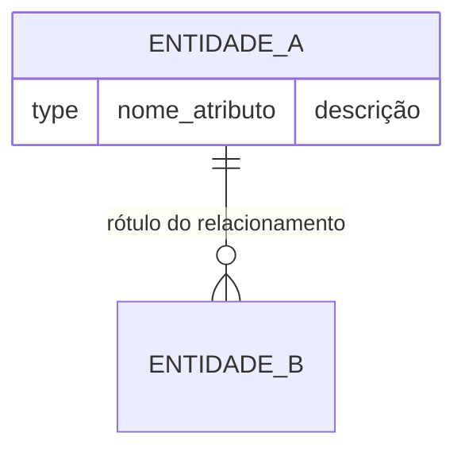

# DER: {WORK_ITEM_TITLE}

## Contexto de Banco de Dados

<!-- Preencha conforme o modo detectado no Passo 2 da skill. Remova as seções que não se aplicam. -->

> **Modo: Greenfield**
> Este DER modela entidades criadas do zero para esta feature. Não há banco de dados preexistente considerado.

<!-- OU -->

> [!as-is] **Modo: AS-IS**
> Este DER representa o modelo de dados atual. Nenhuma alteração é proposta para esta feature — o objetivo é documentar a estrutura existente que será utilizada.

<!-- OU -->

> **Modo: Evolução**
> Este DER documenta as mudanças necessárias sobre o modelo existente. Entidades e atributos marcados com `[NOVO]` ou `[ALTERADO]` são propostas desta feature. O restante reflete a estrutura atual.

## Diagrama

## Glossário de Entidades

| Entidade | Descrição | Fonte |
|----------|-----------|-------|
| ...      | ...       | [`BR-NNN`, `RN-NNN` ou `IN-NNN`](requirements.md) |

## Relacionamentos Confirmados

| Relacionamento | Cardinalidade | Rótulo | Fonte |
|----------------|---------------|--------|-------|
| ... | ... | ... | [`BR-NNN`, `RN-NNN` ou `IN-NNN`](requirements.md) |

## Relacionamentos Inferidos

| Relacionamento | Cardinalidade | Evidência | Fonte |
|----------------|---------------|-----------|-------|
| ... | ... | ... | [`BR-NNN`, `RN-NNN` ou `IN-NNN`](requirements.md)  |

## Atributos Documentados
<!-- Preencha apenas no modo greenfield ou as-is. Remova esta seção no modo evolução. -->

### Entidade: ENTIDADE_A
| Entidade | Atributo | Tipo | Descrição | Regras de Negócio | Fonte | 
|----------|----------|------|-----------|-----------|-------|
| ... | ... | ... | ... | ... | [`BR-NNN`, `RN-NNN` ou `IN-NNN`](requirements.md) |

<!-- Se houver regras de negócio ou restrições arquiteturais que impactam o modelo, descreva-as aqui. -->

### Entidade: ENTIDADE_B
| Entidade | Atributo | Tipo | Descrição | Regras de Negócio | Fonte | 
|----------|----------|------|-----------|-----------|-------|
| ... | ... | ... | ... | ... | [`BR-NNN`, `RN-NNN` ou `IN-NNN`](requirements.md) |

## Delta do Modelo
<!-- Preencha apenas no modo "evolucao". Remova esta seção nos modos greenfield e as-is. -->

| Tipo de Mudança | Entidade | Atributo / Relacionamento | Justificativa |
|---|---|---|---|
| NOVA ENTIDADE | ... | — | ... |
| NOVO ATRIBUTO | ... | nome_atributo | ... |
| NOVO RELACIONAMENTO | ... | EntidadeA → EntidadeB | ... |

## Gaps

> [!gap] ...

## Questões em Aberto

- [ ] ...

## Fontes (Sources)

- [adrs](adr/index.md) <!-- apenas se houver ADRs relacionados a esta decisão de modelo de dados -->
- [requirements](requirements.md) <!-- apenas se houver requisitos relacionados a esta decisão de modelo de dados -->
- [attributes](attributes.md) <!-- apenas se houver atributos relacionados a esta decisão de modelo de dados -->
- [brief](brief.md) <!-- apenas se houver brief relacionado a esta decisão de modelo de dados -->
- [sources]({WIKI_REL_PATH}/sources/slug.md) <!-- apenas se houver fontes relacionadas a esta decisão de modelo de dados -->
