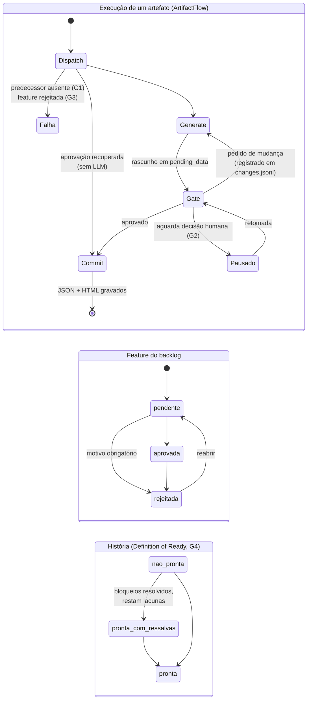

# IT26019 — SENPAI: Relatório de resposta aos Argumentos Técnicos

**Versão:** 1 (primeira versão, para revisão dos inventores)
**Data:** 07/10/2026
**Responde a:** *ICTi — Argumentos Técnicos, Defesa de Patenteabilidade, Caso IT26019 (SENPAI)*, 8 páginas
**Base examinada:** repositório `senpai.info`, commit `9c5678c` (07/10/2026), aplicação **Senpai Refiner**
**Evidências:** pasta [`evidencias/`](evidencias/README.md), com cópias congeladas do código, hashes SHA-256, saídas de teste e uma demonstração reproduzível

---

## 1. Síntese

O documento do ICTi afirma que os dois pontos fortes da defesa, o **gateway de aprovação** e o **work item como unidade de estado**, "estão descritos hoje apenas no Formulário de Submissão, em termos funcionais". **A versão atual do SENPAI resolve essa fragilidade: os dois pontos estão implementados em código, cobertos por testes automatizados e podem ser demonstrados de forma reproduzível.**

As conclusões principais são:

1. **O gateway existe e é determinístico.** A prontidão de cada história é decidida por código, sem chamada a modelo de linguagem, a partir de regras explícitas que cruzam critérios de aceite, cenários Gherkin, tarefas de teste do plano, contratos de interface e referências arquiteturais. O resultado é uma classificação em três níveis (`nao_pronta`, `pronta_com_ressalvas`, `pronta`) com o motivo de cada bloqueio. Isso responde diretamente à pergunta 2 do Argumento 1: a clareza dos critérios **não** é julgada por um LLM avaliador, e sim por verificação formal. [E4, E5]
2. **O controle opera em quatro camadas**, e não como um checkpoint único:
   - predecessor obrigatório antes de qualquer chamada ao LLM;
   - pausa durável para decisão humana antes da gravação;
   - bloqueio de geração e de aprovação para itens rejeitados;
   - classificação de prontidão que acompanha o pacote entregue aos agentes de código.

   Nenhuma das anterioridades D1, D2 ou D3 descreve essa combinação. [E1–E7]
3. **O work item é uma unidade de estado persistida, isolada e transportável.** Tem identificador UUID v7, árvore de diretórios própria, histórico de diretivas, decisões de revisão e checkpoints duráveis. Pode ser retomado após reiniciar a aplicação ou após mudar a definição do pipeline **sem nova chamada ao LLM**, o que é comprovado por teste de integração. [E10, E11, E12]
4. **A versão atual traz mecanismos técnicos que o avaliador não conhece** e que não foram mapeados no parecer (seção 7). Os principais são:
   - autocorreção do LLM com **teto de duas chamadas garantido pela forma do código**, adotada só se reduzir as violações;
   - **log cumulativo de diretivas** criado para resolver uma falha reproduzida de regressão de decisões;
   - **projeções determinísticas** (C4, OpenAPI, AsyncAPI, Gherkin, matriz de cobertura) a partir de um modelo estruturado;
   - **detecção de artefatos desatualizados** que sobrevive à transferência entre máquinas.
5. **O Argumento 3 precisa ser reposicionado.** A versão atual não contém um loop que implemente código de forma autônoma. A execução é delegada a agentes de código externos por meio de um pacote de handoff com instruções de máquina (`AGENTS.md`). O loop, porém, é exatamente o elemento que o próprio parecer atribui a D1/D2 ("procede em grande parte"). A defesa ganha força ao concentrar-se no que é distintivo: o gateway e o estado.
6. **Ponto estratégico:** o documento do ICTi é um subsídio **pré-depósito**. Os mecanismos descritos aqui podem, portanto, ser incorporados ao relatório descritivo antes do depósito. A seção 9 propõe uma redação técnica de reivindicações baseada no que está implementado.

---

## 2. O que foi examinado

| Item | Situação |
|---|---|
| Produto | **Senpai Refiner**: aplicação desktop (Go + Wails) com workflows declarativos em MHL, executados localmente; backend de LLM de produção é o **Devin CLI**. |
| Escopo funcional | Ingestão de fontes → wiki rastreável → artefatos de Discovery/Delivery (brief, atributos, requisitos, ADR, DER, modelo arquitetural, diagramas, backlog, histórias, plano) → pacote de handoff para agentes de código. |
| Volume | 64 arquivos de workflow MHL, 57 com testes. Backend Go com 130 testes e subtestes. |
| Validação executada em 07/10/2026 | `mhl lint`: sem problemas. `mhl test`: **1.181 asserções, 0 falhas**. `go test -short`: **130 aprovados, 0 falhas**. `go vet`: limpo. [E20] |
| Histórico | 143 commits entre 13/09/2026 e 07/10/2026. [`historico/git-log-completo.txt`](evidencias/historico/git-log-completo.txt) |
| Dados reais | **Nenhum work-item real foi lido.** Testes e demonstração usam fixtures sintéticas, executadas em uma cópia temporária da árvore. |

**Relação com o Relatório de 2025.** O ICTi observa que o Relatório do SENPAI (2025) descreve uma versão baseada em prompts, LLMs e ferramentas MCP, com revisão humana por etapa. A versão atual é uma reimplementação em que **as decisões de controle saem do prompt e passam para o código**. Esse é o princípio adotado no código-fonte sob o rótulo "C3": *"a LLM nunca decide se um contexto ausente conta"* ([require.mh:1-4](evidencias/codigo/workflows/shared/artifacts/require.mh)). Essa mudança de arquitetura é, em si, o principal argumento técnico desta resposta.

---

## 3. Argumento 1: gateway de aprovação sobre o work item

### 3.1 O gateway está implementado e é determinístico

O controle de entrada para a implementação opera em quatro camadas, todas em código:

| # | Camada | Onde | Quando atua | Efeito |
|---|---|---|---|---|
| G1 | **Predecessor obrigatório** | `Require.present` ([require.mh:8-12](evidencias/codigo/workflows/shared/artifacts/require.mh)) | Antes de montar o prompt | Falha com "gere 'x' antes de 'y'" **antes de qualquer chamada ao LLM**. A cadeia brief → requisitos → ADR → DER/modelo → diagramas → backlog → histórias → plano é imposta por código. [E1] |
| G2 | **Pausa para decisão humana** | `ArtifactFlow.Gate` ([artifact_flow.mh:122-136](evidencias/codigo/workflows/artifact_flow/artifact_flow.mh)) | Após a geração, antes da gravação | O rascunho fica em `pending_data` num checkpoint durável. A gravação só ocorre com `approved: true`; um pedido de mudança é registrado e regenera. [E2] |
| G3 | **Rejeição de item do backlog** | `FeatureReview.ensure_not_rejected` ([feature_review.mh:38-44](evidencias/codigo/workflows/shared/artifacts/feature_review.mh)), chamado em [discovery_artifacts.mh:265, 281, 322, 331](evidencias/codigo/workflows/discovery/discovery_artifacts.mh) | Na geração **e** na aprovação de histórias e planos | Feature rejeitada (com motivo obrigatório) não avança até ser reaberta. Suas histórias são excluídas do pacote de handoff. [E3] |
| G4 | **Definition of Ready (prontidão)** | `Readiness.evaluate/batch` ([readiness.mh:35-125](evidencias/codigo/workflows/shared/artifacts/readiness.mh)) | Sobre **todas as histórias do work item**, a partir dos arquivos gravados | Classifica em `nao_pronta`, `pronta_com_ressalvas` ou `pronta`, com a lista de bloqueios e ressalvas. **Nenhuma chamada ao LLM.** [E4] |

**G4 é o gateway descrito na Etapa 8 do Formulário**, agora com critérios objetivos. O código estabelece:

- **Bloqueio**, que leva a `nao_pronta`, em qualquer uma destas situações:
  - história sem estrutura (contratos, cenários ou rastreabilidade ausentes);
  - qualquer violação de conformidade da história;
  - ausência de plano de implementação;
  - qualquer violação no plano.
- **Ressalva**, que leva a `pronta_com_ressalvas`, quando há lacunas declaradas, questões em aberto ou dependência de outra história do mesmo lote que ainda não está pronta.

### 3.2 As regras que materializam "completude", "clareza" e "ausência de ambiguidade"

O Formulário descreve o gateway em termos funcionais. O código o descreve em termos verificáveis:

| Condição do Formulário | Regra implementada | Exemplo de violação detectada |
|---|---|---|
| **Existência e integridade dos artefatos obrigatórios** | G1 (cadeia de predecessores); `Readiness.is_structured`; "Sem plano de implementação" | História sem plano; história no formato antigo; requisitos gerados sem brief. |
| **Clareza dos critérios de aceite** | `Scenarios.check` ([historia_spec.mh:484](evidencias/codigo/workflows/shared/artifacts/historia_spec.mh)) | Cenário sem **Dado, Quando ou Então**; critério `CA2` sem cenário que o cubra; cenário que cita `CA7` numa história com 2 critérios. |
| **Testabilidade dos critérios** | `PlanoModel.check` ([plano_model.mh:119-157](evidencias/codigo/workflows/shared/artifacts/plano_model.mh)) | Critério sem tarefa de teste nem item na estratégia de testes; plano sem nenhuma tarefa de teste; tarefa que depende de outra inexistente ou posterior. |
| **Ausência de ambiguidade de interface** | `Contracts.check` ([historia_spec.mh:349](evidencias/codigo/workflows/shared/artifacts/historia_spec.mh)) | Parâmetro `{id}` não declarado; endpoint sem resposta 2xx; `POST` sem corpo; evento sem payload ou canal; integração sem tratamento de falha. |
| **Ausência de referência inventada** | `Traceability.check` ([historia_spec.mh:166](evidencias/codigo/workflows/shared/artifacts/historia_spec.mh)), `PlanoModel.check_context` | História ou plano que cita requisito, ADR, entidade do DER ou contêiner C4 inexistente no work item. |
| **Coerência entre histórias** | `DependencyRules.check_batch` ([backlog_rules.mh:120](evidencias/codigo/workflows/shared/artifacts/backlog_rules.mh)) | Dependência para algo que não existe no backlog nem na arquitetura; dependência circular. |
| **Adequação ao tipo de trabalho** | `StoryRules.check` ([backlog_rules.mh:27](evidencias/codigo/workflows/shared/artifacts/backlog_rules.mh)) | História de usuário sem Como/Quero/Para; habilitadora sem resultado técnico; spike sem pergunta de investigação. |

Essas regras são agregadas em um único ponto, `ArtifactChecks` ([artifact_checks.mh:43-53](evidencias/codigo/workflows/shared/artifacts/artifact_checks.mh)), consumido **tanto pelo gateway (G4) quanto pela autocorreção** (seção 7, I2). A mesma definição de "defeito" orienta a correção automática e a decisão de prontidão.

### 3.3 Distinção frente às anterioridades, no nível do mecanismo

| | D1 (Presidio) | D2 (JPMorgan) | D3 (Morgan Stanley) | **SENPAI atual** |
|---|---|---|---|---|
| **Objeto verificado** | Saída de cada tarefa, durante a execução | Código gerado (testes unitários) | Alteração de um documento | **Conjunto de artefatos de especificação do work item, antes da implementação** |
| **Quem decide** | Checkpoint de validação ou usuário, opcionalmente | Quarto modelo, pelo resultado dos testes | Aprovador humano designado por nível de risco | **Regras determinísticas em código**, com decisão humana sobre o resultado |
| **Critério** | Erros ou desvios "antes que se propaguem" | Testes passam ou falham | Impacto de negócio, complexidade técnica, risco do ativo | **Relações formais entre artefatos**: cobertura CA ↔ cenário ↔ teste, contratos, referências |
| **Saída** | Regeneração a partir do ponto de intervenção | Liberação do código | Tier 1, 2, 3 ou isento; aprovação automática de baixo risco | **Status de prontidão + motivos**, transportados no pacote para o agente de código |

A diferença que deve ser enfatizada ao avaliador: em D1 e D2, a qualidade é verificada **no que foi executado**. No SENPAI, ela é verificada **no que será executado**, por relações cruzadas entre artefatos que só existem porque o work item persiste um modelo estruturado comum (Argumento 2). O mapeamento do parecer não aponta, em nenhum documento, a verificação de cobertura **critério → cenário → tarefa de teste** antes da implementação.

### 3.4 Respostas às perguntas da p. 5

**1. O gateway é automático, humano ou híbrido? Qual parte é feita pela máquina?**

**Híbrido, com divisão de responsabilidades definida em código:**

- **Máquina:**
  - verifica os predecessores (G1);
  - executa todas as regras da tabela 3.2;
  - pede uma única correção ao modelo quando há violações (seção 7, I2);
  - classifica a prontidão (G4);
  - aplica o bloqueio de itens rejeitados (G3).
- **Humano:**
  - aprova, rejeita ou pede mudança em cada rascunho (G2);
  - aprova, rejeita (com motivo obrigatório) ou reabre cada feature (G3).

A máquina nunca usa o LLM para decidir se algo está pronto. Isso está declarado no cabeçalho de [readiness.mh:1-3](evidencias/codigo/workflows/shared/artifacts/readiness.mh): *"Deterministico (C3), a partir do que ja esta gravado — nenhuma chamada de LLM"*.

**2. Como são avaliadas a "clareza dos critérios" e as "ambiguidades críticas"?**

**Por regras**, e não por LLM avaliador nem por checklist manual. O formato Dado/Quando/Então é exigido literalmente em cada cenário. Cada critério de aceite recebe um identificador `CAn`, que precisa ser coberto por ao menos um cenário **e** por ao menos uma tarefa de teste do plano. Contratos e referências arquiteturais são conferidos contra o que existe no work item. A tabela 3.2 lista as regras e o local de cada uma no código.

**3. Há registro de work items bloqueados e do retrabalho evitado?**

Em parte. O sistema registra em disco, por work item:

- os eventos do ciclo de revisão (`activity.jsonl`: `started`, `draft_ready`, `approved`);
- os pedidos de mudança (`changes.jsonl`), as rejeições e as reaberturas com motivo;
- o consumo de tokens e custo com procedência (`usage.jsonl`).

O resultado de prontidão é recalculado a cada leitura e publicado no pacote de handoff. Ainda **não há uma série histórica persistida** das avaliações de prontidão, nem medição de retrabalho evitado. A seção 10 recomenda gerar essa evidência quantitativa antes do depósito.

### 3.5 Prova reproduzível

A demonstração [`evidencias/demonstracao/`](evidencias/demonstracao/) cria um work item sintético com duas features e cinco histórias, executa o gateway real do SENPAI e grava o pacote de handoff resultante. Resultado (16 de 16 asserções aprovadas, [execucao.txt](evidencias/demonstracao/execucao.txt)):

| História | Situação construída | Classificação do gateway |
|---|---|---|
| Consultar ordem | Completa, plano com testes | **Pronta** |
| Cancelar ordem | `CA2` sem cenário; cenário cita `CA7` inexistente; plano sem tarefa de teste | **Não pronta**, com 4 bloqueios nomeados |
| Notificar execução | Completa, mas com lacuna e dependente de "Cancelar ordem" | **Pronta com ressalvas** (a dependência não pronta é propagada) |
| Exportar extrato | Sem plano | **Não pronta**: "Sem plano de implementação" |
| Relatório (FT002) | Feature rejeitada pelo PO | **Excluída do pacote**; gerar ou aprovar histórias dela falha |

O [`README.md` do pacote gerado](evidencias/demonstracao/saida/handoff/README.md) mostra o que um agente de código recebe: a tabela de prontidão e a seção "Bloqueios das histórias não prontas" com os motivos exatos.

### 3.6 Bloqueio rígido e bloqueio por contrato: decisão de produto documentada

O avaliador pode perguntar se uma história `nao_pronta` chega ao desenvolvimento. O histórico do repositório responde com precisão:

- **26/09/2026, commit `441a008`:** o handoff **excluía** as histórias não prontas. Elas ficavam numa seção "Histórias ainda não prontas (fora do pacote)", e o `AGENTS.md` instruía: *"Não implemente histórias fora de `specs/`"*. [E7: [trecho congelado](evidencias/historico/441a008-handoff-bloqueio-rigido.txt)]
- **29/09/2026, commit `c059c57`:** por pedido de usuário, o pacote passou a **incluir** as histórias não prontas, marcadas com seus bloqueios. O motivo, registrado em [handoff.mh:318-323](evidencias/codigo/workflows/shared/artifacts/handoff.mh), foi que a exclusão escondia a especificação inteira por causa de um único aviso. O bloqueio passou a ser transmitido ao agente de código como instrução: *"Se estiver marcada **Não pronta** […] não implemente uma história bloqueada sem essa confirmação"* ([handoff.mh:224](evidencias/codigo/workflows/shared/artifacts/handoff.mh)). [E6, E7]

Os dois modos foram implementados, e a variante atual é **mais rica tecnicamente**: o gateway produz um **contrato de prontidão legível por máquina** que acompanha cada especificação até o executor. Recomenda-se descrever as duas formas no relatório descritivo, como alternativas de concretização: bloqueio por exclusão e bloqueio por instrução ao agente executor.

---

## 4. Argumento 2: work item como unidade de estado

### 4.1 Estrutura persistida

Cada work item é criado com identificador UUID v7 e uma árvore própria. O acesso a ela passa por um único ponto, que rejeita identificadores com `/`, `\` ou `..` ([paths.mh](evidencias/codigo/workflows/shared/core/paths.mh)). Isso garante que nenhuma operação leia ou grave dados de outro work item. [E11]

```text
projects/<uuid-v7>/
├── project.json            identidade: tipo (oportunidade/feature/história), nível, continuidade_de, arquivamento
├── raw/                    fontes ingeridas (inclui retrato AS-IS de repositório)
├── wiki/  .index-state.json   memória do projeto: fontes, entidades, conceitos, alertas
├── artifacts/              especificação: <artefato>.json (semântico) + <artefato>.html (apresentação)
│   ├── features/FT001-*/status.json      decisão do PO (aprovada | rejeitada + motivo)
│   └── historias/FT001-*/US001-*/        historia.json, plano.json, openapi.json, asyncapi.json, historia.feature
├── changes.jsonl           diretivas de mudança, cumulativas, por artefato e escopo
├── activity.jsonl          eventos do ciclo de revisão
├── usage.jsonl             tokens e custo por chamada
└── handoff/                pacote para agentes de código (gerado de forma determinística)
```

Os identificadores **sequenciais** do Formulário existem nos artefatos: `FT001`, `US001`, `ADR-001` ([artifact_id.mh](evidencias/codigo/workflows/shared/artifacts/artifact_id.mh)). O work item raiz usa UUID v7, que também é ordenável no tempo. Convém ajustar o descritivo nesse ponto.

### 4.2 Distinção frente a D1

O parecer resume bem: o arquivo de configuração de D1 diz aos agentes **como** trabalhar. O estado do SENPAI registra **onde** o trabalho está. A implementação vai além disso, porque o estado persistido é **o insumo das verificações do gateway**. `Traceability.known(project_id)` lê do disco o conjunto de requisitos, ADRs, entidades e contêineres existentes, e é contra esse conjunto que G4 rejeita referências inventadas. Sem o estado persistido por work item, o gateway não teria contra o que verificar. A sinergia que o ICTi enuncia (Bloco II, 5.30) **está demonstrada no código**.

### 4.3 Respostas às perguntas da p. 6

**1. Quais são os estados possíveis de um work item e quais transições o gateway controla?**

O estado é composto por três dimensões persistidas:



As transições controladas são as seguintes:

- **G1** impede `Dispatch → Generate` quando falta um predecessor.
- **G3** impede a geração e a gravação de histórias e planos de uma feature `rejeitada`.
- **G2** impede a gravação sem aprovação.
- **G4** determina o status de prontidão de cada história, que é publicado no pacote de handoff. A rejeição exclui a história do pacote.

[E2, E3, E4]

**2. O arquivo de estado é lido pelos agentes a cada sessão? A retomada em outro editor está comprovada?**

**Sim, o estado é relido a cada geração**, e isso não depende da memória de uma conversa:

- `Context.artifact` lê o JSON semântico dos predecessores gravados;
- `ContextSlice` recorta o contexto pelas referências citadas;
- `ChangesBlock.for_artifact` reinjeta **todas** as diretivas anteriores daquele artefato.

[E9, E14]

A retomada foi comprovada em três situações:

| Situação | Mecanismo | Prova |
|---|---|---|
| Reiniciar a aplicação com um rascunho pendente | Checkpoint durável do runtime MHL, com `pending_data` | Teste `TestModoBuddyPauseResume_WikiIngest`. Usa LLM real, então foi **omitido** na execução `-short` desta análise. A pausa e a retomada também são cobertas pelo teste da linha seguinte |
| **Mudança na definição do pipeline** enquanto um rascunho aguardava aprovação | A interface extrai `pending_data` do checkpoint antigo e inicia uma execução nova com `approval_data`. `Dispatch` vai direto ao `Commit` | **`TestApprovalRecoveryCommitsPendingDraftWithoutLLM`** ([app_test.go:172-243](evidencias/codigo/app/app_test.go)): verifica a gravação, a preservação dos tokens originais e **a inexistência de `prompt_log.jsonl`**, ou seja, nenhuma chamada ao LLM [E10] |
| Outra máquina ou outro usuário | Exportação e importação com manifesto versionado, SHA-256 por arquivo e restauração do horário de modificação | 6 testes em [project_transfer_test.go](evidencias/codigo/app/project_transfer_test.go): round-trip, horários, colisão de ID e pacotes corrompidos [E12] |

**Outro editor.** O formato de continuidade entre ferramentas é o **pacote de handoff**: Markdown, OpenAPI, AsyncAPI, Gherkin e um `AGENTS.md` com instruções para agentes de código. É o formato que VSCode/Copilot, Devin e outros agentes leem nativamente. A interoperabilidade está garantida pelo formato. A execução de ponta a ponta em cada ferramenta específica ainda não foi registrada (seção 10).

---

## 5. Argumento 3: execução orquestrada por dependências

### 5.1 O que a versão atual implementa

| Elemento do Formulário (Etapa 9) | Situação na versão atual |
|---|---|
| Orquestração de agentes especializados com estado por tarefa | **Implementada para o refinamento.** `ArtifactFlow` é uma máquina de estados durável (Dispatch → Generate → Gate → Commit). Cada artefato tem gerador, schema, verificador e persistidor próprios. [E2] |
| Tarefas com dependências | **Implementada no plano.** Cada tarefa tem tipo, critérios cobertos e `depende_de`. O código rejeita dependência inexistente ou fora de ordem e exige testes antes da implementação que eles cobrem. O pacote entrega `tasks.md` como checklist ordenado. [E5, E6] |
| Impedimentos registrados | **Implementado na especificação.** Histórias têm `dependencias_impedimentos` tipadas. Uma dependência de história não pronta é propagada como ressalva. Dependências circulares ou para destinos inexistentes são detectadas. [E4, E5] |
| Loop autônomo que implementa código, testa e atualiza o estado de cada tarefa | **Não está nesta versão.** A implementação é delegada a um agente de código externo, que recebe o pacote e as instruções do `AGENTS.md`: seguir `tasks.md` em ordem, fazer os cenários `@CAn` passarem e não implementar histórias bloqueadas sem confirmação. [E6] |

### 5.2 Recomendação

O próprio parecer classifica a Etapa 9 como "procede em grande parte" frente a D1 e D2. Manter o loop autônomo como elemento essencial da reivindicação principal **não acrescenta distinção e acrescenta um ponto sem suporte na versão atual**. Recomenda-se:

- mover o loop para uma **reivindicação dependente**, como forma de concretização;
- concentrar a reivindicação independente no gateway determinístico sobre o estado persistido (seção 9);
- se o loop já operar em outro repositório (piloto com StackSpot, Copilot ou Devin), localizar e anexar a versão, a chamada ao gateway e os testes antes do depósito.

### 5.3 Respostas às perguntas da p. 7

**1. Quais agentes são acionados no loop em produção? O modo autônomo opera hoje?**

Na versão analisada, o agente de produção é o **Devin CLI**, usado para **geração estruturada** com schema JSON validado ([agents.mh](evidencias/codigo/workflows/shared/agents/agents.mh)). Também há o assessment **Radahn**, que avalia se a história pode ser implementada por configuração declarativa (YAML) em vez de código e, quando pode, gera o `radahn.yaml` ([radahn_assess.mh](evidencias/codigo/workflows/shared/radahn/radahn_assess.mh)). O modo autônomo de implementação **não opera neste repositório**. A execução segue o modelo *spec-driven*, em que o executor externo consome o pacote.

**2. Como é registrado um impedimento e o que acontece com as tarefas dependentes?**

- **Entre histórias:** o impedimento é registrado no campo `dependencias_impedimentos` (tipos `depende_de`, `impedimento_externo` etc.). Se a história de destino está `nao_pronta`, a dependente recebe a ressalva *"Depende de 'X', que ainda não está pronta"* ([readiness.mh:106-125](evidencias/codigo/workflows/shared/artifacts/readiness.mh)), como mostra a história "Notificar execução" na demonstração.
- **Entre tarefas do plano:** uma dependência inválida torna o plano não conforme e, por consequência, a história `nao_pronta`.
- **Por feature:** uma feature rejeitada bloqueia toda a sua descendência.

A propagação é local, de um nível. Não há propagação transitiva sobre um grafo de execução.

---

## 6. Argumento 4: problema técnico divergente e falta de motivação

### 6.1 Reforço: o problema técnico está documentado no código, com falhas reproduzidas

A pergunta da p. 8 pede registros de falhas que motivaram o controle. O repositório contém **registros datados de falhas reproduzidas** que motivaram mecanismos centrais:

- **Regressão de decisões entre gerações** ([changes_log.mh:7-33](evidencias/codigo/workflows/shared/artifacts/changes_log.mh), 24/09/2026). A sequência registrada foi:
  - pedidos sucessivos "mude dotnet para Java" e depois "mude Relacional para Documental" fizeram o LLM **reverter Java para dotnet**;
  - a tentativa de reenviar o artefato inteiro pedindo "preserve exceto o que mudou" também falhou: o backlog manteve "FT013 — Fundação de Infraestrutura AWS **com EKS**" depois de a ADR ter mudado para ECS.

  A solução adotada foi regenerar sempre a partir dos predecessores atuais **mais** a lista completa e explícita de diretivas. É um problema técnico de **perda de estado entre execuções do LLM**, exatamente o enunciado no Formulário, com evidência de causa e solução.
- **Truncamento de resposta na autocorreção** ([auto_review.mh:162-177](evidencias/codigo/workflows/shared/artifacts/auto_review.mh)): o Devin encerra com "Response truncated", e a primeira versão válida é preservada.
- **Perda de conteúdo estruturado na síntese** ([literal_blocks.mh:1-11](evidencias/codigo/workflows/shared/wiki/literal_blocks.mh)): "a LLM resumia a árvore em uma frase". A solução foram blocos literais preservados por código.
- **Falso positivo do gateway** ([historia_spec.mh:387-397](evidencias/codigo/workflows/shared/artifacts/historia_spec.mh)): a exigência de contrato para toda história de backend bloqueava histórias legítimas na Definition of Ready, e a regra foi recalibrada. Isso mostra que o gateway é usado e ajustado com base em resultado real.

**Limite desta evidência:** esses registros comprovam o problema técnico de **especificação e estado** que o gateway resolve. Não comprovam falhas de um executor autônomo de código, que não existe nesta versão.

### 6.2 Reforço da tese de não obviedade

O ICTi argumenta que D3 tem finalidade documental. A versão atual permite um argumento mais forte, baseado em **mecanismo**: transpor os níveis de aprovação de D3 para antes do loop de D1 e D2 **não produziria o SENPAI**. Faltariam:

- (i) um modelo estruturado comum com identificadores tipados (`CAn`, `FR-`, `ADR-`, entidades, contêineres) persistido por work item;
- (ii) verificadores das relações entre esses identificadores;
- (iii) o uso do mesmo conjunto de verificadores para controlar a correção automática do LLM e a prontidão.

Nenhum desses três elementos aparece em D1, D2 ou D3, nem é sugerido por eles. D3, além disso, prevê **aprovação automática de mudanças de baixo risco**, o oposto de uma verificação sistemática da especificação antes da execução.

---

## 7. Aspectos inovadores da versão atual que podem não estar claros para o avaliador

Os itens abaixo **não aparecem no Formulário nem no mapeamento do parecer** e têm suporte em código e teste. Todos seguem um mesmo padrão de arquitetura: **o LLM produz dados estruturados; o código verifica, corrige, projeta e decide.**

### I1. Gateway determinístico baseado em relações cruzadas entre artefatos

Detalhado na seção 3. O ponto a enfatizar é que os critérios de aceite recebem identificadores (`CAn`) que **atravessam** artefatos distintos: história, cenários Gherkin (tags `@CAn`), tarefas do plano e estratégia de testes. O código verifica a cobertura em cada salto. É uma verificação de **consistência de um grafo de especificação**, e não uma validação de formato por seção como em D3. [E4, E5]

### I2. Autocorreção do LLM com teto garantido pela forma do código

`AutoReview.execute` ([auto_review.mh:32-64](evidencias/codigo/workflows/shared/artifacts/auto_review.mh)):

- (a) gera a resposta;
- (b) executa os verificadores determinísticos;
- (c) se houver violações, faz **uma única** segunda chamada com a resposta anterior e a lista de violações;
- (d) **adota a versão revisada só se ela tiver menos violações**; caso contrário, ou se a resposta for inválida ou truncada, mantém a original.

O teto de duas chamadas é garantido pela estrutura do código (sem laço, sem recursão, sem `goto`), e não por instrução ao modelo. O teste `never_calls_the_model_more_than_twice_even_if_warnings_persist` prova isso com um modelo falso que nunca corrige. **Efeito técnico:** custo de inferência limitado e previsível, com melhora monotônica no número de violações. Difere da "regeneração a partir do ponto de intervenção" de D1, que não tem critério de adoção nem limite. [E8]

### I3. Memória cumulativa de diretivas por artefato e escopo

`ChangesLog` e `ChangesBlock` ([changes_log.mh](evidencias/codigo/workflows/shared/artifacts/changes_log.mh)): cada pedido de mudança é persistido com artefato e escopo, por exemplo a feature. Cada nova geração recebe os predecessores **atuais** mais **todas** as diretivas daquele escopo, em ordem. Resolve a falha reproduzida descrita em 6.1 sem depender de o LLM inferir um "diff implícito". O motivo de rejeição de uma feature é deliberadamente **excluído** das diretivas do backlog, e há teste para isso. [E9]

### I4. Aprovação humana desacoplada da versão do pipeline

A decisão humana sobre um rascunho sobrevive à mudança da definição do workflow. O rascunho aprovado é gravado pela definição **atual**, sem nova inferência. O checkpoint antigo só é descartado depois de confirmado o término da nova execução ([checkpoint-recovery.js](evidencias/codigo/app/frontend/src/checkpoint-recovery.js)). Esse é um problema técnico específico de pipelines de LLM com revisão humana assíncrona, e não é tratado em D1, D2 ou D3. [E10]

### I5. Modelo estruturado como fonte única de projeções determinísticas

O LLM devolve o **modelo**. Diagramas e contratos são **código**:

- diagramas C4 de contexto e de contêiner derivados do modelo arquitetural aprovado (`ArchModel.views`, [arch_model.mh:122](evidencias/codigo/workflows/shared/artifacts/arch_model.mh)), redesenhados sem LLM quando o usuário edita o modelo;
- OpenAPI e AsyncAPI derivados dos contratos da história;
- arquivo `.feature` (Gherkin) derivado dos cenários;
- diagrama de sequência e matriz de cobertura dos critérios derivados do plano.

**Efeito técnico:** consistência garantida entre representações e eliminação de chamadas de LLM para redesenho. [E15]

### I6. Conformidade arquitetural do backlog

`ArchConformance` ([arch_conformance.mh](evidencias/codigo/workflows/shared/artifacts/arch_conformance.mh)): cada item do backlog declara, com referências **tipadas**, quais contêineres, entidades, ADRs e atributos usa. O código confere cada referência e verifica no lote se alguma ADR ou restrição arquitetural ficou sem item que a materialize. *"Citar 'adr' em fontes não prova nada — uma referência tipada a 'ADR-003' sim."* [E15]

### I7. Recorte de contexto por citação, preservando restrições transversais

`ContextSlice` ([context_slice.mh:1-18](evidencias/codigo/workflows/shared/artifacts/context_slice.mh)): o prompt de cada história ou plano recebe apenas os requisitos e ADRs que o artefato de origem cita. Restrições arquiteturais e obrigações de compliance **sempre** entram, por serem transversais, e os diagramas de contexto e contêiner são sempre mantidos. **Efeito técnico:** prompts menores sem perda das restrições obrigatórias. [E14]

### I8. Detecção de desatualização que sobrevive à transferência

A interface compara os horários de modificação de cada artefato com os de seus predecessores e com a wiki, e sinaliza quais dependências são mais novas ([artifacts.js:205](evidencias/codigo/app/frontend/src/artifacts.js)). A exportação preserva esses horários no manifesto e a importação os restaura ([project_transfer.go:388](evidencias/codigo/app/project_transfer.go)). Por isso, a informação de desatualização **não se perde** ao mover o work item entre máquinas. [E12, E13]

### I9. Continuidade de sistemas existentes (AS-IS)

O nível Delivery parte de um sistema em produção:

- `RepoSnapshot` gera, de forma determinística e sem dar ao LLM acesso ao repositório, um retrato AS-IS a partir de arquivos versionados, com filtro de segredos;
- cada fonte é classificada quanto à `natureza` (sistema atual, pedido novo ou ambos);
- regras, entidades e dependências são marcadas `as_is`, `novo`, `modificado` ou `removido`, e essa marcação chega ao pacote de handoff.

As anterioridades tratam o SDLC como geração a partir de requisitos novos. [E16]

### I10. Pacote de handoff para agentes de código com contrato de prontidão

Detalhado em 3.6. O pacote é gerado de forma determinística a partir dos JSON gravados. Ele incorpora o status de prontidão, os bloqueios e instruções operacionais para o agente executor: ordem das tarefas, testes primeiro, contratos como fonte da verdade e proibição de implementar história bloqueada sem confirmação. Liga o gateway ao executor **sem acoplar o SENPAI a um executor específico**. [E6]

---

## 8. Revisão do mapeamento das 11 etapas

| Etapa | Parecer | Avaliação à luz da versão atual |
|---|---|---|
| 1. Fases sequenciais | Procede (D1) | Procede quanto à sequência. **Novo:** a ordem é imposta por código antes da chamada ao LLM (G1), e não sugerida ao agente. |
| 2. Work items com estado | Frágil | **Fortalecida.** Estrutura persistida, isolada, retomável sem LLM e transportável com integridade (seção 4). |
| 3. Ingestão de insumos | Procede (D1) | Procede no geral. **Novo:** retrato AS-IS determinístico de repositório, classificação de `natureza` e blocos literais (I9). |
| 4. Templates | Procede (D1, D3) | Procede quanto a templates. **Novo:** o modelo estruturado gera projeções por código (I5). |
| 5. Validação estrutural | Procede (D3) | **Deve ser revista.** A validação atual é **relacional entre artefatos** (I1, I6), e não por seção ou propriedade como em D3. |
| 6. Refinamento técnico | Procede (D1) | **Novo:** autocorreção com teto e critério de adoção (I2); memória cumulativa de diretivas (I3). |
| 7. Decomposição com critérios | Procede (D1, D2) | Procede quanto à decomposição. **Novo:** cobertura CA → cenário → teste verificada, e ordem de tarefas validada. |
| 8. Gateway pré-execução | Frágil | **Fortalecida.** Quatro camadas, regras determinísticas, demonstração reproduzível (seção 3). |
| 9. Loop de execução | Procede em grande parte | **Reposicionar** como reivindicação dependente; a execução é delegada por contrato (seção 5). |
| 10. Memória e telemetria | Não atribuída, baixa força | **Ganha força técnica**, pois a memória **altera o comportamento** do sistema: diretivas reinjetadas, contexto recortado, recuperação de aprovação. Telemetria com procedência de custo. |
| 11. Distribuição | Não atribuída, implantação | Secundária. Aplicação desktop multiplataforma com runtime e workflows embarcados. |

---

## 9. Proposta de redação técnica para as reivindicações

*Sugestão para o redator de patente. Não é texto final e deve ser adequada às normas do INPI.*

**Reivindicação independente (método):**

> Método implementado por computador para controlar a passagem de especificações de software geradas por modelo de linguagem para a implementação, caracterizado por compreender:
> (a) persistir, para cada unidade de trabalho, um conjunto de artefatos estruturados interdependentes — incluindo histórias com critérios de aceite identificados, cenários de aceite, contratos de interface e plano de implementação com tarefas — em armazenamento isolado por identificador da unidade de trabalho;
> (b) impedir a geração de um artefato quando um artefato predecessor obrigatório não está persistido, antes de qualquer chamada ao modelo de linguagem;
> (c) verificar, por regras determinísticas e sem uso do modelo de linguagem, relações entre os artefatos persistidos, incluindo a cobertura de cada critério de aceite por ao menos um cenário e por ao menos uma tarefa de teste, e a existência, no conjunto persistido, de cada referência a requisito, decisão arquitetural, entidade de dados ou componente;
> (d) classificar cada história em um dentre uma pluralidade de níveis de prontidão, a partir dos resultados da verificação (c), associando a cada história os motivos de bloqueio e as ressalvas; e
> (e) gerar, a partir dos artefatos persistidos, um pacote de especificação destinado a um agente executor de código, contendo para cada história o nível de prontidão, os motivos e uma instrução de não implementação de histórias bloqueadas sem confirmação.

**Reivindicações dependentes sugeridas:**

1. Em que, quando a verificação (c) aponta violações em um artefato recém-gerado, é feita uma única solicitação adicional de correção ao modelo, contendo a resposta anterior e as violações, e a versão corrigida só é adotada se apresentar menos violações (I2).
2. Em que cada solicitação de mudança é persistida por artefato e escopo, e cada nova geração recebe os artefatos predecessores atuais e todas as solicitações anteriores daquele escopo (I3).
3. Em que o rascunho gerado é mantido em checkpoint durável aguardando decisão humana, e a aprovação pode ser aplicada por uma nova execução, sem nova chamada ao modelo de linguagem, mesmo após alteração da definição do fluxo (I4).
4. Em que a rejeição de um item do backlog, com motivo, bloqueia a geração e a aprovação de suas histórias e planos e as exclui do pacote (G3).
5. Em que a dependência de uma história em relação a outra não pronta é registrada como ressalva da dependente.
6. Em que representações derivadas (diagramas C4, OpenAPI, AsyncAPI, Gherkin) são produzidas deterministicamente a partir dos artefatos estruturados (I5).
7. Em que a unidade de trabalho é exportada com manifesto contendo hash e horário de modificação de cada arquivo, verificados e restaurados na importação, preservando a detecção de artefatos desatualizados (I8).
8. Em que o agente executor seleciona as tarefas conforme suas dependências e executa os cenários de aceite (forma de concretização do loop da Etapa 9).
9. Alternativa a (e): histórias classificadas como não prontas são excluídas do pacote (variante `441a008`).

---

## 10. Pontos de atenção e próximos passos

| # | Ponto | Ação recomendada |
|---|---|---|
| 1 | **Data da matéria.** Os mecanismos deste relatório foram implementados entre 13/09 e 07/10/2026, depois do Relatório de 2025 e, provavelmente, depois do Formulário. | Como o pedido ainda não foi depositado, **incorporar ao relatório descritivo** os mecanismos da seção 7 antes do depósito. Confirmar com a Coordenação de PI se houve alguma divulgação pública anterior. |
| 2 | **Bloqueio por instrução, e não por exclusão** (3.6). | Descrever as duas variantes. Avaliar oferecer um "modo estrito" configurável no produto, que exclui as histórias não prontas do pacote. |
| 3 | **Ausência de loop autônomo nesta versão.** | Reivindicação dependente (seção 5.2). Se existir em outro repositório, anexar a evidência. |
| 4 | **Falta de métricas** de bloqueios e retrabalho evitado. | Persistir uma série histórica das avaliações de prontidão (história, hash do conteúdo, regras violadas, decisão humana) e medir, num piloto, as gerações e regenerações evitadas. |
| 5 | **"Ausência de ambiguidade" é uma formulação absoluta.** | Substituir no descritivo pelas classes de inconsistência efetivamente detectadas (tabela 3.2). A avaliação semântica fina continua com o revisor humano. |
| 6 | **Interoperabilidade entre editores.** | Registrar uma execução de ponta a ponta: exportar o handoff e consumi-lo em VSCode/Copilot e no Devin, com captura de tela ou log. |

---

## 11. Índice de evidências

O detalhamento, os hashes e as instruções de reprodução estão em [`evidencias/README.md`](evidencias/README.md).

| ID | Evidência | Arquivo |
|---|---|---|
| E1 | Predecessor obrigatório antes do LLM | [require.mh](evidencias/codigo/workflows/shared/artifacts/require.mh); usos em [delivery_artifacts.mh](evidencias/codigo/workflows/delivery/delivery_artifacts.mh) e [discovery_artifacts.mh](evidencias/codigo/workflows/discovery/discovery_artifacts.mh) |
| E2 | Máquina de estados Dispatch → Generate → Gate → Commit | [artifact_flow.mh](evidencias/codigo/workflows/artifact_flow/artifact_flow.mh) |
| E3 | Revisão e rejeição de feature com bloqueio | [feature_review.mh](evidencias/codigo/workflows/shared/artifacts/feature_review.mh) |
| E4 | Definition of Ready determinística | [readiness.mh](evidencias/codigo/workflows/shared/artifacts/readiness.mh) |
| E5 | Regras de conformidade | [artifact_checks.mh](evidencias/codigo/workflows/shared/artifacts/artifact_checks.mh), [historia_spec.mh](evidencias/codigo/workflows/shared/artifacts/historia_spec.mh), [plano_model.mh](evidencias/codigo/workflows/shared/artifacts/plano_model.mh), [backlog_rules.mh](evidencias/codigo/workflows/shared/artifacts/backlog_rules.mh) |
| E6 | Pacote de handoff e `AGENTS.md` | [handoff.mh](evidencias/codigo/workflows/shared/artifacts/handoff.mh) |
| E7 | Bloqueio rígido (26/09) e transição para bloqueio por contrato (29/09) | [441a008](evidencias/historico/441a008-handoff-bloqueio-rigido.txt), [c059c57](evidencias/historico/c059c57-handoff-diff.patch) |
| E8 | Autocorreção com teto de duas chamadas | [auto_review.mh](evidencias/codigo/workflows/shared/artifacts/auto_review.mh) |
| E9 | Memória cumulativa de diretivas e falha reproduzida | [changes_log.mh](evidencias/codigo/workflows/shared/artifacts/changes_log.mh) |
| E10 | Recuperação de aprovação sem LLM | [checkpoint-recovery.js](evidencias/codigo/app/frontend/src/checkpoint-recovery.js), [app_test.go](evidencias/codigo/app/app_test.go) |
| E11 | Identidade, isolamento e IDs sequenciais | [paths.mh](evidencias/codigo/workflows/shared/core/paths.mh), [actions.mh](evidencias/codigo/workflows/work_item/actions.mh), [artifact_id.mh](evidencias/codigo/workflows/shared/artifacts/artifact_id.mh) |
| E12 | Transferência com integridade e horários | [project_transfer.go](evidencias/codigo/app/project_transfer.go), [project_transfer_test.go](evidencias/codigo/app/project_transfer_test.go) |
| E13 | Detecção de desatualização | [artifacts.js](evidencias/codigo/app/frontend/src/artifacts.js) |
| E14 | Contexto por citação | [context_slice.mh](evidencias/codigo/workflows/shared/artifacts/context_slice.mh), [context.mh](evidencias/codigo/workflows/shared/artifacts/context.mh) |
| E15 | Modelo arquitetural, projeções e conformidade | [arch_model.mh](evidencias/codigo/workflows/shared/artifacts/arch_model.mh), [arch_conformance.mh](evidencias/codigo/workflows/shared/artifacts/arch_conformance.mh) |
| E16 | Retrato AS-IS e blocos literais | [repo_snapshot.mh](evidencias/codigo/workflows/shared/wiki/repo_snapshot.mh), [literal_blocks.mh](evidencias/codigo/workflows/shared/wiki/literal_blocks.mh) |
| E17 | Assessment Radahn | [radahn_assess.mh](evidencias/codigo/workflows/shared/radahn/radahn_assess.mh) |
| E18 | Adaptador Devin e paginação | [agents.mh](evidencias/codigo/workflows/shared/agents/agents.mh), [common_drafts.mh](evidencias/codigo/workflows/shared/artifacts/common_drafts.mh) |
| E19 | **Demonstração reproduzível do gateway** | [demonstracao/](evidencias/demonstracao/) |
| E20 | Resultados de lint, testes e vet | [testes/](evidencias/testes/) |
